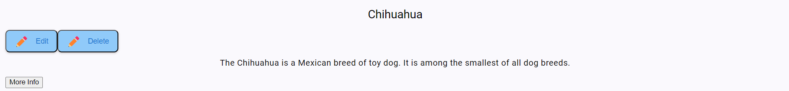
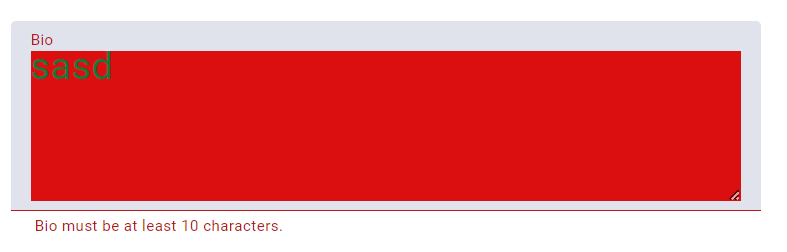
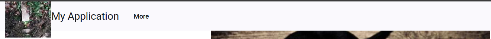
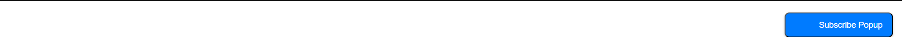

<!-- Custom Table Properties -->

# Custom Table Properties

key: string;

- Unique identifier for the column, used to bind data.

title?: string;

- Optional title displayed as the column header.

order?: number;

- Defines the display order of the columns.

type?: 'text' | 'image' | 'video' | 'multi';

- Specifies the content type in the column (text, image, video, or multiple).

minWidth?: string;

- Minimum width of the column.

maxWidth?: string;

- Maximum width of the column.

alignment?: 'left' | 'center' | 'right' | 'top' | 'bottom';

- Sets the content alignment within the column (left, center, right, top, or bottom).

# Table Config Properties

isHeader: boolean;

- Determines if the table's header should be displayed.

columns: TableColumn[];

- List of column configurations defined by the TableColumn interface.

itemsPerPage: number;

- Number of items displayed per page.

maxItemsOptions: number[];

- Array of options for the maximum number of items per page.

buttons?: { [key: string]: () => void };

- Object that defines custom actions triggered by specific buttons.

editableColumns?: string[];

- List of columns that are editable in the table.

actions?: ButtonConfig[];

- Array of ButtonConfig objects to define actions like Edit, Delete, etc.

rowHeight?: string;

- Custom height of each row in the table.

maxRowHeight?: string;

- Maximum height allowed for each row.

columnAlignments?: any;

- Custom alignment configurations for columns.

filterWidth?: string;

- Width of the filter input field.

filterAlignment?: 'left' | 'center' | 'right';

- Alignment of the filter input (left, center, right).

showFilter: boolean;

- Controls the visibility of the filter input.

margin : string;

- Space between the table and its surroundings.

elementSpacing : string;

- Space between elements inside a table cell (e.g., buttons).

# Material Table Properties

key: string;

- Unique identifier for the column, used to bind data.

title?: string;

- Optional title to be displayed in the table header.

order?: number;

- Determines the display order of the column.

type?: 'text' | 'image' | 'video' | 'multi';

- Specifies the content type of the column (text, image, video, or multiple types).

minWidth?: string;

- Minimum width for the column.

maxWidth?: string;

- Maximum width for the column.

alignment?: 'left' | 'center' | 'right' | 'top' | 'bottom';

- Defines content alignment in the column (left, center, right, top, or bottom).

# Button Config Properties

text: string;

- Text label to be displayed on the button.

icon?: string;

- Optional icon name to be displayed on the button.

showIcon?: boolean;

- Controls whether the icon should be visible.

iconPosition?: 'left' | 'center' | 'right' | 'full';

- Defines the position of the icon relative to the text (left, center, right, or full with no text).

onClick: (row: any) => void;

- Function to be executed when the button is clicked, receiving the current row data.

shape?: 'circle' | 'square' | 'rectangle';

- Defines the button shape (circle, square, or rectangle).

corners?: 'rounded' | 'squared';

- Determines whether the button has rounded or squared corners.

transparent?: boolean;

- Indicates if the button background should be transparent.

foreground?: string;

- Sets the text or icon color (foreground color).

background?: string;

- Sets the button's background color.

shadow?: boolean;

- Specifies if a shadow should be applied to the button.

textAlign?: 'left' | 'center' | 'right';

- Defines the alignment of the button text (left, center, or right).

validate?: () => boolean;

- Optional function to validate the button's state before action.

# Card Properties

header

- title: Title text displayed in the card's header.

      align: 'left' | 'center' | 'right';
      align: Alignment of the title in the header (left, center, or right).

      buttonsAlign: 'left' | 'center' | 'right';
      buttonsAlign: Alignment of buttons in the header (left, center, or right).

      buttons?: ButtonConfig[];
      buttons: Optional array of ButtonConfig objects for buttons in the header.

layout?: 'grid' | 'list';

- Defines the layout of the card.

  - grid: Displays the card in a grid layout.

  - list: Displays the card in a list layout.

width?: number;

- Specifies the width of the card.

body
-> type: 'text' | 'text+buttons' | 'table';.

- type: Defines the type of content in the card body (text, text with buttons, or a table).

      align: 'left' | 'center' | 'right';
      align: Alignment of the content in the body (left, center, or right).

      content: string;
      content: Text content displayed in the body.

      buttons?: ButtonConfig[];
      buttons: Optional array of ButtonConfig objects for buttons in the body.

footer
-> type: 'text' | 'buttons';

- type: Specifies whether the footer contains text or buttons.

      buttons?: ButtonConfig[];
      buttons: Optional array of ButtonConfig objects for buttons in the footer.

- align?: 'left' | 'center' | 'right' | 'multi-column';
  - left: Aligns footer content to the left.
  - center: Centers footer content.
  - right: Aligns footer content to the right.
  - multi-column: Aligns footer content in a multi-column layout.

Image:

- position?: 'background' | 'top-half' | 'middle' | 'bottom-half' | 'square-under-title' | 'rectangle-under-title' | 'dark-background-title';

  - Defines the position and style of the image within the card:

    > background: The image is used as the card's background.

    > top-half: The image occupies the top half of the card.

    > middle: The image is centered vertically in the card.

    > bottom-half: The image occupies the bottom half of the card.

    > square-under-title: A square image placed below the card's title.

    > rectangle-under-title: A rectangular image placed below the card's title.

    > dark-background-title: The image serves as a darkened background with the -title overlaid.

  src?: string;

  - The source URL of the image to be displayed in the card.

  hoverEffect?: boolean;

  - Determines whether a hover effect is applied to the image.

    > true: Enables hover effects like zoom or fade.

    > false: No hover effect.

  title?: string;

  - Optional title displayed over or near the image.

  description?: string;

  - Optional description text associated with the image.

Content:

description?: string;

- Additional descriptive text content for the card.

customHtml?: string;

- Custom HTML content that can be embedded in the card.

details?: { align?: 'left' | 'center' | 'right' | 'multi-column'; columns?: 1 | 2 | 3; rows?: 1 | 2 | 3; content?: { text?: string; icon?: string; }[][]; };

- details: A nested structure for detailed content.

  - align: Defines the alignment of the detailed content (left, center, right, or multi-column).
  - columns: Number of columns for the details (1, 2, or 3).
  - rows: Number of rows for the details (1, 2, or 3).
  - content: A 2D array of objects, each containing:

    > text: Text content.

    > icon: Icon associated with the text.

# User Properties

id: number;

- Unique identifier for the user.

name: string;

- Name of the user.

email: string;

- Email address of the user.

role: string;

- Role or designation of the user (e.g., Admin, User).

imageUrl?: string;

- Optional URL for the user's profile image.

videoUrl?: string;

- Optional URL for the user's profile video.

actions?: ButtonConfig[];

- Optional array of ButtonConfig objects for actions related to the user (e.g., Edit, Delete).

contentItems?: { [columnKey: string]: ColumnItem[] };

- Optional object containing content data for each column, where the key is the column's identifier, and the value is an array of ColumnItem objects.

rowAlignments?: { [key: string]: 'left' | 'center' | 'right' };

- Optional object defining custom alignment for each key in the row (e.g., left, center, right).

imageLoading?: boolean;

- Boolean flag indicating if the user's image is still loading.

videoLoading?: boolean;

- Boolean flag indicating if the user's video is still loading.

# Footer Properties

## FooterColumn Properties

title?: string;

- An optional title displayed in the footer column.

description?: string;

- Additional descriptive text for the footer column.

  buttonText?: string;

- The text displayed on a button in the footer column.

  buttonUrl?: string;

- The URL the button redirects to when clicked.

  lineText?: string;

- Optional text displayed as a line separator or under the column content.

  linkUrl?: string;

- A URL associated with the line text or a link in the footer column.

iconButtons?: { icon: string; url: string }[];

- An array of icon buttons with the following properties:

  - icon: The icon displayed on the button.
  - url: The URL the button redirects to when clicked.

## FooterConfig Properties

iframeUrl?: string;

- URL of an embedded iframe displayed in the footer.

iframeWidth?: string;

- The width of the iframe, specified as a CSS-compatible value (e.g., 100%, 500px).

iframeHeight?: string;

- The height of the iframe, specified as a CSS-compatible value.

bottomBar:

- logoUrl: string;

  - The URL of the logo displayed in the bottom bar.

- copyrightText: string;

  - The copyright text displayed in the bottom bar.

- year: number;

  - The year displayed in the bottom bar.

- company: string;

  - The name of the company displayed in the bottom bar.

- backgroundColor: string;

  - The background color of the bottom bar, specified as a CSS-compatible value.

- align?: 'left' | 'center' | 'right';
  - left: Aligns content to the left.
  - center: Centers content.
  - right: Aligns content to the right.

margin?: string;

- Optional margin around the bottom bar, specified as a CSS-compatible value (e.g., 16px, 1rem).

# Form Properties

## FormFieldConfig Properties

type: 'text' | 'number' | 'date' | 'file' | 'textarea';

- Specifies the type of the form field:
  - text: A plain text input field.
  - number: A numeric input field.
  - date: A date picker field.
  - file: A file input field.
  - textarea: A multi-line text area.

label: string;

- The label displayed for the field.

placeholder?: string;

- Optional placeholder text displayed inside the field.

value?: any;

- The default or initial value of the field.

required?: boolean;

- true: The field must be filled out.
- false: The field is optional.

validation?: ValidationConfig;

- Validation rules applied to the field, defined by the ValidationConfig interface.

fileConfig?: FileConfig;

- Configuration for file input fields, defined by the FileConfig interface.

textareaConfig?: TextAreaConfig;

- Configuration for textarea fields, defined by the TextAreaConfig interface.

style?: StyleConfig;

- Custom styling for the field, defined by the StyleConfig interface.

errorMessages?: ErrorMessagesConfig;

- Custom error messages for validation errors, defined by the ErrorMessagesConfig interface.

hide?: boolean;

- true: The field is not visible.
- false: The field is displayed.

showCheckbox?: boolean;

- true: Checkbox is displayed to control visibility.
- false: No checkbox is displayed.

## ValidationConfig Properties

minLength?: number;

- Minimum length for text input fields.

maxLength?: number;

- Maximum length for text input fields.

minValue?: number;

- Minimum value for numeric input fields.

maxValue?: number;

- Maximum value for numeric input fields.

pattern?: string;

- Regular expression pattern to validate the field's input.

customErrorMessage?: string;

-Custom error message displayed for validation failures.

## ErrorMessagesConfig Properties

required?: string;

- Custom error message for required field validation.

minLength?: string;

- Custom error message for minLength validation.

maxLength?: string;

- Custom error message for maxLength validation.

minValue?: string;

- Custom error message for minValue validation.

maxValue?: string;

- Custom error message for maxValue validation.

pattern?: string;
-Custom error message for pattern validation.

## FileConfig Properties

allowedTypes?: string[];

- List of allowed file types (e.g., ['image/png', 'application/pdf']).

## ErrorMessagesConfig Properties

rows: number;

- Number of rows displayed in the textarea by default.

toolbarOptions: ToolbarOption[];

- List of toolbar options for text formatting, defined by the ToolbarOption interface.

modules?: any;

- Additional configuration for the toolbar or editor (e.g., custom modules).

## ToolbarOption Properties

type: 'bold' | 'italic' | 'underline' | 'color' | 'blockquote' | 'code-block' | 'header' | 'list' | 'script' | 'indent' | 'direction' | 'size' | 'font' | 'align';

- Specifies the type of formatting tool available in the textarea toolbar:
  - bold: Makes text bold.
  - italic: Makes text italic.
  - underline: Underlines text.
  - color: Changes text color.
  - blockquote: Adds block quotes.
  - code-block: Formats text as a code block.
  - header: Adds headers.
  - list: Creates lists.
  - script: Formats text as superscript or subscript.
  - indent: Indents text.
  - direction: Sets text direction (e.g., left-to-right or right-to-left).
  - size: Adjusts text size.
  - font: Changes the font.
  - align: Aligns text (e.g., left, center, right).

## StyleConfig Properties

class?: string;

- Optional CSS class applied to the field for styling.

inlineStyles?: { [key: string]: string };

- Inline CSS styles applied directly to the field.
  Example: { 'color': 'red', 'font-size': '14px' }.

# NavBar Properties

## NavBarConfig Properties

logo?: LogoConfig | null;

- Configuration for the navbar logo, defined by the LogoConfig interface.
  If set to null, no logo will be displayed.

title?: TitleConfig | null;

- Configuration for the navbar title, defined by the TitleConfig interface.
  If set to null, no title will be displayed.

buttons?: ButtonGroupConfig[];

- Array of button group configurations, each defined by the ButtonGroupConfig interface.

banner?: BannerConfig;

- Configuration for the banner, defined by the BannerConfig interface.

carouselButtons?: CarouselButtonsConfig;

- Configuration for carousel buttons, defined by the CarouselButtonsConfig interface.

## LogoConfig Properties

url?: string;

- The URL of the logo image.

position?: 'left' | 'middle' | 'right';

- The position of the logo within the navbar:
  - left: Aligns the logo to the left.
  - middle: Centers the logo.
  - right: Aligns the logo to the right.

## TitleConfig Properties

text?: string;

- The text to be displayed as the navbar's title.

position?: 'left' | 'right';

- The position of the title relative to the logo:
  - left: Title appears to the left of the logo.
  - right: Title appears to the right of the logo.

alignWithLogo?: boolean;

- true: Title and logo share the same alignment.
- false: Independent alignment for title and logo.

## ButtonGroupConfig Properties

position?: 'left' | 'center' | 'right';

- The position of the button group within the navbar:
  - left: Buttons appear on the left side.
  - center: Buttons are centered.
  - right: Buttons appear on the right side.

alignWithLogo?: boolean;

- true: Button group alignment matches the logo.
- false: Independent alignment for the button group.

buttonsGroup?: NavButtonConfig[];

- Array of button configurations, each defined by the NavButtonConfig interface.

## NavButtonConfig Properties

text?: string;

- The text displayed on the button.

url?: string;

- The URL the button navigates to when clicked.

subMenu?: SubMenuConfig[];

- Array of submenu configurations, each defined by the SubMenuConfig interface.

## SubMenuConfig Properties

text?: string;

- The text displayed for the submenu item.

url?: string;

- The URL the submenu item navigates to when clicked.

## BannerConfig Properties

position: 'top' | 'bottom' | 'middle';

- top: Displays the banner at the top.
- bottom: Displays the banner at the bottom.
- middle: Displays the banner in the middle.

slideshow?: boolean;

- true: Activates slideshow mode.
- false: Static images.

imageSrc?: string[];

- Array of image URLs used in the banner.

width?: 'specific' | 'full';

- specific: Banner width is constrained by content or specified dimensions.
- full: Banner spans the full width of the navbar.

iframeUrl?: string;

- URL for embedding content in an iframe within the banner.

iframeWidth?: string;

- Width of the iframe in the banner (e.g., "600px" or "100%").

iframeHeight?: string;

- Height of the iframe in the banner (e.g., "400px" or "100%").

forcePagination?: boolean;

- true: Enables pagination even with a small number of images.
- false: Pagination depends on the number of images.

## CarouselButtonsConfig Properties

prevIcon?: string;

- Icon displayed on the "Previous" button of the carousel.

nextIcon?: string;
-Icon displayed on the "Next" button of the carousel.

# Examples:

Showing the table.

{ key: 'name', title: 'Name', order: 1, type: 'text', minWidth: '150px', maxWidth: '250px', alignment: 'left' },
{ key: 'email', title: 'Email', order: 2, type: 'text',minWidth: '150px', maxWidth: '250px', alignment: 'left' },
{ key: 'role', title: 'User Role', order: 3, type: 'text', minWidth: '150px', maxWidth: '250px', alignment: 'left' },
{ key: 'imageUrl', title: 'Profile Picture', order: 4, type: 'image', minWidth: '150px', maxWidth: '250px', alignment: 'center' },
{ key: 'videoUrl', title: 'Profile Video', order: 5, type: 'video', minWidth: '150px', maxWidth: '250px',alignment: 'center' }


---

## Table Component

Table Column Alignment Scenarios

Scenario 1: Changing Column Alignment

> Description: The text or media inside the columns should align as specified.

Example:
{ key: 'name', title: 'Name', alignment: 'center' },
{ key: 'email', title: 'Email', alignment: 'right' }
Test Case: Ensure the name column aligns to the center and the email column aligns to the right.

Scenario 2: Default Alignment

> Description: If no alignment is specified, the default alignment should be 'left'.

Example:
{ key: 'role', title: 'User Role' } // No alignment provided
Test Case: Ensure the text aligns to the left when no alignment is specified.

Scenario 3: Alignment Based on Data Type

> Description: Text columns should default to 'left' alignment, while numerical columns may default to 'right'.

Example:
{ key: 'name', title: 'Name', type: 'text', alignment: 'left' },
{ key: 'age', title: 'Age', type: 'number', alignment: 'right' }
Test Case: Verify that text is aligned to the left and numbers to the right.


---

Table Column Width Scenarios

Scenario 4: Minimum and Maximum Width

> Description: Columns should adjust based on the minWidth and maxWidth properties.

Example:
{ key: 'name', title: 'Name', minWidth: '150px', maxWidth: '250px' }
Test Case: Ensure the name column is within the width range and does not exceed the defined width.

Scenario 5: Auto Width

> Description: When no minWidth or maxWidth is specified, the column should adjust based on its content.

Example:
{ key: 'email', title: 'Email' } // No width constraints
Test Case: Verify that the column adjusts naturally based on content.


---

Table Row Height Scenarios

Scenario 6: Fixed Row Height
Description: Set a fixed row height for all rows.
Example:
rowHeight: '100px'
Test Case: Ensure all rows are of fixed height, regardless of content.

Scenario 7: Variable Row Height Based on Content
Description: Rows should dynamically expand based on their content, especially for images or videos.
Example:
{ key: 'imageUrl', title: 'Image', type: 'image' } // Rows adjust based on image size
Test Case: Ensure rows expand as needed when an image is loaded.


---

Image and Video Loading States

Scenario 8: Handling Loading State for Images
Description: Display a loader until the image is fully loaded.
Example:
{ imageUrl: 'https://picsum.photos/200/300', imageLoading: true } // Show loader
Test Case: Verify that the loader appears while the image is loading and disappears after it's fully loaded.

Scenario 9: Handling Loading State for Videos
Description: Display a loader until the video is fully loaded or ready to play.
Example:
{ videoUrl: 'path-to-video.mp4', videoLoading: true } // Show loader
Test Case: Ensure the loader is displayed while the video is loading.


---

Button Configuration Scenarios

Scenario 10: Default Button with Text Only
Description: Show a button with only text, no icon.
Example:
{ text: 'Edit', showIcon: false }
Test Case: Ensure the button displays only text and no icon.


Scenario 11: Button with Icon Only
Description: Show a button with only an icon, no text.
Example:
{ icon: '❌', showIcon: true, text: '', iconPosition: 'center' }
Test Case: Ensure the button displays only an icon, centered.


Scenario 12: Button with Both Icon and Text
Description: Display a button with both an icon and text.
Example:
{ text: 'Delete', icon: '❌', showIcon: true, iconPosition: 'left' }
Test Case: Verify that both the text and the icon appear as configured.


Scenario 13: Changing Button Icon Position
Description: Allow the icon to be positioned left, center, or right.
Example:
{ text: 'Edit', icon: '✏️', showIcon: true, iconPosition: 'right' }
Test Case: Check that the icon appears on the right side of the text.


---

Actions in Table Scenarios

Scenario 14: Multiple Action Buttons in a Row
Description: Show multiple action buttons (e.g., Edit, Delete) in a single row.
Example:
actions: [
{ text: 'Edit', icon: '✏️', showIcon: true, iconPosition: 'left' },
{ text: 'Delete', icon: '❌', showIcon: true, iconPosition: 'left' }
]
Test Case: Ensure both buttons are rendered in the actions column.


Scenario 15: Conditionally Show Action Buttons
Description: Display buttons conditionally based on row data (e.g., show 'Edit' for Admin users only).
Example:
{ role: 'Admin', actions: [ { text: 'Edit', showIcon: true } ] }
Test Case: Check that only Admin rows display the Edit button.


---

Dynamic Row Alignments

Scenario 16: Set Dynamic Alignments for Individual Rows
Description: Allow different rows to have different alignment settings based on conditions.
Example:
{ rowAlignments: { name: 'center', email: 'right' } }
Test Case: Verify that individual row alignments can differ from column alignments.


---

Changing Table Column Titles Dynamically

Scenario 17: Dynamic Column Title Updates
Description: Dynamically change the title of a column based on certain conditions (e.g., localization).
Example:
{ key: 'name', title: 'Nombre' } // Changing title to Spanish
Test Case: Ensure the title changes appropriately based on the dynamic update.


---

Sorting and Ordering Columns

Scenario 18: Reordering Columns
Description: Dynamically change the order of columns.
Example:
{ key: 'email', order: 1 }, { key: 'name', order: 2 }
Test Case: Verify that the email column appears first after changing the order.


Scenario 19: Disabling Sorting for Specific Columns
Description: Disable sorting for columns that shouldn't allow sorting (e.g., images, videos).
Example:
{ key: 'imageUrl', sortable: false }
Test Case: Ensure the image column cannot be sorted while others can.


---

Customizable Loader for Buttons

Scenario 20: Displaying Loader on Button Click
Description: Replace the button icon with a loader upon clicking until the action completes.
Example:
actions: [
{ text: 'Save', icon: '💾', showIcon: true, iconPosition: 'left', isLoading: true }
]
Test Case: Check that the loader replaces the icon on button click and reverts after the action is complete.


---

Row Expansion

Scenario 21: Expandable Rows
Description: Allow rows to expand to show additional details.
Example:
expandable: true, expandedContent: '<p>Extra details here</p>'
Test Case: Verify that clicking the row expands it to show additional content.

---

Filter Alignment

Scenario 22: Search Bar Alignment
Description: Change the Searching filter alignment
Example:
filterAlignment: true, expandedContent: '<p>Extra details here</p>'
Test Case: Verify that clicking the row expands it to show additional content.


---

Change the Table

Scenario 23: Change the Table
Description: Changing the Table By clicking on the button.
Example:
<app-custom-table *ngIf="!isNewTable" [data]="users" [config]="tableConfig"></app-custom-table>
<app-custom-material-table *ngIf="isNewTable" [data]="users" [config]="tableConfig"></app-custom-material-table>


---

Change the Shape

Scenario 24: Change the Shape
Description: Changeing the shape of the button.
Example:
<app-custom-table *ngIf="!isNewTable" [data]="users" [config]="tableConfig"></app-custom-table>
<app-custom-material-table *ngIf="isNewTable" [data]="users" [config]="tableConfig"></app-custom-material-table>


---

## Button Component

Change the shape for the button

shape?: 'circle' | 'square' | 'rectangle';

Scenario 25: Change the Table
Description: Changing the Table By clicking on the button.
Example:
<app-custom-button
\*ngFor="let action of (element.actions || config.actions)"
[ngStyle]="{ 'margin-right': config.elementSpacing || '0px' }"
[text]="action.text"
[icon]="action.icon || ''"
[showIcon]="action.showIcon !== undefined ? action.showIcon : true"
[iconPosition]="action.iconPosition || 'left'"
[shape]="action.shape"
[corners]="action.corners"
[foreground]="action.foreground"
[background]="action.background"
[shadow]="action.shadow"
[transparent]="action.transparent"
(click)="action.text === 'Edit' ? startEditing(i) : handleActionClick(action, element)">
</app-custom-button>
actions : [
{
text: 'Edit',
icon: '✏️',
showIcon: true,
iconPosition: 'left',
onClick: this.editUser.bind(this),
shape: 'square',
corners: 'rounded',
foreground: '#ffffff',
background: '#1976d2',
shadow: true,
transparent: false
},
{
text: 'Delete',
icon: '❌',
showIcon: true,
iconPosition: 'right',
onClick: this.deleteUser.bind(this),
shape: 'square',
corners: 'squared',
foreground: '#ff0000',
background: '#000000',
shadow: false,
transparent: true
},
],


---

Change the corners for the button

corners?: 'rounded' | 'squared';

Scenario 26: Change the Table
Description: Changing the Table By clicking on the button.
Example:
actions : [
{
text: 'Edit',
icon: '✏️',
showIcon: true,
iconPosition: 'left',
onClick: this.editUser.bind(this),
shape: 'square',
corners: 'rounded',
foreground: '#ffffff',
background: '#1976d2',
shadow: true,
transparent: false
},
{
text: 'Delete',
icon: '❌',
showIcon: true,
iconPosition: 'right',
onClick: this.deleteUser.bind(this),
shape: 'square',
corners: 'squared',
foreground: '#ff0000',
background: '#000000',
shadow: false,
transparent: true
},
],


---

Change the transparency for the button

transparent?: boolean;

Scenario 27: Change the transparent
Description: Used for the transparent the background.
Example:
actions : [
{
text: 'Edit',
icon: '✏️',
showIcon: true,
iconPosition: 'left',
onClick: this.editUser.bind(this),
shape: 'square',
corners: 'rounded',
foreground: '#ffffff',
background: '#1976d2',
shadow: true,
transparent: false
},
{
text: 'Delete',
icon: '❌',
showIcon: true,
iconPosition: 'right',
onClick: this.deleteUser.bind(this),
shape: 'square',
corners: 'squared',
foreground: '#ff0000',
background: '#000000',
shadow: false,
transparent: false
},
],


---

Change the Foreground Color

foreground?: string;

Scenario 28: Change the Foreground Color
Description: Used for the change the foreground color for the button component.
Example:
actions : [
{
text: 'Edit',
icon: '✏️',
showIcon: true,
iconPosition: 'left',
onClick: this.editUser.bind(this),
shape: 'square',
corners: 'rounded',
foreground: '#ffffff',
background: '#1976d2',
shadow: true,
transparent: false
},
{
text: 'Delete',
icon: '❌',
showIcon: true,
iconPosition: 'right',
onClick: this.deleteUser.bind(this),
shape: 'square',
corners: 'squared',
foreground: '#ff0000',
background: '#000000',
shadow: false,
transparent: false
},
],


---

`background?: string;`

Scenario 29: Change the Background of the button
Description: Used for the change the background color for the button component.
Example:

```JSON
actions : [
    {
    text: 'Edit',
    icon: '✏️',
    showIcon: true,
    iconPosition: 'left',
    onClick: this.editUser.bind(this),
    shape: 'square',
    corners: 'rounded',
    foreground: '#ffffff',
    background: '#1976d2',
    shadow: true,
    transparent: false
  },
  {
    text: 'Delete',
    icon: '❌',
    showIcon: true,
    iconPosition: 'right',
    onClick: this.deleteUser.bind(this),
    shape: 'square',
    corners: 'squared',
    foreground: '#ff0000',
    background: '#000000',
    shadow: false,
    transparent: false
  }
]
```


---

shadow?: boolean;

Scenario 30: Showing the shadow
Description: Used for the showing the shadow for the button.
Example:
actions : [
{
text: 'Edit',
icon: '✏️',
showIcon: true,
iconPosition: 'left',
onClick: this.editUser.bind(this),
shape: 'square',
corners: 'rounded',
foreground: '#ffffff',
background: '#1976d2',
shadow: true,
transparent: false
},
{
text: 'Delete',
icon: '❌',
showIcon: true,
iconPosition: 'right',
onClick: this.deleteUser.bind(this),
shape: 'square',
corners: 'squared',
foreground: '#ff0000',
background: '#000000',
shadow: false,
transparent: false
},
],


---

validate?: () => boolean;

Scenario 31: Validate message
Description: Used for the show the error message or validate when there are no text or icon available.
Example:
actions : [
{
text: 'Edit',
icon: '✏️',
showIcon: true,
iconPosition: 'left',
onClick: this.editUser.bind(this),
shape: 'square',
corners: 'rounded',
foreground: '#ffffff',
background: '#1976d2',
shadow: true,
transparent: false
},
{
text: '',
icon: '',
showIcon: true,
iconPosition: 'right',
onClick: this.deleteUser.bind(this),
shape: 'square',
corners: 'squared',
foreground: '#ff0000',
background: '#000000',
shadow: false,
transparent: false
},
],


---

## Table Component

margin : string;

Scenario 32: Add the Margin
Description: Used for the set the margin for the table component.
Example:
tableConfig: TableConfig = {
isHeader: true,
columns: [
{ key: 'name', title: 'Name', order: 1, type: 'text', minWidth: '150px', maxWidth: '250px', alignment: 'left' },
{ key: 'email', title: 'Email', order: 2, type: 'text',minWidth: '150px', maxWidth: '250px', alignment: 'left' },
{ key: 'role', title: 'User Role', order: 3, type: 'text', minWidth: '150px', maxWidth: '250px', alignment: 'left' },
{ key: 'imageUrl', title: 'Profile Picture', order: 4, type: 'image', minWidth: '150px', maxWidth: '250px', alignment: 'left' },
{ key: 'videoUrl', title: 'Profile Video', order: 5, type: 'video', minWidth: '150px', maxWidth: '250px',alignment: 'left' }
],
itemsPerPage: 5,
maxItemsOptions: [5, 10, 15],
actions: [
{ text: 'Edit',
icon: '✏️',
showIcon: true,
iconPosition: 'left',
onClick: this.editUser.bind(this),
shape: 'square',
corners: 'rounded',
foreground: '#ffffff',
background: '#1976d2',
shadow: true,
transparent: false
},
],
filterAlignment: 'center',
showFilter: true,
filterWidth: '500px',
margin: '20px',
};


---

elementSpacing : string;

Scenario 33: Add the Element Spacing
Description: Used for the set the margin for the more than 2 elements.
Example:
tableConfig: TableConfig = {
isHeader: true,
columns: [
{ key: 'name', title: 'Name', order: 1, type: 'text', minWidth: '150px', maxWidth: '250px', alignment: 'left' },
{ key: 'email', title: 'Email', order: 2, type: 'text',minWidth: '150px', maxWidth: '250px', alignment: 'left' },
{ key: 'role', title: 'User Role', order: 3, type: 'text', minWidth: '150px', maxWidth: '250px', alignment: 'left' },
{ key: 'imageUrl', title: 'Profile Picture', order: 4, type: 'image', minWidth: '150px', maxWidth: '250px', alignment: 'left' },
{ key: 'videoUrl', title: 'Profile Video', order: 5, type: 'video', minWidth: '150px', maxWidth: '250px',alignment: 'left' }
],
itemsPerPage: 5,
maxItemsOptions: [5, 10, 15],
actions: [
{ text: 'Edit',
icon: '✏️',
showIcon: true,
iconPosition: 'left',
onClick: this.editUser.bind(this),
shape: 'square',
corners: 'rounded',
foreground: '#ffffff',
background: '#1976d2',
shadow: true,
transparent: false
},
],
filterAlignment: 'center',
showFilter: true,
filterWidth: '500px',
margin: '20px',
elementSpacing: '10px'
};


---

align: 'left' | 'center' | 'right';

Scenario 34: Title Alignment
Description: Used for set the alighment for the text as left|center|right.
Example:
header: {
title: 'Chihuahua',
align: 'center',
buttonsAlign: 'left',
buttons: [
{ text: 'Edit', align: 'left', icon: '✏️', action: this.onEdit, },
{ text: 'Delete', align: 'right', icon: '✏️', action: this.onDelete }
]
},


---

buttonsAlign: 'left' | 'center' | 'right';

Scenario 35: Button Alignment
Description: Used for set the alighment for the button as left|center|right.
Example:
header: {
title: 'Chihuahua',
align: 'center',
buttonsAlign: 'left',
buttons: [
{ text: 'Edit', align: 'left', icon: '✏️', action: this.onEdit, },
{ text: 'Delete', align: 'right', icon: '✏️', action: this.onDelete }
]
},


---

buttons?: ButtonConfig[];

Scenario 36: Button Congif
Description: ButtonConfig. Used for set the buttoncongif dynamically.
Example:
{
title: 'Chihuahua',
align: 'center',
buttonsAlign: 'left',
buttons: [
{ text: 'Edit', align: 'left', icon: '✏️', action: this.onEdit, },
{ text: 'Delete', align: 'right', icon: '✏️', action: this.onDelete }
]
}


---

type: 'text' | 'text+buttons' | 'table';

Scenario 37: Body Type as 'text'
Description: Used for set the type of the body contant.
Example:
body: {
type: 'text',
align: 'right',
content: `The Chihuahua is a Mexican breed of toy dog. It is among the smallest of all dog breeds.`,
buttons: [
{ text: 'More Info', align: 'center', action: this.onMoreInfo }
]
},


---

type: 'text' | 'text+buttons' | 'table';

Scenario 38: Body Type as 'table'
Description: Used for set the type of the body contant.
Example:
body: {
type: 'table',
align: 'center',
content: `The Chihuahua is a Mexican breed of toy dog. It is among the smallest of all dog breeds.`,
buttons: [
{ text: 'More Info', align: 'center', action: this.onMoreInfo }
]
},


---

type: 'text' | 'text+buttons' | 'table';

Scenario 39: Body Type as 'table'
Description: Used for set the type of the body contant.
Example:
body: {
type: 'table',
align: 'center',
content: `The Chihuahua is a Mexican breed of toy dog. It is among the smallest of all dog breeds.`,
buttons: [
{ text: 'More Info', align: 'center', action: this.onMoreInfo }
]
},


---

type: 'text' | 'text+buttons' | 'table';

Scenario 40: Body Type as 'text+buttons'
Description: Used for set the type of the body contant.
Example:
body: {
type: 'text+buttons',
align: 'center',
content: `The Chihuahua is a Mexican breed of toy dog. It is among the smallest of all dog breeds.`,
buttons: [
{ text: 'More Info', align: 'left', action: this.onMoreInfo }
]
},



---

align: 'left' | 'center' | 'right';

Scenario 41: Body Button Alignment
Description: Used for set the alighment for the button as left|center|right.
Example:
body: {
type: 'text+buttons',
align: 'center',
content: `The Chihuahua is a Mexican breed of toy dog. It is among the smallest of all dog breeds.`,
buttons: [
{ text: 'More Info', align: 'left', action: this.onMoreInfo }
]
},


---

### Footer

Scenario 42: Footer with Text Aligned Left
Description: The footer text "This is footer text aligned to the left" will appear in the footer aligned to the left.

Example:  
cardConfig: CardConfig = {
footer: {
type: 'text',
align: 'left',
text: 'This is footer text aligned to the left.'
}
};


---

Scenario 43: Footer with Text Aligned Center
Description: The footer text "This is footer text aligned to the center" will appear in the footer centered.

Example:  
cardConfig: CardConfig = {
footer: {
type: 'text',
align: 'center',
text: 'This is footer text aligned to the center.'
}
};


---

Scenario 44: Footer with Text Aligned Right
Description: The footer text "This is footer text aligned to the right" will appear in the footer aligned to the right.

Example:  
cardConfig: CardConfig = {
footer: {
type: 'text',
align: 'right',
text: 'This is footer text aligned to the right.'
}
};


---

Scenario 45: Footer with Text Aligned Left
Description: The footer text "This is footer text aligned to the left" will appear in the footer aligned to the left.

Example:  
cardConfig: CardConfig = {
footer: {
type: 'text',
align: 'left',
text: 'This is footer text aligned to the left.'
}
};

57

---

Footer Button Alignment

align: 'left' | 'center' | 'right';

Scenario 46: Footer Button Alignment
Description: Used for set the alighment for the button as left|center|right.
Example:
footer: {
type: 'buttons',
buttons: [
{
text: 'Edit',
align: 'left',
group: 'left',
action: this.onEdit,

      icon: '✏️',
      showIcon: true,
      iconPosition: 'left',
      shape: 'square',
      corners: 'rounded',
      foreground: '#ffffff',
      background: '#1976d2',
      shadow: true,
      transparent: false
    },
    { text: 'Cancel', align: 'left', group: 'left', action: this.onCancel },
    { text: 'Submit', align: 'right', group: 'right', action: this.onSubmit }

]
}


---

Footer - Group of Button Alignment

align: 'left' | 'center' | 'right';

Scenario 47: Group of Button Alignment
Description: Used for set the alighment for the group of button as left|center|right.
Example:
footer: {
type: 'buttons',
buttons: [
{
text: 'Edit',
align: 'left',
group: 'left',
action: this.onEdit,

      icon: '✏️',
      showIcon: true,
      iconPosition: 'left',
      shape: 'square',
      corners: 'rounded',
      foreground: '#ffffff',
      background: '#1976d2',
      shadow: true,
      transparent: false
    },
    { text: 'Cancel', align: 'left', group: 'left', action: this.onCancel },
    { text: 'Submit', align: 'right', group: 'right', action: this.onSubmit }

]
}


---

## Card Component

Card with header, body and footer

Scenario 48: Card with header, body and footer
Description: Showing the card component with all the details.
Example:
cardConfig: CardConfig = {
header: {
title: 'Chihuahua',
align: 'center',
buttonsAlign: 'left',
buttons: [
{ text: 'Edit', align: 'left', icon: '✏️', action: this.onEdit, },
{ text: 'Delete', align: 'right', icon: '✏️', action: this.onDelete }
]
},
body: {
type: 'table',
align: 'center',
content: `The Chihuahua is a Mexican breed of toy dog. It is among the smallest of all dog breeds.`,
buttons: [
{ text: 'More Info', align: 'center', action: this.onMoreInfo }
]
},
footer: {
type: 'buttons',
buttons: [
{
text: 'Edit',
align: 'left',
group: 'left',
action: this.onEdit,

          icon: '✏️',
          showIcon: true,
          iconPosition: 'left',
          shape: 'square',
          corners: 'rounded',
          foreground: '#ffffff',
          background: '#1976d2',
          shadow: true,
          transparent: false
        },
        { text: 'Cancel', align: 'left', group: 'left', action: this.onCancel },
        { text: 'Submit', align: 'right', group: 'right', action: this.onSubmit }
      ]
    }

};


---

### Image Properties

Scenario 49: Full Background Image
Description: Image fills the entire card as a background.
On hover, the image fades slightly and the description "This is a background image with hover description" is displayed.

Example:

`image: {
  position: 'background',
  src: 'https://media.istockphoto.com/id/1934523700/photo/close-up-on-man-hand-using-mobile-phone.jpg?s=1024x1024&w=is&k=20&c=8rb1PLOQMgOY52356fBOBjWfVknpGT-uxfeJk_h3ols=',
  title: 'Sample Background Title',
  description: 'This is a background image with hover description.',
  hoverEffect: true
}`


---

Scenario 50: Image Positioned in Top Half of Card
Description: Image is displayed in the top half of the card with the title "Top Half Image" overlaid.

Example:

`image: {
  position: 'top-half',
  src: 'https://media.istockphoto.com/id/1934523700/photo/close-up-on-man-hand-using-mobile-phone.jpg?s=1024x1024&w=is&k=20&c=8rb1PLOQMgOY52356fBOBjWfVknpGT-uxfeJk_h3ols=',
  title: 'Top Half Image',
  hoverEffect: false
}`


---

Scenario 51: Image Positioned in the Middle of the Card
Description: Image is centered vertically in the card.

Example:

image: {
position: 'middle',
src: 'https://media.istockphoto.com/id/1934523700/photo/close-up-on-man-hand-using-mobile-phone.jpg?s=1024x1024&w=is&k=20&c=8rb1PLOQMgOY52356fBOBjWfVknpGT-uxfeJk_h3ols=',
title: 'Middle Positioned Image',
description: 'This description appears on hover.',
hoverEffect: true
}


---

Scenario 52: Image Positioned in Bottom Half of Card
Description: The image appears in the bottom half of the card.

Example:

image: {
position: 'bottom-half',
src: 'https://media.istockphoto.com/id/1934523700/photo/close-up-on-man-hand-using-mobile-phone.jpg?s=1024x1024&w=is&k=20&c=8rb1PLOQMgOY52356fBOBjWfVknpGT-uxfeJk_h3ols=',
title: 'Bottom Half Image',
hoverEffect: false
}


---

Scenario 53: Square Image Under Title
Description: A square image is displayed under the title.

Example:

image: {
position: 'square-under-title',
src: 'https://media.istockphoto.com/id/1934523700/photo/close-up-on-man-hand-using-mobile-phone.jpg?s=1024x1024&w=is&k=20&c=8rb1PLOQMgOY52356fBOBjWfVknpGT-uxfeJk_h3ols=',
title: 'Square Image Below Title',
hoverEffect: false
}


---

Scenario 54: Rectangle Image Under Title
Description: A rectangular image is displayed under the title "Rectangle Image Below Title".

Example:

image: {
position: 'rectangle-under-title',
src: 'https://media.istockphoto.com/id/1934523700/photo/close-up-on-man-hand-using-mobile-phone.jpg?s=1024x1024&w=is&k=20&c=8rb1PLOQMgOY52356fBOBjWfVknpGT-uxfeJk_h3ols=',
title: 'Rectangle Image Below Title',
hoverEffect: false
}


---

Scenario 55: Dark Background with Image Title
Description: Image is displayed with a dark overlay background.

Example:

image: {
position: 'dark-background-title',
src: 'https://media.istockphoto.com/id/1934523700/photo/close-up-on-man-hand-using-mobile-phone.jpg?s=1024x1024&w=is&k=20&c=8rb1PLOQMgOY52356fBOBjWfVknpGT-uxfeJk_h3ols=',
title: 'Dark Background Image Title',
description: 'Description on hover',
hoverEffect: true
}


---

Scenario 56: Image Hover Effect with Title and Description
Description: Image is displayed with title "Hover to See Description".

Example:

image: {
position: 'background',
src: 'https://media.istockphoto.com/id/1934523700/photo/close-up-on-man-hand-using-mobile-phone.jpg?s=1024x1024&w=is&k=20&c=8rb1PLOQMgOY52356fBOBjWfVknpGT-uxfeJk_h3ols=',
title: 'Hover to See Description',
description: 'This description is shown on hover.',
hoverEffect: true
}


---

Scenario 57: Full Background Image
Description: Image fills the entire card as a background.

Example:

image: {
position: 'background',
src: 'https://media.istockphoto.com/id/1934523700/photo/close-up-on-man-hand-using-mobile-phone.jpg?s=1024x1024&w=is&k=20&c=8rb1PLOQMgOY52356fBOBjWfVknpGT-uxfeJk_h3ols=',
title: 'Sample Background Title',
description: 'This is a background image with hover description.',
hoverEffect: true
}


---

### Card Properties

Scenario 58: Content with Description
Description: This test case ensures that a simple text description is displayed inside the content section of the card.

Example:
content: {
description: 'This is a sample card description for testing purposes.'
}


---

Scenario 59: Content with Custom HTML
Description: This test case validates that custom HTML content can be injected into the card’s content section.

Example:
content: {
customHtml: '<div><strong>Custom HTML Content For Card Section</strong></div>'
}


---

Scenario 60: Left-aligned Text in Details Section
Description: The text in the details section should be aligned to the left, and each row should contain one text item that is left-aligned.

Example:
content: {
details: {
align: 'left',
content: [
[{ text: 'Left Aligned Item 1' }],
[{ text: 'Left Aligned Item 2' }],
[{ text: 'Left Aligned Item 3' }]
]
}
}


---

Scenario 61: Center-aligned Text with Icons in Details Section
Description: The details section should display icons followed by text, all center-aligned. Each row should contain one item with an icon on the left and the text next to it.

Example:
content: {
details: {
align: 'center',
content: [
[{ icon: '🔧', text: 'Settings' }],
[{ icon: '📧', text: 'Email' }],
[{ icon: '⚙️', text: 'Configuration' }]
]
}
}


---

Scenario 62: Right-aligned Text with Multiple Rows
Description: The text in the details section should be aligned to the right, with each row containing one item that is right-aligned.

Example:
content: {
details: {
align: 'right',
content: [
[{ text: 'Right Aligned Item 1' }],
[{ text: 'Right Aligned Item 2' }],
[{ text: 'Right Aligned Item 3' }]
]
}
}


---

Scenario 63: Multi-column Layout with Text in Details Section
Description: The details section should display content in a two-row, three-column layout. Each row should contain three text items distributed evenly across the columns.

Example:
content: {
details: {
align: 'multi-column',
content: [
[
{ text: 'Column 1, Row 1' },
{ text: 'Column 2, Row 1' },
{ text: 'Column 3, Row 1' }
],
[
{ text: 'Column 1, Row 2' },
{ text: 'Column 2, Row 2' },
{ text: 'Column 3, Row 2' }
]
]
}
}


---

Scenario 64: Multi-column Layout with Icons and Text
Description: The details section should display a two-row, three-column layout with each item containing an icon on the left followed by text. All content should be evenly distributed across the rows and columns.

Example:
content: {
details: {
align: 'multi-column',
content: [
[
{ icon: '🏠', text: 'Home' },
{ icon: '💻', text: 'Work' },
{ icon: '📚', text: 'Library' }
],
[
{ icon: '🎨', text: 'Design' },
{ icon: '✍️', text: 'Write' },
{ icon: '🎤', text: 'Speak' }
]
]
}
}


---

Scenario 65: Multi-column Layout with Icons and Text
Description: The details section should display a two-row, three-column layout with each item containing an icon on the left followed by text. All content should be evenly distributed across the rows and columns.

Example:
`content: {
  details: {
    align: 'multi-column',
    content: [
      [
        { icon: '🏠', text: 'Home' },
        { icon: '💻', text: 'Work' },
        { icon: '📚', text: 'Library' }
      ],
      [
        { icon: '🎨', text: 'Design' },
        { icon: '✍️', text: 'Write' },
        { icon: '🎤', text: 'Speak' }
      ]
    ]
  }
}`


---

Scenario 66: Multi-column Layout with Icons and Text, description and customHtml
Description: All the detaild added for the Card Section.

Example:

`content: {
  description: 'This is the main content description.',
  customHtml: '<p>Custom HTML content here</p>',
  details: {
    align: 'multi-column',
    columns: 2,
    rows: 2,
    content: [
      [
        { text: 'Detail 1', icon: '🔍' },
        { text: 'Detail 2', icon: '📅' }
      ],
      [
        { text: 'Detail 3', icon: '💼' },
        { text: 'Detail 4', icon: '🌍' }
      ]
    ]
  }
}`


---

## Form Component Properties

Scenario 67: Required Validation for Text Field (Name)

Description: Test the behavior when the "Name" field is left blank, which is required.

Example:

`formConfig: FormConfig = {
  fields: [
    {
      type: 'text',
      label: 'Name',
      placeholder: 'Enter your name',
      required: true,
      validation: {
        minLength: 3,
        maxLength: 30
      },
      errorMessages: {
        required: 'Name is required.'
      }
    }
  ]
};`


---

Scenario 68: MinLength Validation for Text Field (Name)

Description: Test the behavior when fewer than 3 characters are entered in the "Name" field.

Example:

`fields: [
    {
      type: 'text',
      label: 'Name',
      placeholder: 'Enter your name',
      required: true,
      validation: {
        minLength: 3,
        maxLength: 30
      },
      errorMessages: {
        minLength: 'Name must be at least 3 characters long.'
      }
    }
  ];`


---

Scenario 69: MaxLength Validation for Text Field (Name)

Description: Test the behavior when more than 30 characters are entered in the "Name" field.

Example:

`fields: [
  {
    type: 'text',
    label: 'Name',
    placeholder: 'Enter your name',
    required: true,
    validation: {
      minLength: 3,
      maxLength: 30
    },
    errorMessages: {
      maxLength: 'Name cannot exceed 30 characters.'
    }
  }
]`


---

Scenario 70: Number Field Validation (Age)

Description: Test the behavior when an invalid number is entered for the "Age" field, with the minimum value of 18 and maximum value of 60.

Example:

`fields: [
  {
    type: 'number',
    label: 'Age',
    placeholder: 'Enter your age',
    validation: {
      minValue: 18,
      maxValue: 60
    },
    errorMessages: {
      minValue: 'Age must be at least 18.',
      maxValue: 'Age must be 60 or less.'
    }
  }
]`


---

Scenario 71: Textarea Field with Custom Toolbar (Bio)

Description: Test the textarea field with a custom toolbar, ensuring that the text styling options (bold, italic, color) work as expected.

Example:

`formConfig: FormConfig = {
  fields: [
    {
      type: 'textarea',
      label: 'Bio',
      placeholder: 'Write your bio',
      textareaConfig: {
        rows: 5,
        toolbarOptions: [
          { type: 'bold' },
          { type: 'italic' },
          { type: 'color' }
        ]
      },
      validation: {
        minLength: 10,
        maxLength: 200
      },
      style: {
        inlineStyles: { 'background-color': '#db0f0f', 'color': '#15763d', 'font-size': '30px' }
      }
    }
  ]
};`



---

Scenario 72: Required Date Field (Date of Birth)

Description: Test the required validation for the "Date of Birth" field to ensure that the field cannot be left empty.

Example:

`formConfig: FormConfig = {
  fields: [
    {
      type: 'date',
      label: 'Date of Birth',
      placeholder: 'Pick a date',
      required: true,
      errorMessages: {
        required: 'Date of Birth is required.'
      }
    }
  ]
};`


---

Scenario 73: Valid Form Submission

Description: Test a scenario where all form fields are filled with valid input, ensuring that the form can be submitted without errors.

Example:

`formConfig: FormConfig = {
  fields: [
    {
      type: 'text',
      label: 'Name',
      placeholder: 'Enter your name',
      required: true,
      validation: {
        minLength: 3,
        maxLength: 30
      }
    },
    {
      type: 'number',
      label: 'Age',
      validation: {
        minValue: 18,
        maxValue: 60
      }
    },
    {
      type: 'date',
      label: 'Date of Birth',
      required: true
    },
    {
      type: 'file',
      label: 'Profile Picture',
      fileConfig: {
        allowedTypes: ['image/png']
      }
    },
    {
      type: 'textarea',
      label: 'Bio',
      validation: {
        minLength: 10,
        maxLength: 200
      }
    }
  ]
};`


---

Scenario 74: Textarea Field Min and Max Length Validation (Bio)

Description: Test the behavior when the input text for the "Bio" field does not meet the minimum or exceeds the maximum character length.

Example:

`formConfig: FormConfig = {
  fields: [
    {
      type: 'textarea',
      label: 'Bio',
      placeholder: 'Write your bio',
      validation: {
        minLength: 10,
        maxLength: 200
      },
      errorMessages: {
        minLength: 'Bio must be at least 10 characters long.',
        maxLength: 'Bio cannot exceed 200 characters.'
      }
    }
  ]
};`


---

Scenario 75: Custom Inline Styles for Text Field (Name)

Description: Test the application of custom inline styles for the "Name" field.

Example:

`formConfig: FormConfig = {
  fields: [
    {
      type: 'text',
      label: 'Name',
      placeholder: 'Enter your name',
      required: true,
      style: {
        inlineStyles: {
          'font-size': '18px',
          'font-weight': 'bold',
          'color': '#333'
        }
      }
    }
  ]
};`


---

Scenario 76: Optional Text Field without Validation (Middle Name)

Description: Test the behavior of an optional text field that does not require validation.

Example:

`formConfig: FormConfig = {
  fields: [
    {
      type: 'text',
      label: 'Middle Name',
      placeholder: 'Enter your middle name',
      required: false
    }
  ]
};`


---

Scenario 77: Dynamic Error Messages for Custom Validation

Description: Test a custom validation rule for the "Age" field, which displays a specific error message when the input is outside the valid range.

Example:

`formConfig: FormConfig = {
  fields: [
    {
      type: 'number',
      label: 'Age',
      placeholder: 'Enter your age',
      validation: {
        minValue: 18,
        maxValue: 60,
        customErrorMessage: 'Age must be between 18 and 60.'
      }
    }
  ]
};`


---

## Nav Bar Component Properties

Scenario 78: Default Configuration

Description: Logo is displayed on the left, Title is aligned to the right of the logo

Example:

`navbarConfig: NavBarConfig = {
    logo: {
      url: 'https://picsum.photos/75/75',
      position: 'left'
    },
    title: {
      text: 'My Application',
      position: 'right',
      alignWithLogo: true,
    },
  };`


---

Scenario 79: Buttons on the Left

Description: Logo is on the left, and the title is on the right of the logo, The "Settings" button is positioned on the left without aligning to the logo.

Example:

`navbarConfig: NavBarConfig = {
    logo: {
    url: 'https://picsum.photos/100/100',
    position: 'left'
    },
    title: {
      text: 'My Application',
      position: 'right',
      alignWithLogo: true,
    },
    buttons: [
      {
        position: 'left',
        alignWithLogo: false,
        buttonsGroup: [
          {
            text: 'Settings',
            subMenu: [
              { text: 'Profile', url: '/profile' },
              { text: 'Account', url: '/account' }
            ]
          }
        ]
      }
    ]
  };`


---

Scenario 80: Default Configuration

Description: Logo is displayed on the left, Title is aligned to the right of the logo

Example:

`navbarConfig: NavBarConfig = {
    logo: {
      url: 'https://picsum.photos/75/75',
      position: 'left'
    },
    title: {
      text: 'My Application',
      position: 'right',
      alignWithLogo: true,
    },
    buttons: [
      {
        position: 'right',
        alignWithLogo: true,
        buttonsGroup: [
          {
            text: 'Home',
            url: 'https://www.google.com/',
          },
          {
            text: 'About',
            subMenu: [
              { text: 'Option 1' },
              { text: 'Option 2' }
            ],
            url: 'https://www.google.com/'
          },
          {
            text: 'More',
            subMenu: [
              { text: 'Option 1' },
              { text: 'Option 2' }
            ]
          }
        ],
      }
    ],
  };`


---

Scenario 81: No Logo and Title

Description: No logo or title is displayed, The "Help" button appears in the center with its submenu items

Example:

`navbarConfig: NavBarConfig = {
    logo: null,
    title: null,
    buttons: [
      {
        position: 'center',
        alignWithLogo: false,
        buttonsGroup: [
          {
            text: 'Help',
            subMenu: [
              { text: 'FAQ', url: '/faq' },
              { text: 'Contact', url: '/contact' }
            ]
          }
        ]
      }
    ],
  };`


---

Scenario 82: Multiple Button Groups

Description: The logo appears on the left with the title next to it, A "Home" button appears on the left with a submenu for "Dashboard", A "Logout" button appears on the right with no submenu.

Example:

`navbarConfig: NavBarConfig = {
    logo: {
    url: 'https://picsum.photos/100/100',
    position: 'left'
    },
    title: {
      text: 'My Application',
      position: 'left',
      alignWithLogo: true,
    },
    buttons: [
      {
        position: 'left',
        alignWithLogo: true,
        buttonsGroup: [
          {
            text: 'Home',
            subMenu: [
              { text: 'Dashboard', url: '/dashboard' }
            ]
          }
        ]
      },
      {
        position: 'right',
        alignWithLogo: false,
        buttonsGroup: [
          {
            text: 'Logout',
            subMenu: []
          }
        ]
      }
    ]
  };`


---

Scenario 83: Submenu Without URL

Description: The "More" button displays correctly, The submenu for "More" shows "Option 1" without a link and "Option 2" with a link.

Example:

`navbarConfig: NavBarConfig = {
    logo: {
    url: 'https://picsum.photos/100/100',
    position: 'left'
    },
    title: {
      text: 'My Application',
      position: 'right',
      alignWithLogo: true,
    },
    buttons: [
      {
        position: 'right',
        alignWithLogo: false,
        buttonsGroup: [
          {
            text: 'More',
            subMenu: [
              { text: 'Option 1' }, // No URL
              { text: 'Option 2', url: '/option2' }
            ]
          }
        ]
      }
    ]
  };`



---

Scenario 84: Complete Empty Configuration

Description: No elements are displayed in the navbar.

Example:

`navbarConfig: NavBarConfig = {
    logo: null,
    title: null,
    buttons: [],
    banner: {
      position: 'middle',
      imageSrc: [
        'https://picsum.photos/id/237/600/300',
        'https://picsum.photos/id/238/600/300',
        'https://picsum.photos/id/239/600/300'
      ],
      width: 'full',
      iframeUrl: 'https://www.example.com',
      iframeWidth: '100%',
      iframeHeight: '100px',
      slideshow: true,
    }
  };`


---

Scenario 85: Banner Positioned in the Middle with Images.

Description: No elements are displayed in the navbar.

Example:

`navbarConfig: NavBarConfig = {
  logo: {
    url: 'https://picsum.photos/75/75',
    position: 'left'
  },
  title: {
    text: 'My Application',
    position: 'right',
    alignWithLogo: true,
  },
  buttons: [
    {
      position: 'right',
      alignWithLogo: true,
      buttonsGroup: [
        {
          text: 'Home',
          url: 'https://www.google.com/'
        },
        {
          text: 'About',
          subMenu: [
            { text: 'Option 1' },
            { text: 'Option 2' }
          ],
          url: 'https://www.google.com/'
        },
        {
          text: 'More',
          subMenu: [
            { text: 'Option 1' },
            { text: 'Option 2' }
          ]
        }
      ],
    }
  ],
  banner: {
    position: 'middle',
    imageSrc: [
      'https://picsum.photos/id/237/600/300',
      'https://picsum.photos/id/238/600/300',
      'https://picsum.photos/id/239/600/300'
    ],
    width: 'full',
    slideshow: true,
  }
};`


---

Scenario 86: Banner with Iframe Embed in Middle

Description: The banner displays an embedded iframe in the middle of the navbar, The iframe occupies 100% width and has a height of 100px., No images are shown since imageSrc is not provided.

Example:

`navbarConfig: NavBarConfig = {
    logo: {
      url: 'https://picsum.photos/75/75',
      position: 'left'
    },
    title: {
      text: 'My Application',
      position: 'right',
      alignWithLogo: true,
    },
    buttons: [
      {
        position: 'right',
        alignWithLogo: true,
        buttonsGroup: [
          {
            text: 'Home',
            url: 'https://www.google.com/'
          },
          {
            text: 'About',
            subMenu: [
              { text: 'Option 1' },
              { text: 'Option 2' }
            ],
            url: 'https://www.google.com/'
          },
          {
            text: 'More',
            subMenu: [
              { text: 'Option 1' },
              { text: 'Option 2' }
            ]
          }
        ],
      }
    ],
    banner: {
      position: 'middle',
      iframeUrl: 'https://www.example.com',
      iframeWidth: '100%',
      iframeHeight: '100px',
    }
  };`


---

Scenario 87: Full-Width Banner with Static Image

Description: A single static image appears in the middle of the navbar with full width, No slideshow functionality is active since slideshow is set to false.

Example:

`navbarConfig: NavBarConfig = {
    logo: {
      url: 'https://picsum.photos/75/75',
      position: 'left'
    },
    title: {
      text: 'My Application',
      position: 'right',
      alignWithLogo: true,
    },
    buttons: [
      {
        position: 'right',
        alignWithLogo: true,
        buttonsGroup: [
          {
            text: 'Home',
            url: 'https://www.google.com/'
          },
          {
            text: 'About',
            subMenu: [
              { text: 'Option 1' },
              { text: 'Option 2' }
            ],
            url: 'https://www.google.com/'
          },
          {
            text: 'More',
            subMenu: [
              { text: 'Option 1' },
              { text: 'Option 2' }
            ]
          }
        ],
      }
    ],
    banner: {
      position: 'middle',
      imageSrc: ['https://picsum.photos/id/237/600/300'],
      width: 'full',
      slideshow: false,
    }
  };`


---

Scenario 88: Left-Aligned Banner with Slideshow and No Iframe

Description: The banner displays a slideshow positioned on the left side of the navbar, The banner width is half of the navbar width, with images rotating every few seconds.

Example:

`navbarConfig: NavBarConfig = {
    logo: {
      url: 'https://picsum.photos/75/75',
      position: 'left'
    },
    title: {
      text: 'My Application',
      position: 'right',
      alignWithLogo: true,
    },
    buttons: [
      {
        position: 'right',
        alignWithLogo: true,
        buttonsGroup: [
          {
            text: 'Home',
            url: 'https://www.google.com/'
          },
          {
            text: 'About',
            subMenu: [
              { text: 'Option 1' },
              { text: 'Option 2' }
            ],
            url: 'https://www.google.com/'
          },
          {
            text: 'More',
            subMenu: [
              { text: 'Option 1' },
              { text: 'Option 2' }
            ]
          }
        ],
      }
    ],
    banner: {
      position: 'left',
      imageSrc: [
        'https://picsum.photos/id/237/600/300',
        'https://picsum.photos/id/238/600/300'
      ],
      width: 'half',
      slideshow: true,
    }
  };`


---

Scenario 89: Change the height and width for iframe.

Description: Change the height and width for iframe.

Example:

`navbarConfig: NavBarConfig = {
    logo: {
      url: 'https://picsum.photos/75/75',
      position: 'left'
    },
    title: {
      text: 'My Application',
      position: 'right',
      alignWithLogo: true,
    },
    buttons: [
      {
        position: 'right',
        alignWithLogo: true,
        buttonsGroup: [
          {
            text: 'Home',
            url: 'https://www.google.com/'
          },
          {
            text: 'About',
            subMenu: [
              { text: 'Option 1' },
              { text: 'Option 2' }
            ],
            url: 'https://www.google.com/'
          },
          {
            text: 'More',
            subMenu: [
              { text: 'Option 1' },
              { text: 'Option 2' }
            ]
          }
        ],
      }
    ],
    banner: {
      position: 'middle',
      imageSrc: [
        'https://picsum.photos/id/237/600/300',
        'https://picsum.photos/id/238/600/300',
        'https://picsum.photos/id/239/600/300'
      ],
      width: 'full',
      iframeUrl: 'https://www.example.com',
      iframeWidth: '100%',
      iframeHeight: '500px',
      slideshow: true,
    }
  };`


---

Scenario 90: Change the Force Pagination.

Description: Change the Force Pagination as true when we have more then 10 images for the image carousel.

Example:

`navbarConfig: NavBarConfig = {
    logo: {
      url: 'https://picsum.photos/75/75',
      position: 'left'
    },
    title: {
      text: 'My Application',
      position: 'right',
      alignWithLogo: true,
    },
    buttons: [
      {
        position: 'right',
        alignWithLogo: true,
        buttonsGroup: [
          {
            text: 'Home',
            url: 'https://www.google.com/'
          },
          {
            text: 'About',
            subMenu: [
              { text: 'Option 1' },
              { text: 'Option 2' }
            ],
            url: 'https://www.google.com/'
          },
          {
            text: 'More',
            subMenu: [
              { text: 'Option 1' },
              { text: 'Option 2' }
            ]
          }
        ],
      }
    ],
    banner: {
      position: 'middle',
      imageSrc: [
        'https://picsum.photos/id/237/600/300',
        'https://picsum.photos/id/238/600/300',
        'https://picsum.photos/id/239/600/300',
        'https://picsum.photos/id/237/600/300',
        'https://picsum.photos/id/237/600/300',
        'https://picsum.photos/id/237/600/300',
        'https://picsum.photos/id/237/600/300',
        'https://picsum.photos/id/237/600/300',
        'https://picsum.photos/id/237/600/300',
        'https://picsum.photos/id/237/600/300',
        'https://picsum.photos/id/237/600/300',
        'https://picsum.photos/id/237/600/300',
      ],
      width: 'full',
      iframeUrl: 'https://www.example.com',
      iframeWidth: '100%',
      iframeHeight: '300px',
      slideshow: true,
      forcePagination: true,
    },
  };`


---

Scenario 91: Change the Force Pagination.

Description: Change the Force Pagination as false when we have more then 10 images for the image carousel.

Example:

`navbarConfig: NavBarConfig = {
    logo: {
      url: 'https://picsum.photos/75/75',
      position: 'left'
    },
    title: {
      text: 'My Application',
      position: 'right',
      alignWithLogo: true,
    },
    buttons: [
      {
        position: 'right',
        alignWithLogo: true,
        buttonsGroup: [
          {
            text: 'Home',
            url: 'https://www.google.com/'
          },
          {
            text: 'About',
            subMenu: [
              { text: 'Option 1' },
              { text: 'Option 2' }
            ],
            url: 'https://www.google.com/'
          },
          {
            text: 'More',
            subMenu: [
              { text: 'Option 1' },
              { text: 'Option 2' }
            ]
          }
        ],
      }
    ],
    banner: {
      position: 'middle',
      imageSrc: [
        'https://picsum.photos/id/237/600/300',
        'https://picsum.photos/id/238/600/300',
        'https://picsum.photos/id/239/600/300',
        'https://picsum.photos/id/237/600/300',
      ],
      width: 'full',
      iframeUrl: 'https://www.example.com',
      iframeWidth: '100%',
      iframeHeight: '300px',
      slideshow: true,
      forcePagination: false,
    },
  };`


---

Scenario 92: Set the button icon for previous and next.

Description: Set the button when the forcePagination true for the previous and next button.

Example:

`navbarConfig: NavBarConfig = {
    logo: {
      url: 'https://picsum.photos/75/75',
      position: 'left'
    },
    title: {
      text: 'My Application',
      position: 'right',
      alignWithLogo: true,
    },
    buttons: [
      {
        position: 'right',
        alignWithLogo: true,
        buttonsGroup: [
          {
            text: 'Home',
            url: 'https://www.google.com/'
          },
          {
            text: 'About',
            subMenu: [
              { text: 'Option 1' },
              { text: 'Option 2' }
            ],
            url: 'https://www.google.com/'
          },
          {
            text: 'More',
            subMenu: [
              { text: 'Option 1' },
              { text: 'Option 2' }
            ]
          }
        ],
      }
    ],
    banner: {
      position: 'middle',
      imageSrc: [
        'https://picsum.photos/id/237/600/300',
        'https://picsum.photos/id/238/600/300',
        'https://picsum.photos/id/239/600/300',
        'https://picsum.photos/id/237/600/300',
      ],
      width: 'full',
      iframeUrl: 'https://www.example.com',
      iframeWidth: '100%',
      iframeHeight: '300px',
      slideshow: true,
      forcePagination: true,
    },
  };`


---

## Card Component Properties

Scenario 93: Change the width of the Cards.

Description: Change the width of the cards when the toggle button is on.

Example:

`maxWidth = '400px';

cardConfigs: CardConfig[] = [{
//layout: 'grid',
// width: 100,
header: {
title: 'Chihuahua 1',
align: 'center',
buttonsAlign: 'left',
buttons: [{
text: 'Edit',
align: 'left',
icon: '✏️'
},
{
text: 'Delete',
align: 'right',
icon: '✏️'
},
],
},
image: {
position: 'top-half',
src: 'https://media.istockphoto.com/id/1934523700/photo/close-up-on-man-hand-using-mobile-phone.jpg?s=1024x1024&w=is&k=20&c=8rb1PLOQMgOY52356fBOBjWfVknpGT-uxfeJk_h3ols=',
title: 'Title on Image',
description: 'This is a description shown on hover.',
hoverEffect: false,
},
content: {
description: 'This is the main content description for Chihuahua 1.',
customHtml: '<p>Custom HTML content here</p>',
details: {
align: 'multi-column',
columns: 2,
rows: 2,
content: [
[{
text: 'Detail 1',
icon: '🔍'
},
{
text: 'Detail 2',
icon: '📅'
},
],
[{
text: 'Detail 3',
icon: '💼'
},
{
text: 'Detail 4',
icon: '🌍'
},
],
],
},
},
body: {
type: 'text',
align: 'center',
content: `The Chihuahua is a Mexican breed of toy dog.`,
buttons: [{
text: 'More Info',
align: 'center'
}],
},
footer: {
type: 'buttons',
align: 'left',
text: 'This is a dynamically aligned footer text',
buttons: [{
text: 'Edit',
align: 'left',
group: 'left',
icon: '✏️',
showIcon: true,
iconPosition: 'left',
shape: 'square',
corners: 'rounded',
foreground: '#ffffff',
background: '#1976d2',
shadow: true,
transparent: false,
},
{
text: 'Cancel',
align: 'left',
group: 'left'
},
{
text: 'Submit',
align: 'right',
group: 'right'
},
],
},
},
{
//layout: 'list', //Use the list layout
// width: 100,
header: {
title: 'Chihuahua 2',
align: 'center',
buttonsAlign: 'left',
buttons: [{
text: 'Edit',
align: 'left',
icon: '✏️'
},
{
text: 'Delete',
align: 'right',
icon: '✏️'
},
],
},
image: {
position: 'top-half',
src: 'https://media.istockphoto.com/id/1934523700/photo/close-up-on-man-hand-using-mobile-phone.jpg?s=1024x1024&w=is&k=20&c=8rb1PLOQMgOY52356fBOBjWfVknpGT-uxfeJk_h3ols=',
title: 'Title on Image',
description: 'This is a description shown on hover.',
hoverEffect: false,
},
content: {
description: 'This is the main content description for Chihuahua 2.',
customHtml: '<p>Custom HTML content here</p>',
details: {
align: 'multi-column',
columns: 2,
rows: 2,
content: [
[{
text: 'Detail 1',
icon: '🔍'
},
{
text: 'Detail 2',
icon: '📅'
},
],
[{
text: 'Detail 3',
icon: '💼'
},
{
text: 'Detail 4',
icon: '🌍'
},
],
],
},
},
body: {
type: 'text',
align: 'center',
content: `The Chihuahua is a Mexican breed of toy dog.`,
buttons: [{
text: 'More Info',
align: 'center'
}],
},
footer: {
type: 'buttons',
align: 'left',
text: 'This is a dynamically aligned footer text',
buttons: [{
text: 'Edit',
align: 'left',
group: 'left',
icon: '✏️',
showIcon: true,
iconPosition: 'left',
shape: 'square',
corners: 'rounded',
foreground: '#ffffff',
background: '#1976d2',
shadow: true,
transparent: false,
},
{
text: 'Cancel',
align: 'left',
group: 'left'
},
{
text: 'Submit',
align: 'right',
group: 'right'
},
],
},
},
{
//layout: 'list', //Use the list layout
// width: 100,
header: {
title: 'Chihuahua 2',
align: 'center',
buttonsAlign: 'left',
buttons: [{
text: 'Edit',
align: 'left',
icon: '✏️'
},
{
text: 'Delete',
align: 'right',
icon: '✏️'
},
],
},
image: {
position: 'top-half',
src: 'https://media.istockphoto.com/id/1934523700/photo/close-up-on-man-hand-using-mobile-phone.jpg?s=1024x1024&w=is&k=20&c=8rb1PLOQMgOY52356fBOBjWfVknpGT-uxfeJk_h3ols=',
title: 'Title on Image',
description: 'This is a description shown on hover.',
hoverEffect: false,
},
content: {
description: 'This is the main content description for Chihuahua 2.',
customHtml: '<p>Custom HTML content here</p>',
details: {
align: 'multi-column',
columns: 2,
rows: 2,
content: [
[{
text: 'Detail 1',
icon: '🔍'
},
{
text: 'Detail 2',
icon: '📅'
},
],
[{
text: 'Detail 3',
icon: '💼'
},
{
text: 'Detail 4',
icon: '🌍'
},
],
],
},
},
body: {
type: 'text',
align: 'center',
content: `The Chihuahua is a Mexican breed of toy dog.`,
buttons: [{
text: 'More Info',
align: 'center'
}],
},
footer: {
type: 'buttons',
align: 'left',
text: 'This is a dynamically aligned footer text',
buttons: [{
text: 'Edit',
align: 'left',
group: 'left',
icon: '✏️',
showIcon: true,
iconPosition: 'left',
shape: 'square',
corners: 'rounded',
foreground: '#ffffff',
background: '#1976d2',
shadow: true,
transparent: false,
},
{
text: 'Cancel',
align: 'left',
group: 'left'
},
{
text: 'Submit',
align: 'right',
group: 'right'
},
],
},
},
{
//layout: 'list', //Use the list layout
// width: 100,
header: {
title: 'Chihuahua 2',
align: 'center',
buttonsAlign: 'left',
buttons: [{
text: 'Edit',
align: 'left',
icon: '✏️'
},
{
text: 'Delete',
align: 'right',
icon: '✏️'
},
],
},
image: {
position: 'top-half',
src: 'https://media.istockphoto.com/id/1934523700/photo/close-up-on-man-hand-using-mobile-phone.jpg?s=1024x1024&w=is&k=20&c=8rb1PLOQMgOY52356fBOBjWfVknpGT-uxfeJk_h3ols=',
title: 'Title on Image',
description: 'This is a description shown on hover.',
hoverEffect: false,
},
content: {
description: 'This is the main content description for Chihuahua 2.',
customHtml: '<p>Custom HTML content here</p>',
details: {
align: 'multi-column',
columns: 2,
rows: 2,
content: [
[{
text: 'Detail 1',
icon: '🔍'
},
{
text: 'Detail 2',
icon: '📅'
},
],
[{
text: 'Detail 3',
icon: '💼'
},
{
text: 'Detail 4',
icon: '🌍'
},
],
],
},
},
body: {
type: 'text',
align: 'center',
content: `The Chihuahua is a Mexican breed of toy dog.`,
buttons: [{
text: 'More Info',
align: 'center'
}],
},
footer: {
type: 'buttons',
align: 'left',
text: 'This is a dynamically aligned footer text',
buttons: [{
text: 'Edit',
align: 'left',
group: 'left',
icon: '✏️',
showIcon: true,
iconPosition: 'left',
shape: 'square',
corners: 'rounded',
foreground: '#ffffff',
background: '#1976d2',
shadow: true,
transparent: false,
},
{
text: 'Cancel',
align: 'left',
group: 'left'
},
{
text: 'Submit',
align: 'right',
group: 'right'
},
],
},
},
{
//layout: 'list', //Use the list layout
// width: 100,
header: {
title: 'Chihuahua 2',
align: 'center',
buttonsAlign: 'left',
buttons: [{
text: 'Edit',
align: 'left',
icon: '✏️'
},
{
text: 'Delete',
align: 'right',
icon: '✏️'
},
],
},
image: {
position: 'top-half',
src: 'https://media.istockphoto.com/id/1934523700/photo/close-up-on-man-hand-using-mobile-phone.jpg?s=1024x1024&w=is&k=20&c=8rb1PLOQMgOY52356fBOBjWfVknpGT-uxfeJk_h3ols=',
title: 'Title on Image',
description: 'This is a description shown on hover.',
hoverEffect: false,
},
content: {
description: 'This is the main content description for Chihuahua 2.',
customHtml: '<p>Custom HTML content here</p>',
details: {
align: 'multi-column',
columns: 2,
rows: 2,
content: [
[{
text: 'Detail 1',
icon: '🔍'
},
{
text: 'Detail 2',
icon: '📅'
},
],
[{
text: 'Detail 3',
icon: '💼'
},
{
text: 'Detail 4',
icon: '🌍'
},
],
],
},
},
body: {
type: 'text',
align: 'center',
content: `The Chihuahua is a Mexican breed of toy dog.`,
buttons: [{
text: 'More Info',
align: 'center'
}],
},
footer: {
type: 'buttons',
align: 'left',
text: 'This is a dynamically aligned footer text',
buttons: [{
text: 'Edit',
align: 'left',
group: 'left',
icon: '✏️',
showIcon: true,
iconPosition: 'left',
shape: 'square',
corners: 'rounded',
foreground: '#ffffff',
background: '#1976d2',
shadow: true,
transparent: false,
},
{
text: 'Cancel',
align: 'left',
group: 'left'
},
{
text: 'Submit',
align: 'right',
group: 'right'
},
],
},
},
];`


---

Scenario 94: Toggle button is off to show the cards as list view.

Description: Toggle button is off to show the cards as list view.

Example:

`maxWidth = '400px';

cardConfigs: CardConfig[] = [{
//layout: 'grid',
// width: 100,
header: {
title: 'Chihuahua 1',
align: 'center',
buttonsAlign: 'left',
buttons: [{
text: 'Edit',
align: 'left',
icon: '✏️'
},
{
text: 'Delete',
align: 'right',
icon: '✏️'
},
],
},
image: {
position: 'top-half',
src: 'https://media.istockphoto.com/id/1934523700/photo/close-up-on-man-hand-using-mobile-phone.jpg?s=1024x1024&w=is&k=20&c=8rb1PLOQMgOY52356fBOBjWfVknpGT-uxfeJk_h3ols=',
title: 'Title on Image',
description: 'This is a description shown on hover.',
hoverEffect: false,
},
content: {
description: 'This is the main content description for Chihuahua 1.',
customHtml: '<p>Custom HTML content here</p>',
details: {
align: 'multi-column',
columns: 2,
rows: 2,
content: [
[{
text: 'Detail 1',
icon: '🔍'
},
{
text: 'Detail 2',
icon: '📅'
},
],
[{
text: 'Detail 3',
icon: '💼'
},
{
text: 'Detail 4',
icon: '🌍'
},
],
],
},
},
body: {
type: 'text',
align: 'center',
content: `The Chihuahua is a Mexican breed of toy dog.`,
buttons: [{
text: 'More Info',
align: 'center'
}],
},
footer: {
type: 'buttons',
align: 'left',
text: 'This is a dynamically aligned footer text',
buttons: [{
text: 'Edit',
align: 'left',
group: 'left',
icon: '✏️',
showIcon: true,
iconPosition: 'left',
shape: 'square',
corners: 'rounded',
foreground: '#ffffff',
background: '#1976d2',
shadow: true,
transparent: false,
},
{
text: 'Cancel',
align: 'left',
group: 'left'
},
{
text: 'Submit',
align: 'right',
group: 'right'
},
],
},
},
{
//layout: 'list', //Use the list layout
// width: 100,
header: {
title: 'Chihuahua 2',
align: 'center',
buttonsAlign: 'left',
buttons: [{
text: 'Edit',
align: 'left',
icon: '✏️'
},
{
text: 'Delete',
align: 'right',
icon: '✏️'
},
],
},
image: {
position: 'top-half',
src: 'https://media.istockphoto.com/id/1934523700/photo/close-up-on-man-hand-using-mobile-phone.jpg?s=1024x1024&w=is&k=20&c=8rb1PLOQMgOY52356fBOBjWfVknpGT-uxfeJk_h3ols=',
title: 'Title on Image',
description: 'This is a description shown on hover.',
hoverEffect: false,
},
content: {
description: 'This is the main content description for Chihuahua 2.',
customHtml: '<p>Custom HTML content here</p>',
details: {
align: 'multi-column',
columns: 2,
rows: 2,
content: [
[{
text: 'Detail 1',
icon: '🔍'
},
{
text: 'Detail 2',
icon: '📅'
},
],
[{
text: 'Detail 3',
icon: '💼'
},
{
text: 'Detail 4',
icon: '🌍'
},
],
],
},
},
body: {
type: 'text',
align: 'center',
content: `The Chihuahua is a Mexican breed of toy dog.`,
buttons: [{
text: 'More Info',
align: 'center'
}],
},
footer: {
type: 'buttons',
align: 'left',
text: 'This is a dynamically aligned footer text',
buttons: [{
text: 'Edit',
align: 'left',
group: 'left',
icon: '✏️',
showIcon: true,
iconPosition: 'left',
shape: 'square',
corners: 'rounded',
foreground: '#ffffff',
background: '#1976d2',
shadow: true,
transparent: false,
},
{
text: 'Cancel',
align: 'left',
group: 'left'
},
{
text: 'Submit',
align: 'right',
group: 'right'
},
],
},
},
{
//layout: 'list', //Use the list layout
// width: 100,
header: {
title: 'Chihuahua 2',
align: 'center',
buttonsAlign: 'left',
buttons: [{
text: 'Edit',
align: 'left',
icon: '✏️'
},
{
text: 'Delete',
align: 'right',
icon: '✏️'
},
],
},
image: {
position: 'top-half',
src: 'https://media.istockphoto.com/id/1934523700/photo/close-up-on-man-hand-using-mobile-phone.jpg?s=1024x1024&w=is&k=20&c=8rb1PLOQMgOY52356fBOBjWfVknpGT-uxfeJk_h3ols=',
title: 'Title on Image',
description: 'This is a description shown on hover.',
hoverEffect: false,
},
content: {
description: 'This is the main content description for Chihuahua 2.',
customHtml: '<p>Custom HTML content here</p>',
details: {
align: 'multi-column',
columns: 2,
rows: 2,
content: [
[{
text: 'Detail 1',
icon: '🔍'
},
{
text: 'Detail 2',
icon: '📅'
},
],
[{
text: 'Detail 3',
icon: '💼'
},
{
text: 'Detail 4',
icon: '🌍'
},
],
],
},
},
body: {
type: 'text',
align: 'center',
content: `The Chihuahua is a Mexican breed of toy dog.`,
buttons: [{
text: 'More Info',
align: 'center'
}],
},
footer: {
type: 'buttons',
align: 'left',
text: 'This is a dynamically aligned footer text',
buttons: [{
text: 'Edit',
align: 'left',
group: 'left',
icon: '✏️',
showIcon: true,
iconPosition: 'left',
shape: 'square',
corners: 'rounded',
foreground: '#ffffff',
background: '#1976d2',
shadow: true,
transparent: false,
},
{
text: 'Cancel',
align: 'left',
group: 'left'
},
{
text: 'Submit',
align: 'right',
group: 'right'
},
],
},
},
{
//layout: 'list', //Use the list layout
// width: 100,
header: {
title: 'Chihuahua 2',
align: 'center',
buttonsAlign: 'left',
buttons: [{
text: 'Edit',
align: 'left',
icon: '✏️'
},
{
text: 'Delete',
align: 'right',
icon: '✏️'
},
],
},
image: {
position: 'top-half',
src: 'https://media.istockphoto.com/id/1934523700/photo/close-up-on-man-hand-using-mobile-phone.jpg?s=1024x1024&w=is&k=20&c=8rb1PLOQMgOY52356fBOBjWfVknpGT-uxfeJk_h3ols=',
title: 'Title on Image',
description: 'This is a description shown on hover.',
hoverEffect: false,
},
content: {
description: 'This is the main content description for Chihuahua 2.',
customHtml: '<p>Custom HTML content here</p>',
details: {
align: 'multi-column',
columns: 2,
rows: 2,
content: [
[{
text: 'Detail 1',
icon: '🔍'
},
{
text: 'Detail 2',
icon: '📅'
},
],
[{
text: 'Detail 3',
icon: '💼'
},
{
text: 'Detail 4',
icon: '🌍'
},
],
],
},
},
body: {
type: 'text',
align: 'center',
content: `The Chihuahua is a Mexican breed of toy dog.`,
buttons: [{
text: 'More Info',
align: 'center'
}],
},
footer: {
type: 'buttons',
align: 'left',
text: 'This is a dynamically aligned footer text',
buttons: [{
text: 'Edit',
align: 'left',
group: 'left',
icon: '✏️',
showIcon: true,
iconPosition: 'left',
shape: 'square',
corners: 'rounded',
foreground: '#ffffff',
background: '#1976d2',
shadow: true,
transparent: false,
},
{
text: 'Cancel',
align: 'left',
group: 'left'
},
{
text: 'Submit',
align: 'right',
group: 'right'
},
],
},
},
{
//layout: 'list', //Use the list layout
// width: 100,
header: {
title: 'Chihuahua 2',
align: 'center',
buttonsAlign: 'left',
buttons: [{
text: 'Edit',
align: 'left',
icon: '✏️'
},
{
text: 'Delete',
align: 'right',
icon: '✏️'
},
],
},
image: {
position: 'top-half',
src: 'https://media.istockphoto.com/id/1934523700/photo/close-up-on-man-hand-using-mobile-phone.jpg?s=1024x1024&w=is&k=20&c=8rb1PLOQMgOY52356fBOBjWfVknpGT-uxfeJk_h3ols=',
title: 'Title on Image',
description: 'This is a description shown on hover.',
hoverEffect: false,
},
content: {
description: 'This is the main content description for Chihuahua 2.',
customHtml: '<p>Custom HTML content here</p>',
details: {
align: 'multi-column',
columns: 2,
rows: 2,
content: [
[{
text: 'Detail 1',
icon: '🔍'
},
{
text: 'Detail 2',
icon: '📅'
},
],
[{
text: 'Detail 3',
icon: '💼'
},
{
text: 'Detail 4',
icon: '🌍'
},
],
],
},
},
body: {
type: 'text',
align: 'center',
content: `The Chihuahua is a Mexican breed of toy dog.`,
buttons: [{
text: 'More Info',
align: 'center'
}],
},
footer: {
type: 'buttons',
align: 'left',
text: 'This is a dynamically aligned footer text',
buttons: [{
text: 'Edit',
align: 'left',
group: 'left',
icon: '✏️',
showIcon: true,
iconPosition: 'left',
shape: 'square',
corners: 'rounded',
foreground: '#ffffff',
background: '#1976d2',
shadow: true,
transparent: false,
},
{
text: 'Cancel',
align: 'left',
group: 'left'
},
{
text: 'Submit',
align: 'right',
group: 'right'
},
],
},
},
];`


---

Scenario 95: Footer Component

Description: Footer Component with all the properties.

Example:

`footerConfig: FooterConfig = {
    columns: [
      {
        title: 'About Us',
        description: 'Learn more about our company and team.',
        buttonText: 'Contact',
        buttonUrl: 'https://facebook.com',
        lineText: 'Connect with us on social media.',
        iconButtons: [
          { icon: 'Google', url: 'https://google.com' },
          { icon: 'facebook', url: 'https://facebook.com' },
        ],
      },
      {
        lineText: 'Connect with us on social media.',
        iconButtons: [
          { icon: 'Google', url: 'https://google.com' },
          { icon: 'facebook', url: 'https://facebook.com' },
        ],
      },
    ],
    iframeUrl: 'https://example.com',
    iframeWidth: '400',
    iframeHeight: '300',
    bottomBar: {
      logoUrl: 'https://picsum.photos/id/237/600/300',
      copyrightText: 'All rights reserved.',
      year: 2024,
      company: 'My Company',
      backgroundColor: '#F31212',
      align: 'left',
      margin: '10px 10px',
    },
  };`


---

Scenario 96: General Column Rendering

Description: Ensure that all columns in the footer are rendered

Example:

`footerConfig: FooterConfig = {
    columns: [
      { title: 'Column 1' },
      { title: 'Column 2', description: 'Some description for column 2.' },
    ],
  };`


---

Scenario 97: Column Title and Description

Description: Showing the Title and the Description.

Example:

`footerConfig: FooterConfig = {
    columns: [
      {
        title: 'Our Services',
        description: 'Explore our wide range of services.',
      },
    ],
  };`


---

Scenario 98: Button Functionality

Description: Button labeled Reach Out appears

Example:

`footerConfig: FooterConfig = {
    columns: [
      {
        title: 'Contact Us',
        buttonText: 'Reach Out',
        buttonUrl: 'https://example.com/contact',
      },
    ],
  };`


---

Scenario 99: Icon Buttons

Description: Icon buttons for "home" and "email" appear.

Example:

`footerConfig: FooterConfig = {
    columns: [
      {
        iconButtons: [
          { icon: 'home', url: 'https://example.com/home' },
          { icon: 'email', url: 'mailto:support@example.com' },
        ],
      },
    ],
  };`


---

Scenario 100: Iframe Integration

Description: An iframe is displayed with 600px width and 400px height.

Example:

`footerConfig: FooterConfig = {
    iframeUrl: 'https://example.com',
    iframeWidth: '600',
    iframeHeight: '400',
  };`


---

Scenario 101: Bottom Bar Rendering

Description: Bottom Bar contains logourl, text, year, name, color, alignments, margins.

Example:

`footerConfig: FooterConfig = {
    bottomBar: {
      logoUrl: 'https://picsum.photos/id/237/600/300',
      copyrightText: 'All rights reserved.',
      year: 2024,
      company: 'My Company',
      backgroundColor: '#F31212',
      align: 'left',
      margin: '10px 10px',
    },
  };`


---

Scenario 102: Change the bootom bar alignments.

Description: Change the bootom bar alignments. to the right.

Example:

`footerConfig: FooterConfig = {
    bottomBar: {
      logoUrl: 'https://picsum.photos/id/237/600/300',
      copyrightText: 'All rights reserved.',
      year: 2024,
      company: 'My Company',
      backgroundColor: '#F31212',
      align: 'right',
      margin: '10px 10px',
    },
  };`


---

Scenario 103: Change the bootom bar alignments.

Description: Change the bootom bar alignments. to the center.

Example:

`footerConfig: FooterConfig = {
    bottomBar: {
      logoUrl: 'https://picsum.photos/id/237/600/300',
      copyrightText: 'All rights reserved.',
      year: 2024,
      company: 'My Company',
      backgroundColor: '#F31212',
      align: 'center',
      margin: '10px 10px',
    },
  };`


---

Scenario 104: Margin changes.

Description: Change the marfin for the bottom bar.

Example:

`footerConfig: FooterConfig = {
    bottomBar: {
      logoUrl: 'https://picsum.photos/id/237/600/300',
      copyrightText: 'All rights reserved.',
      year: 2024,
      company: 'My Company',
      backgroundColor: '#4ad90d',
      align: 'left',
      margin: '10px 10px',
    },
  };`


---

Scenario 105: Change the bg color.

Description: Change the background color.

Example:

`footerConfig: FooterConfig = {
    columns: [
      {
        title: 'Contact Us',
        buttonText: 'Reach Out',
        buttonUrl: 'https://example.com/contact',
      },
    ],
  };`


---

Scenario 106: Dynamic Column Adjustments

Description: Footer layout adjusts dynamically to accommodate them.

Example:

`footerConfig: FooterConfig = {
    columns: [
      { title: 'Column 1' },
      { title: 'Column 2' },
      { title: 'Column 3' },
      { title: 'Column 4' },
    ],
    bottomBar: {
      logoUrl: 'https://picsum.photos/id/237/600/300',
      copyrightText: 'All rights reserved.',
      year: 2024,
      company: 'My Company',
      backgroundColor: '#F31212',
      align: 'left',
      margin: '10px 10px',
    },
  };`


---

Scenario 107: Logo and Text Alignment in Bottom Bar

Description: Ensure separate alignment of logo and text in the bottom bar.

Example:

`footerConfig: FooterConfig = {
    bottomBar: {
      align: 'center',
      logoUrl: 'https://picsum.photos/200',
    },
  };`


---

## PopUp Component

Scenario 108: Default Popup

Description: Test if the popup renders with a default title, hook message, and description

Example:

`popupConfig: PopupConfig = {
  title: 'Welcome to our Platform',
  hookMessage: 'Your journey starts here!',
  description: 'Subscribe now to receive the latest updates.',
};`


---

Scenario 109: Dynamic Title Styling

Description: Verify if the titleStyle property applies the specified styles to the title.

Example:

`popupConfig: PopupConfig = {
  title: 'Welcome Back!',
  titleStyle: {
    fontWeight: 'bold',
    fontSize: '32px',
    color: '#ff5722',
    textAlign: 'center',
  },
};`


---

Scenario 110: Dynamic Hook Message Styling

Description: Test if the hookStyle property correctly applies styles to the hook message.

Example:

`popupConfig: PopupConfig = {
  hookMessage: 'Limited Time Offer!',
  hookStyle: {
    fontSize: '20px',
    fontWeight: 'bold',
    color: '#3f51b5',
    textTransform: 'uppercase',
  },
};`


---

Scenario 111: Dynamic Description Styling

Description: Ensure that the descriptionStyle property modifies the description text styling.

Example:

`popupConfig: PopupConfig = {
  title: 'Subscribe to our newsletter',
  description: 'Sign up now to unlock premium features.',
  descriptionStyle: {
    fontSize: '14px',
    color: '#607d8b',
    fontStyle: 'italic',
  },
};`


---

Scenario 112: Background Customization

Description: Validate if the popup displays the correct background image or color.

Example:

`popupConfig: PopupConfig = {
    title: 'Subscribe to our newsletter',
    description: 'Get the latest updates directly to your inbox.',
    backgroundImage: 'https://stock.adobe.com/in/search?k=light%20background',
  };`


---

Scenario 113: Action Buttons

Description: Verify if the buttons render correctly and trigger the assigned actions.

Example:

`popupConfig: PopupConfig = {
    title: 'Subscribe to our newsletter',
    description: 'Get the latest updates directly to your inbox.',
    backgroundColor: '#f9f9f9',
    actionButtons: [
      { text: 'Confirm', action: () => console.log('Confirmed!') },
      { text: 'Cancel', action: () => console.log('Cancelled!') },
    ],
  };`


---

Scenario 114: Hook Message and Description Empty

Description: Popup works as expected when hookMessage or description is omitted.

Example:

`popupConfig: PopupConfig = {
  title: 'Hello User',
  backgroundColor: '#ffffff',
  actionButtons: [
    { text: 'Get Started', action: () => console.log('Started!') },
  ],
};`


---

Scenario 115: Hook Message and Description Empty

Description: All configuration options applied.

Example:

`popupConfig: PopupConfig = {
    title: 'Subscribe to our newsletter',
    titleStyle: {
      fontWeight: 'bold',
      fontSize: '28px',
      color: '#4caf50',
      textAlign: 'center',
    },
    hookMessage: 'Stay updated!',
    hookStyle: {
      fontWeight: 'bold',
      fontSize: '24px',
      color: '#007bff',
    },
    description: 'Get the latest updates directly to your inbox.',
    descriptionStyle: {
      fontSize: '16px',
      color: '#333',
      fontStyle: 'italic',
    },
    backgroundImage: '',
    backgroundColor: '#f9f9f9',
    actionButtons: [
      {
        text: 'Subscribe',
        action: () => this.subscribeUser(),
      },
    ],
  };`


---

Scenario 116: Button Alignment.

Description: Change the button position as center.

Example:

`isPopupVisible = false;
buttonAlignment: string = 'center';

popupType: 'subscribe' | 'notification' | 'freeForm' = 'subscribe';

popupConfig: PopupConfig = this.getPopupConfig();

openPopup(): void {
this.isPopupVisible = true;
this.popupConfig = this.getPopupConfig();
}

setPopupType(type: 'subscribe' | 'notification' | 'freeForm'): void {
this.popupType = type;
this.popupConfig = this.getPopupConfig();
}

getPopupConfig(): PopupConfig {
switch (this.popupType) {
case 'subscribe':
return {
type: 'subscribe',
title: 'Subscribe to our newsletter',
hookMessage: 'Stay updated!',
description: 'Get the latest updates directly to your inbox.',
backgroundColor: '#f9f9f9',
actionButtons: [
{ text: 'Subscribe', action: () => this.subscribeUser() },
],
};
case 'notification':
return {
type: 'notification',
title: 'System Notification',
description: 'This is an important system alert.',
backgroundColor: '#ffcccc',
actionButtons: [{ text: 'Dismiss', action: () => this.closePopup() }],
};
case 'freeForm':
return {
type: 'freeForm',
title: 'Custom Form',
description: 'Please fill out the following fields:',
backgroundColor: '#e0f7fa',
actionButtons: [{ text: 'Submit', action: () => this.submitForm() }],
};
}
}`


---

Scenario 117: Button Alignment.

Description: Change the button position as left.

Example:

`isPopupVisible = false;
buttonAlignment: string = 'left';

popupType: 'subscribe' | 'notification' | 'freeForm' = 'subscribe';

popupConfig: PopupConfig = this.getPopupConfig();

openPopup(): void {
this.isPopupVisible = true;
this.popupConfig = this.getPopupConfig();
}

setPopupType(type: 'subscribe' | 'notification' | 'freeForm'): void {
this.popupType = type;
this.popupConfig = this.getPopupConfig();
}

getPopupConfig(): PopupConfig {
switch (this.popupType) {
case 'subscribe':
return {
type: 'subscribe',
title: 'Subscribe to our newsletter',
hookMessage: 'Stay updated!',
description: 'Get the latest updates directly to your inbox.',
backgroundColor: '#f9f9f9',
actionButtons: [
{ text: 'Subscribe', action: () => this.subscribeUser() },
],
};
case 'notification':
return {
type: 'notification',
title: 'System Notification',
description: 'This is an important system alert.',
backgroundColor: '#ffcccc',
actionButtons: [{ text: 'Dismiss', action: () => this.closePopup() }],
};
case 'freeForm':
return {
type: 'freeForm',
title: 'Custom Form',
description: 'Please fill out the following fields:',
backgroundColor: '#e0f7fa',
actionButtons: [{ text: 'Submit', action: () => this.submitForm() }],
};
}
}`


---

Scenario 118: Button Alignment.

Description: Change the button position as right.

Example:

`isPopupVisible = false;
buttonAlignment: string = 'right';

popupType: 'subscribe' | 'notification' | 'freeForm' = 'subscribe';

popupConfig: PopupConfig = this.getPopupConfig();

openPopup(): void {
this.isPopupVisible = true;
this.popupConfig = this.getPopupConfig();
}

setPopupType(type: 'subscribe' | 'notification' | 'freeForm'): void {
this.popupType = type;
this.popupConfig = this.getPopupConfig();
}

getPopupConfig(): PopupConfig {
switch (this.popupType) {
case 'subscribe':
return {
type: 'subscribe',
title: 'Subscribe to our newsletter',
hookMessage: 'Stay updated!',
description: 'Get the latest updates directly to your inbox.',
backgroundColor: '#f9f9f9',
actionButtons: [
{ text: 'Subscribe', action: () => this.subscribeUser() },
],
};
case 'notification':
return {
type: 'notification',
title: 'System Notification',
description: 'This is an important system alert.',
backgroundColor: '#ffcccc',
actionButtons: [{ text: 'Dismiss', action: () => this.closePopup() }],
};
case 'freeForm':
return {
type: 'freeForm',
title: 'Custom Form',
description: 'Please fill out the following fields:',
backgroundColor: '#e0f7fa',
actionButtons: [{ text: 'Submit', action: () => this.submitForm() }],
};
}
}`



---

Scenario 119: Popup Visible.

Description: Popup is visible or not is based on the isPopupVisible. Once true that will be visible all the time.

Example:

`isPopupVisible = true;
buttonAlignment: string = 'right';

popupType: 'subscribe' | 'notification' | 'freeForm' = 'subscribe';

popupConfig: PopupConfig = this.getPopupConfig();

openPopup(): void {
this.isPopupVisible = true;
this.popupConfig = this.getPopupConfig();
}

setPopupType(type: 'subscribe' | 'notification' | 'freeForm'): void {
this.popupType = type;
this.popupConfig = this.getPopupConfig();
}

getPopupConfig(): PopupConfig {
switch (this.popupType) {
case 'subscribe':
return {
type: 'subscribe',
title: 'Subscribe to our newsletter',
hookMessage: 'Stay updated!',
description: 'Get the latest updates directly to your inbox.',
backgroundColor: '#f9f9f9',
actionButtons: [
{ text: 'Subscribe', action: () => this.subscribeUser() },
],
};
case 'notification':
return {
type: 'notification',
title: 'System Notification',
description: 'This is an important system alert.',
backgroundColor: '#ffcccc',
actionButtons: [{ text: 'Dismiss', action: () => this.closePopup() }],
};
case 'freeForm':
return {
type: 'freeForm',
title: 'Custom Form',
description: 'Please fill out the following fields:',
backgroundColor: '#e0f7fa',
actionButtons: [{ text: 'Submit', action: () => this.submitForm() }],
};
}
}`


---

Scenario 120: Popup Type.

Description: Change the popup type as subscribe. It will change the button text and the popup contant.

Example:

`isPopupVisible = false;
buttonAlignment: string = 'right';

popupType: 'subscribe' | 'notification' | 'freeForm' = 'subscribe';

popupConfig: PopupConfig = this.getPopupConfig();

openPopup(): void {
this.isPopupVisible = true;
this.popupConfig = this.getPopupConfig();
}

setPopupType(type: 'subscribe' | 'notification' | 'freeForm'): void {
this.popupType = type;
this.popupConfig = this.getPopupConfig();
}

getPopupConfig(): PopupConfig {
switch (this.popupType) {
case 'subscribe':
return {
type: 'subscribe',
title: 'Subscribe to our newsletter',
hookMessage: 'Stay updated!',
description: 'Get the latest updates directly to your inbox.',
backgroundColor: '#f9f9f9',
actionButtons: [
{ text: 'Subscribe', action: () => this.subscribeUser() },
],
};
case 'notification':
return {
type: 'notification',
title: 'System Notification',
description: 'This is an important system alert.',
backgroundColor: '#ffcccc',
actionButtons: [{ text: 'Dismiss', action: () => this.closePopup() }],
};
case 'freeForm':
return {
type: 'freeForm',
title: 'Custom Form',
description: 'Please fill out the following fields:',
backgroundColor: '#e0f7fa',
actionButtons: [{ text: 'Submit', action: () => this.submitForm() }],
};
}
}`


---

Scenario 121: Popup Type.

Description: Change the popup type as notification. It will change the button text and the popup contant.

Example:

`isPopupVisible = false;
buttonAlignment: string = 'right';

popupType: 'subscribe' | 'notification' | 'freeForm' = 'subscribe';

popupConfig: PopupConfig = this.getPopupConfig();

openPopup(): void {
this.isPopupVisible = true;
this.popupConfig = this.getPopupConfig();
}

setPopupType(type: 'subscribe' | 'notification' | 'freeForm'): void {
this.popupType = type;
this.popupConfig = this.getPopupConfig();
}

getPopupConfig(): PopupConfig {
switch (this.popupType) {
case 'subscribe':
return {
type: 'subscribe',
title: 'Subscribe to our newsletter',
hookMessage: 'Stay updated!',
description: 'Get the latest updates directly to your inbox.',
backgroundColor: '#f9f9f9',
actionButtons: [
{ text: 'Subscribe', action: () => this.subscribeUser() },
],
};
case 'notification':
return {
type: 'notification',
title: 'System Notification',
description: 'This is an important system alert.',
backgroundColor: '#ffcccc',
actionButtons: [{ text: 'Dismiss', action: () => this.closePopup() }],
};
case 'freeForm':
return {
type: 'freeForm',
title: 'Custom Form',
description: 'Please fill out the following fields:',
backgroundColor: '#e0f7fa',
actionButtons: [{ text: 'Submit', action: () => this.submitForm() }],
};
}
}`


---

Scenario 122: Popup Type.

Description: Change the popup type as freeForm. It will change the button text and the popup contant.

Example:

`isPopupVisible = false;
buttonAlignment: string = 'right';

popupType: 'subscribe' | 'notification' | 'freeForm' = 'freeForm';

popupConfig: PopupConfig = this.getPopupConfig();

openPopup(): void {
this.isPopupVisible = true;
this.popupConfig = this.getPopupConfig();
}

setPopupType(type: 'subscribe' | 'notification' | 'freeForm'): void {
this.popupType = type;
this.popupConfig = this.getPopupConfig();
}

getPopupConfig(): PopupConfig {
switch (this.popupType) {
case 'subscribe':
return {
type: 'subscribe',
title: 'Subscribe to our newsletter',
hookMessage: 'Stay updated!',
description: 'Get the latest updates directly to your inbox.',
backgroundColor: '#f9f9f9',
actionButtons: [
{ text: 'Subscribe', action: () => this.subscribeUser() },
],
};
case 'notification':
return {
type: 'notification',
title: 'System Notification',
description: 'This is an important system alert.',
backgroundColor: '#ffcccc',
actionButtons: [{ text: 'Dismiss', action: () => this.closePopup() }],
};
case 'freeForm':
return {
type: 'freeForm',
title: 'Custom Form',
description: 'Please fill out the following fields:',
backgroundColor: '#e0f7fa',
actionButtons: [{ text: 'Submit', action: () => this.submitForm() }],
};
}
}`


---

Scenario 123: Button background.

Description: Change the button background based on the type. For the subscribe.

Example:

`isPopupVisible = false;
buttonAlignment: string = 'right';

popupType: 'subscribe' | 'notification' | 'freeForm' = 'subscribe';

popupConfig: PopupConfig = this.getPopupConfig();

getButtonBackground(): string {
return this.popupType === 'subscribe'
? '#007bff'
: this.popupType === 'notification'
? '#4caf50'
: '#f44336';
}`


---

Scenario 124: Button background.

Description: Change the button background based on the type. For the notification.

Example:

`isPopupVisible = false;
buttonAlignment: string = 'right';

popupType: 'subscribe' | 'notification' | 'freeForm' = 'notification';

popupConfig: PopupConfig = this.getPopupConfig();

getButtonBackground(): string {
return this.popupType === 'subscribe'
? '#007bff'
: this.popupType === 'notification'
? '#4caf50'
: '#f44336';
}`


---

Scenario 125: Button background.

Description: Change the button background based on the type. For the freeForm.

Example:

`isPopupVisible = false;
buttonAlignment: string = 'right';

popupType: 'subscribe' | 'notification' | 'freeForm' = 'freeForm';

popupConfig: PopupConfig = this.getPopupConfig();

getButtonBackground(): string {
return this.popupType === 'subscribe'
? '#007bff'
: this.popupType === 'notification'
? '#4caf50'
: '#f44336';
}`


---
