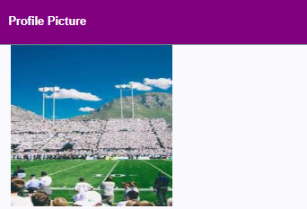
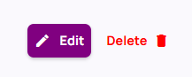
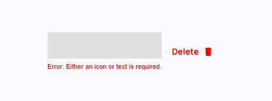
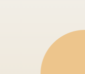
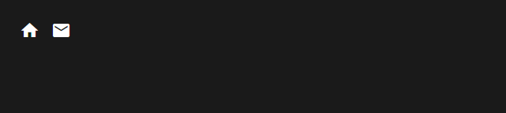
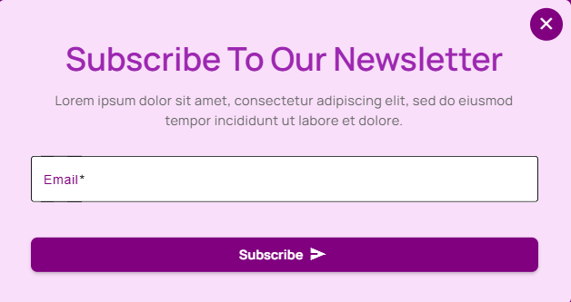

<!-- Custom Table Properties -->

# Custom Table Properties

## key

- Type: string
- Unique identifier for the column, used to bind data.

## title

- Type: string (optional)
- Optional title displayed as the column header.

## order

- Type: number (optional)
- Defines the display order of the columns.

## type

- Type: 'text' | 'image' | 'video' | 'multi' (optional)
- Specifies the content type in the column (text, image, video, or multiple).

## minWidth

- Type: string (optional)
- Minimum width of the column.

## maxWidth

- Type: string (optional)
- Maximum width of the column.

## alignment

- Type: 'left' | 'center' | 'right' | 'top' | 'bottom' (optional)
- Sets the content alignment within the column (left, center, right, top, or bottom).

# Table Config Properties

## isHeader

- Type: boolean
- Determines if the table's header should be displayed.

## columns

- Type: TableColumn[]
- List of column configurations defined by the TableColumn interface.

## tableTitle

- Type: string (optional)
- Title displayed for the table.

## currentPage

- Type: number
- The current page being displayed in the table.

## itemsPerPage

- Type: number
- Number of items displayed per page.

## maxItemsOptions

- Type: number[]
- Array of options for the maximum number of items per page.

## buttons

- Type: { [key: string]: () => void } (optional)
- Object that defines custom actions triggered by specific buttons.

## editableColumns

- Type: string[] (optional)
- List of columns that are editable in the table.

## actions

- Type: ButtonConfig[]
- Array of ButtonConfig objects to define actions like Edit, Delete, etc.

## rowHeight

- Type: string (optional)
- Custom height of each row in the table.

## maxRowHeight

- Type: string (optional)
- Maximum height allowed for each row.

## margin

- Type: string (optional)
- Space between the table and its surroundings.

## elementSpacing

- Type: string (optional)
- Space between elements inside a table cell (e.g., buttons).

## columnAlignments

- Type: any (optional)
- Custom alignment configurations for columns.

## filterWidth

- Type: string (optional)
- Width of the filter input field.

## filterAlignment

- Type: 'left' | 'center' | 'right' (optional)
- Alignment of the filter input (left, center, right).

## showFilter

- Type: boolean
- Controls the visibility of the filter input.

# Button Config Properties

## id

- Type: string (optional)
- Unique identifier for the button.

## text

- Type: string (optional)
- Text label to be displayed on the button.

## icon

- Type: string (optional)
- Icon name to be displayed on the button.

## group

- Type: 'left' | 'right' (optional)
- Button group alignment (left or right).

## align

- Type: 'left' | 'center' | 'right' (optional)
- Alignment of the button within its container.

## showIcon

- Type: boolean (optional)
- Controls whether the icon should be visible.

## iconPosition

- Type: 'left' | 'center' | 'right' | 'full' | 'top' | 'bottom' (optional)
- Defines the position of the icon relative to the text.

## shape

- Type: 'circle' | 'square' | 'rectangle' (optional)
- Defines the button shape.

## corners

- Type: 'rounded' | 'squared' (optional)
- Determines whether the button has rounded or squared corners.

## transparent

- Type: boolean (optional)
- Indicates if the button background should be transparent.

## width

- Type: string (optional)
- Width of the button.

## backgroundColor

- Type: string (optional)
- Sets the button's background color.

## foregroundColor

- Type: string (optional)
- Sets the text or icon color.

## borderColor

- Type: string (optional)
- Sets the button's border color.

## hasBorder

- Type: boolean
- Controls whether the button has a border.

## shadow

- Type: boolean (optional)
- Specifies if a shadow should be applied to the button.

## navigate

- Type: boolean (optional)
- Indicates if clicking the button should navigate to a URL.

## action

- Type: () => void (optional)
- Function to be executed when the button is clicked.

## url

- Type: string (optional)
- URL to navigate to when button is clicked (if navigate is true).

## onClick

- Type: (row: any) => void (optional)
- Function to be executed when the button is clicked, receiving the current row data.

## validate

- Type: () => boolean (optional)
- Function to validate the button's state before action.

## textAlign

- Type: 'left' | 'center' | 'right' (optional)
- Defines the alignment of the button text.

## menuItems

- Type: ButtonConfig[] (optional)
- Array of button configurations for dropdown menu items.

## isMenuButton

- Type: boolean (optional)
- Indicates if the button displays a dropdown menu.

## class

- Type: string (optional)
- Additional CSS class names to apply to the button.

## isPillButton

- Type: boolean (optional)
- Indicates if the button should be styled as a pill (fully rounded rectangle).

## customStyles

- Type: { [key: string]: string } (optional)
- Object containing custom CSS styles to apply to the button.

# Card Component Properties

The card component system supports both individual cards and collections (grid/list layouts). Here's a complete guide to configuring cards using the available properties.

## Card Collection Configurations

### CardGridConfig

A configuration for displaying multiple cards in a grid layout.

#### gridTitle

- Type: string (optional)
- Title displayed above the grid of cards.

#### gridTitleTag

- Type: 'h1' | 'h2' | 'h3' | 'h4' | 'p' (optional)
- HTML tag used for the grid title.

#### gridTitleStyles

- Type: { [key: string]: string } (optional)
- Custom CSS styles applied to the grid title.

#### gridSubtitle

- Type: string (optional)
- Subtitle displayed below the grid title.

#### gridSubtitleTag

- Type: 'h1' | 'h2' | 'h3' | 'h4' | 'p' (optional)
- HTML tag used for the grid subtitle.

#### gridSubtitleStyles

- Type: { [key: string]: string } (optional)
- Custom CSS styles applied to the grid subtitle.

#### layoutType

- Type: 'grid'
- Specifies that this configuration is for a grid layout.

#### gridContainerStyle

- Type: { [key: string]: string } (optional)
- Custom CSS styles applied to the grid container.

#### cardConfigs

- Type: CardConfig[]
- Array of card configurations to be displayed in the grid.

### CardListConfig

A configuration for displaying multiple cards in a list layout.

#### listTitle

- Type: string (optional)
- Title displayed above the list of cards.

#### listTitleTag

- Type: 'h1' | 'h2' | 'h3' | 'h4' | 'p' (optional)
- HTML tag used for the list title.

#### listTitleStyles

- Type: { [key: string]: string } (optional)
- Custom CSS styles applied to the list title.

#### listSubtitle

- Type: string (optional)
- Subtitle displayed below the list title.

#### listSubtitleTag

- Type: 'h1' | 'h2' | 'h3' | 'h4' | 'p' (optional)
- HTML tag used for the list subtitle.

#### listSubtitleStyles

- Type: { [key: string]: string } (optional)
- Custom CSS styles applied to the list subtitle.

#### layoutType

- Type: 'list'
- Specifies that this configuration is for a list layout.

#### listContainerStyle

- Type: { [key: string]: string } (optional)
- Custom CSS styles applied to the list container.

#### cardConfigs

- Type: CardConfig[]
- Array of card configurations to be displayed in the list.

## Individual Card Configuration (CardConfig)

### dynamicComponents

- Type: DynamicComponentConfig[] (optional)
- Array of dynamic components to be rendered within the card.

### iframeUrl

- Type: string (optional)
- URL to be loaded in an iframe within the card.

### iframeHeight

- Type: string (optional)
- Height of the iframe within the card.

### iframeWidth

- Type: string (optional)
- Width of the iframe within the card.

### layout

- Type: 'grid' | 'list' (optional)
- Layout style of the individual card.

### width

- Type: number (optional)
- Width of the card.

### imageAlignment

- Type: 'left' | 'right' (optional)
- Alignment of images within the card.

### sectionWidths

- Type: [number, number] (optional)
- Widths of different sections within the card.

### hasBorder

- Type: boolean (optional)
- Whether the card has a border.

### customStyles

- Type: { [key: string]: string } (optional)
- Custom CSS styles applied to the card.

### hoverStyles

- Type: { [key: string]: string } (optional)
- Custom CSS styles applied to the card on hover.

### cardActions

- Type: { icon: string; text: string; }[] (optional)
- Array of action items (with icons and text) displayed in the card.

### header

Card header configuration containing title, description, buttons, and icons.

#### header.headerStyles

- Type: { [key: string]: string } (optional)
- Custom CSS styles applied to the header section.

#### header.title

- Type: string
- Title text displayed in the card's header.

#### header.titleTag

- Type: 'h1' | 'h2' | 'h3' | 'h4' | 'p' (optional)
- HTML tag used for the title.

#### header.titleStyles

- Type: { [key: string]: string } (optional)
- Custom CSS styles applied to the title.

#### header.titleAlign

- Type: 'left' | 'center' | 'right' (optional)
- Alignment of the title within the header.

#### header.description

- Type: Array of description objects (optional)
- Array of description elements to be displayed in the header.
  - **descriptionText**: Text content for the description.
  - **descriptionTag**: HTML tag for the description ('h1' | 'h2' | 'h3' | 'h4' | 'p').
  - **descriptionStyles**: Custom CSS styles for the description.
  - **descriptionAlign**: Alignment of the description ('left' | 'center' | 'right').

#### header.buttonsAlign

- Type: 'left' | 'center' | 'right' (optional)
- Alignment of buttons within the header.

#### header.buttons

- Type: ButtonConfig[] (optional)
- Array of button configurations for the header.

#### header.icons

- Type: Array of icon objects (optional)
- Icons to be displayed in the header.
  - **icon**: Icon identifier string.
  - **iconStyles**: Custom CSS styles for the icon.
  - **iconPlacement**: Position of the icon ('left' | 'right' | 'top' | 'bottom').

### imagebackgroundShapes

- Type: Array of shape objects (optional)
- Background shapes to be displayed behind images.
  - **type**: Shape type ('rectangle' | 'oval' | 'circle' | 'square' | 'triangle' | 'hexagon' | 'pentagon').
  - **position**: Position of the shape ('top-left' | 'top-right' | 'bottom-left' | 'bottom-right').
  - **styles**: Custom CSS styles for the shape.

### listForegroundImages

- Type: Array of image objects (optional)
- Foreground images to be displayed in list layouts.
  - **src**: Image source URL.
  - **position**: Position of the image ('top-left' | 'top-right' | 'bottom-left' | 'bottom-right').
  - **img-class**: CSS class for the image.
  - **imgStyles**: Custom CSS styles for the image.

### image

- Type: Object (optional)
- Main image configuration for the card.
  - **position**: Position and style of the image ('background' | 'top-half' | 'middle' | 'bottom-half' | 'square-under-title' | 'rectangle-under-title' | 'dark-background-title').
  - **src**: Source URL of the image.
  - **hoverEffect**: Whether to apply hover effects to the image.
  - **title**: Optional title for the image.
  - **description**: Optional description for the image.

### body

- Type: Object (optional)
- Configuration for the card body.
  - **type**: Type of content in the body ('text' | 'text+buttons' | 'table').
  - **align**: Alignment of the content ('left' | 'center' | 'right').
  - **content**: Text content displayed in the body.
  - **buttons**: Array of button configurations for the body.

### content

- Type: Object (optional)
- Additional content configuration.
  - **description**: Additional descriptive text.
  - **customHtml**: Custom HTML content.
  - **details**: Structured detailed content.
    - **align**: Alignment of details ('left' | 'center' | 'right' | 'multi-column').
    - **columns**: Number of columns (1 | 2 | 3).
    - **rows**: Number of rows (1 | 2 | 3).
    - **content**: 2D array of content objects with text and icons.

### footer

- Type: Object (optional)
- Configuration for the card footer.
  - **type**: Type of footer content ('text' | 'buttons').
  - **buttons**: Array of button configurations for the footer.
  - **text**: Text content for the footer.
  - **align**: Alignment of the footer content ('left' | 'center' | 'right' | 'multi-column').

## DynamicComponentConfig

Configuration for dynamic components that can be inserted into cards.

### dynamicComponent

- Type: Type<any>
- Angular component type to be dynamically loaded.

### dynamicComponentConfig

- Type: { [key: string]: any } (optional)
- Configuration object passed to the dynamic component.

# User Properties

## id

- Type: number
- Unique identifier for the user.

## name

- Type: string
- Name of the user.

## email

- Type: string
- Email address of the user.

## role

- Type: string
- Role or designation of the user (e.g., Admin, User).

## imageUrl

- Type: string (optional)
- URL for the user's profile image.

## videoUrl

- Type: string (optional)
- URL for the user's profile video.

## actions

- Type: ButtonConfig[] (optional)
- Array of ButtonConfig objects for actions related to the user (e.g., Edit, Delete).

## contentItems

- Type: { [columnKey: string]: ColumnItem[] } (optional)
- Object containing content data for each column, where the key is the column's identifier, and the value is an array of ColumnItem objects.

## rowAlignments

- Type: { [key: string]: 'left' | 'center' | 'right' } (optional)
- Object defining custom alignment for each key in the row (e.g., left, center, right).

## imageLoading

- Type: boolean (optional)
- Flag indicating if the user's image is still loading.

## videoLoading

- Type: boolean (optional)
- Flag indicating if the user's video is still loading.

# Footer Properties

## FooterColumn Properties

### title?: string;

- An optional title displayed in the footer column.

### description?: string;

- Additional descriptive text for the footer column.

### buttonText?: string;

- The text displayed on a button in the footer column.

### buttonUrl?: string;

- The URL the button redirects to when clicked.

### lineText?: string;

- Optional text displayed as a line separator or under the column content.

### linkUrl?: string;

- A URL associated with the line text or a link in the footer column.

### iconButtons?: { icon: string; url: string }[];

- An array of icon buttons with the following properties:
  - **icon**: The icon displayed on the button.
  - **url**: The URL the button redirects to when clicked.

## FooterConfig Properties

### footerContainerstyle?: { [key: string]: string };

- A CSS-compatible object to style the footer container.

### isSubscribeShow: boolean;

- Determines whether the subscribe section is displayed.

### subscribeButton?: string;

- The text displayed on the subscribe button.

### subscribeDesc?: string;

- A description text for the subscribe section.

### subscribeText?: string;

- Placeholder text for the subscribe input field.

### contactusButton?: string;

- The text displayed on the contact us button.

### logoUrl: string;

- The URL of the logo displayed in the footer.

### description: string;

- A brief description displayed in the footer.

### usefulLinks: { name: string; url: string }[];

- An array of useful links with the following properties:
  - **name**: The text displayed for the link.
  - **url**: The destination URL for the link.

### contact:

- **address**: string; - The contact address displayed in the footer.
- **email**: string; - The contact email displayed in the footer.
- **phone**: string; - The contact phone number displayed in the footer.

### columns: FooterColumn[];

- An array of footer columns containing properties defined in `FooterColumn`.

### iframeUrl?: string;

- URL of an embedded iframe displayed in the footer.

### iframeWidth?: string;

- The width of the iframe, specified as a CSS-compatible value (e.g., `100%`, `500px`).

### iframeHeight?: string;

- The height of the iframe, specified as a CSS-compatible value.

### bottomBar?:

- **logoUrl?**: string; - The URL of the logo displayed in the bottom bar.
- **copyrightText?**: string; - The copyright text displayed in the bottom bar.
- **year?**: number; - The year displayed in the bottom bar.
- **company?**: string; - The name of the company displayed in the bottom bar.
- **backgroundColor?**: string; - The background color of the bottom bar, specified as a CSS-compatible value.
- **align?**: 'left' | 'center' | 'right';
  - **left**: Aligns content to the left.
  - **center**: Centers content.
  - **right**: Aligns content to the right.
- **margin?**: string;
  - Optional margin around the bottom bar, specified as a CSS-compatible value (e.g., `16px`, `1rem`).
- **icons?**: { icon: string; url: string }[];
  - An array of icons displayed in the bottom bar with the following properties:
    - **icon**: The icon displayed.
    - **url**: The URL the icon redirects to when clicked.

# Form Component

## Overview

This Angular form component provides a dynamic and configurable form system with validation, styling, and various field types. It supports multiple input types, validation rules, and customizable styling.

---

## Form Configuration

### FormConfig

- **formTitle**: (optional) `string` - The title of the form.
- **formTitleStyles**: (optional) `{ [key: string]: string }` - Custom CSS styles for the form title.
- **formSubTitle**: (optional) `string` - Subtitle of the form.
- **formSubTitleStyles**: (optional) `{ [key: string]: string }` - Custom CSS styles for the form subtitle.
- **isImageShow**: `boolean` - Determines if an image should be displayed in the form.
- **formWidth**: `number` - The width of the form.
- **fields**: `FormFieldConfig[]` - Array of form fields with configurations.
- **submitButtonConfig**: (optional) `ButtonConfig` - Configuration for the submit button.
- **cancelButtonConfig**: (optional) `ButtonConfig` - Configuration for the cancel button.
- **backgroundColor**: (optional) `string` - Background color of the form.

---

### FormFieldConfig

- **type**: `'text' | 'email' | 'number' | 'date' | 'file' | 'textarea' | 'time' | 'switch' | 'radio' | 'checkbox' | 'password' | 'color' | 'select'` - Specifies the type of the input field.
- **label**: `string` - The label displayed for the field.
- **key**: `string` - Unique identifier for the field.
- **placeholder**: (optional) `string` - Placeholder text for the input field.
- **showFileIcon**: (optional) `boolean` - Whether to show a file icon for file inputs.
- **width**: (optional) `number | string` - Width of the field in pixels or percentage.
- **value**: (optional) `any` - Default value for the field.
- **isPasswordVisible**: (optional) `boolean` - Determines if password fields should be visible.
- **required**: (optional) `boolean` - Whether the field is required.
- **validation**: (optional) `ValidationConfig` - Validation rules for the field.
- **fileConfig**: (optional) `FileConfig` - Configuration options for file inputs.
- **textareaConfig**: (optional) `TextAreaConfig` - Configuration options for textarea inputs.
- **style**: (optional) `StyleConfig` - Custom styles for the field.
- **errorMessages**: (optional) `ErrorMessagesConfig` - Custom error messages for validation.
- **hide**: (optional) `boolean` - Whether the field should be hidden.
- **disabled**: (optional) `boolean` - Whether the field should be disabled.
- **showCheckbox**: (optional) `boolean` - Whether to show a checkbox for field visibility control.
- **buttonConfig**: (optional) `ButtonConfig` - Configuration for buttons inside the form field.
- **options**: (optional) `OptionConfig[]` - List of selectable options (for dropdowns, radio, etc.).
- **defaultValue**: (optional) `any` - Default value assigned to the field.

---

### ToolbarOption

- **type**: `'bold' | 'italic' | 'underline' | 'strike' | 'color' | 'background' | 'blockquote' | 'code-block' | 'header' | 'list' | 'script' | 'indent' | 'direction' | 'size' | 'font' | 'align' | 'link' | 'image' | 'video' | 'clean'` - Type of toolbar formatting option.
- **value**: (optional) `string | number | string[] | boolean` - Configuration value for the toolbar option.

---

### OptionConfig

- **key**: `string` - Unique key for the option.
- **label**: `string` - Display label for the option.
- **value**: `string | number | boolean` - The value associated with the option.
- **status**: (optional) `'available' | 'booked'` - Indicates whether the option is available or booked.

---

## Field Types and Examples

### Text Field

```typescript
{
  type: 'text',
  label: 'First Name',
  key: 'firstName',
  placeholder: 'Enter your first name',
  required: true,
  validation: { minLength: 2, maxLength: 30 },
  errorMessages: {
    required: 'First name is required.',
    minLength: 'First name must be at least 2 characters long.',
    maxLength: 'First name cannot exceed 30 characters.',
  }
}
```

### Email Field

```typescript
{
  type: 'email',
  label: 'Email',
  key: 'email',
  placeholder: 'Enter your email',
  required: true,
  validation: { pattern: '^[a-zA-Z0-9._%+-]+@[a-zA-Z0-9.-]+\\.[a-zA-Z]{2,}$' },
  errorMessages: {
    required: 'Email is required.',
    pattern: 'Enter a valid email address.',
  }
}
```

### Number Field

```typescript
{
  type: 'number',
  label: 'Phone',
  key: 'phone',
  placeholder: 'Enter your phone number',
  validation: { minLength: 10, maxLength: 15 },
  errorMessages: {
    minLength: 'Phone number must be at least 10 digits.',
    maxLength: 'Phone number cannot exceed 15 digits.',
  }
}
```

### Date Field

```typescript
{
  type: 'date',
  label: 'Date of Birth',
  key: 'dob',
  required: true,
  errorMessages: { required: 'Date of Birth is required.' }
}
```

### File Upload Field

```typescript
{
  type: 'file',
  label: 'Upload Document',
  key: 'document',
  fileConfig: { allowedExtensions: ['pdf', 'docx'], maxSize: 5 },
  errorMessages: {
    maxSize: 'File size should not exceed 5MB.',
    allowedExtensions: 'Only PDF and DOCX files are allowed.',
  }
}
```

### Password Field

```typescript
{
  type: 'password',
  label: 'Password',
  key: 'password',
  required: true,
  validation: { minLength: 8 },
  errorMessages: {
    required: 'Password is required.',
    minLength: 'Password must be at least 8 characters long.',
  }
}
```

### Color Picker

```typescript
{
  type: 'color',
  label: 'Choose Color',
  key: 'color',
  value: '#ff0000'
}
```

### Select Dropdown

```typescript
{
  type: 'select',
  label: 'Select Country',
  key: 'country',
  options: [
    { key: 'us', label: 'United States', value: 'US' },
    { key: 'in', label: 'India', value: 'IN' },
  ],
  required: true,
  errorMessages: { required: 'Please select a country.' }
}
```

### Radio Buttons

```typescript
{
  type: 'radio',
  label: 'Gender',
  key: 'gender',
  options: [
    { key: 'male', label: 'Male', value: 'male' },
    { key: 'female', label: 'Female', value: 'female' }
  ],
  required: true,
  errorMessages: { required: 'Please select your gender.' }
}
```

### Checkbox

```typescript
{
          type: 'checkbox',
          label: 'Hobbies',
          key: 'hobbies',
          width: '100%',
          value: [],
          options: [
            { key: 'reading', label: 'Reading', value: 'reading' },
            { key: 'traveling', label: 'traveling', value: 'traveling' },
            { key: 'music', label: 'music', value: 'music' },
          ],
          required: true,
          errorMessages: {
            required: 'Select at least one hobby.',
          },
          showCheckbox: true,
        }
```

### Switch Toggle

```typescript
{
  type: 'switch',
  label: 'Enable Notifications',
  key: 'notifications',
  value: true
}
```

### Textarea Field

```typescript
{
  type: 'textarea',
  label: 'Message',
  key: 'message',
  placeholder: 'Enter your message',
  textareaConfig: { rows: 5 },
}
```

---

# NavBar Properties

## NavBarConfig Properties

### logo?

- Configuration for the navbar logo, defined by the LogoConfig interface.
  If set to null, no logo will be displayed.

### title?

- Configuration for the navbar title, defined by the TitleConfig interface.
  If set to null, no title will be displayed.

### buttons?

- Array of button group configurations, each defined by the ButtonGroupConfig interface.

### activeButton?

- The currently active button's identifier.

### isBorderTop?

- Boolean indicating if a top border should be displayed.

### isBorderBottom?

- Boolean indicating if a bottom border should be displayed.

## LogoConfig Properties

### url?

- The URL of the logo image.

### position?

- The position of the logo within the navbar:
  - left: Aligns the logo to the left.
  - middle: Centers the logo.
  - right: Aligns the logo to the right.

## TitleConfig Properties

### text?

- The text to be displayed as the navbar's title.

### position?

- The position of the title relative to the logo:
  - left: Title appears to the left of the logo.
  - right: Title appears to the right of the logo.

### alignWithLogo?

- true: Title and logo share the same alignment.
- false: Independent alignment for title and logo.

## ButtonGroupConfig Properties

### position?

- The position of the button group within the navbar:
  - left: Buttons appear on the left side.
  - center: Buttons are centered.
  - right: Buttons appear on the right side.

### alignWithLogo?

- true: Button group alignment matches the logo.
- false: Independent alignment for the button group.

### buttonsGroup?

- Array of button configurations, each defined by the NavButtonConfig interface.

## NavButtonConfig Properties

### id?

- A unique identifier for the button.

### text?

- The text displayed on the button.

### url?

- The URL the button navigates to when clicked.

### subMenu?

- Array of submenu configurations, each defined by the SubMenuConfig interface.

### type?

- Defines the button type:
  - normal
  - primary
  - secondary
  - bordered

### icon?

- The icon displayed on the button.

### showIcon?

- Boolean indicating if the icon should be shown.

### iconPosition?

- The position of the icon:
  - left, center, right, full, top, bottom

### shape?

- The shape of the button:
  - circle, square, rectangle

### corners?

- The corner styling of the button:
  - rounded, squared

### transparent?

- Boolean indicating if the button has a transparent background.

### foreground?

- The foreground color of the button.

### background?

- The background color of the button.

### shadow?

- Boolean indicating if the button has a shadow.

### border?

- Boolean indicating if the button has a border.

### navigate?

- Boolean indicating if the button triggers navigation.

### onClick?

- Function executed when the button is clicked.

### validate?

- Function executed to validate the button action.

### menuItems?

- Array of NavButtonConfig items representing a menu structure.

### isMenuButton?

- Boolean indicating if the button acts as a menu toggle.

## SubMenuConfig Properties

### text?

- The text displayed for the submenu item.

### url?

- The URL the submenu item navigates to when clicked.

# Carousel Component

This Angular standalone component displays an image carousel using the Swiper library.

## Configuration

The component accepts an `@Input()` property `config`, which allows customization of carousel behavior.

### Config Properties

#### images (array of objects)

- An array of image objects to be displayed in the carousel.

##### Image Object Properties:

- **src** (`string`)

iframeUrl?: string;

- URL for embedding content in an iframe within the banner.

iframeWidth?: string;

- Width of the iframe in the banner (e.g., "600px" or "100%").

iframeHeight?: string;

- Height of the iframe in the banner (e.g., "400px" or "100%").

forcePagination?: boolean;

- true: Enables pagination even with a small number of images.
- false: Pagination depends on the number of images.

## CarouselButtonsConfig Properties

prevIcon?: string;

- Icon displayed on the "Previous" button of the carousel.

nextIcon?: string;
-Icon displayed on the "Next" button of the carousel.

---

# Examples:

# Custom Material Table

This project demonstrates a customizable material table component in Angular.

## Configuration & Example

### Table Configuration

```typescript
const tableConfig: TableConfig = {
  isHeader: true,
  tableTitle: "Custom Table By Parag",
  columns: [
    { key: "name", title: "Name", type: "text", minWidth: "150px", maxWidth: "250px", alignment: "left" },
    { key: "email", title: "Email", type: "text", minWidth: "150px", maxWidth: "250px", alignment: "left" },
    { key: "role", title: "User Role", type: "text", minWidth: "150px", maxWidth: "250px", alignment: "left" },
    { key: "imageUrl", title: "Profile Picture", type: "image", minWidth: "150px", maxWidth: "250px", alignment: "left" },
    { key: "videoUrl", title: "Profile Video", type: "video", minWidth: "150px", maxWidth: "250px", alignment: "left" },
  ],
  itemsPerPage: 5,
  actions: [
    { icon: "✏️", onClick: this.editUser.bind(this), backgroundColor: "#800080" },
    { icon: "❌", onClick: this.deleteUser.bind(this), backgroundColor: "#000000", transparent: true },
  ],
};
```

### Example Usage

```html
<app-custom-material-table *ngIf="isNewTable" [data]="users" [config]="tableConfig"></app-custom-material-table>
```

## Table Preview

Passing the above configuration results in the following table:


---

## Table Component

# Table Scenarios

## Table Column Alignment Scenarios

### Scenario 1: Changing Column Alignment

> **Description:** The text or media inside the columns should align as specified.

**Example:**

```typescript
{ key: 'name', title: 'Name', alignment: 'center' },
{ key: 'email', title: 'Email', alignment: 'right' }
```

**Test Case:** Ensure the name column aligns to the center and the email column aligns to the right.

### Scenario 2: Default Alignment

> **Description:** If no alignment is specified, the default alignment should be 'left'.

**Example:**

```typescript
{ key: 'email', title: 'Email' }
```

**Test Case:** Ensure the text aligns to the left when no alignment is specified.

## Table Preview


---

## Table Column Width Scenarios

### Scenario 4: Minimum and Maximum Width

> **Description:** Columns should adjust based on the minWidth and maxWidth properties.

**Example:**

```typescript
{ key: 'name', title: 'Name', minWidth: '150px', maxWidth: '250px' }
```

**Test Case:** Ensure the name column is within the width range and does not exceed the defined width.


---

### Scenario 5: Auto Width

> **Description:** When no minWidth or maxWidth is specified, the column should adjust based on its content.

**Example:**

```typescript
{ key: 'email', title: 'Email' }
```

**Test Case:** Verify that the column adjusts naturally based on content.

## Table Row Height Scenarios

### Scenario 6: Fixed Row Height

> **Description:** Set a fixed row height for all rows.

**Example:**

```typescript
rowHeight: "50px";
maxRowHeight: "200px";
```

**Test Case:** Ensure all rows are of fixed height, regardless of content.

### Scenario 7: Variable Row Height Based on Content

> **Description:** Rows should dynamically expand based on their content, especially for images or videos.

**Example:**

```typescript
{ key: 'imageUrl', title: 'Image', type: 'image' } // Rows adjust based on image size
```

**Test Case:** Ensure rows expand as needed when an image is loaded.



---

## Image and Video Loading States

### Scenario 8: Handling Loading State for Images

> **Description:** Display a loader until the image is fully loaded.

**Example:**

```typescript
{ imageUrl: 'https://picsum.photos/200/300', imageLoading: true } // Show loader
```

**Test Case:** Verify that the loader appears while the image is loading and disappears after it's fully loaded.

### Scenario 9: Handling Loading State for Videos

> **Description:** Display a loader until the video is fully loaded or ready to play.

**Example:**

```typescript
{ videoUrl: 'https://www.learningcontainer.com/wp-content/uploads/2020/05/sample-mp4-file.mp4', videoLoading: true } // Show loader
```

**Test Case:** User can play pause expand and download video.


---

---

Actions in Table Scenarios

Scenario 14: Multiple Action Buttons in a Row
Description: Show multiple action buttons (e.g., Edit, Delete) in a single row.
Example:
actions: [
{ text: 'Edit', icon: 'edit', showIcon: true, iconPosition: 'left' },
{ text: 'Delete', icon: 'delete', showIcon: true, iconPosition: 'left' }
]
Test Case: Ensure both buttons are rendered in the actions column.


---

Dynamic Row Alignments

Scenario 16: Set Dynamic Alignments for Individual Rows
Description: Allow different rows to have different alignment settings based on conditions.
Example:
{ rowAlignments: { name: 'center', email: 'right' } }
Test Case: Verify that individual row alignments can differ from column alignments.


---

Changing Table Column Titles Dynamically

Scenario 17: Dynamic Column Title Updates
Description: Dynamically change the title of a column based on certain conditions (e.g., localization).
Example:
{ key: 'name', title: 'Nombre' } // Changing title to Spanish
Test Case: Ensure the title changes appropriately based on the dynamic update.


---

---

filering Columns

Scenario 18: filering Columns
Description: Dynamically change columns Hide/Show.
Example:
Test Case: Verify that the column appears and hide after checked and unchecked.


---

---

Scenario 19: Global Search
Description: here you can see the example of search.
Test Case: Ensure the image where I am searching "Jane".


---

# Button Configuration Guide

## Overview

This document provides details on configuring buttons within the application, including various display scenarios such as text-only buttons, icon-only buttons, and buttons with both icons and text. Below are different configuration scenarios, their descriptions, examples, and test cases.

## Button Configuration Scenarios

### Scenario 10: Default Button with Text Only

> **Description:** Displays a button with only text, without an icon.

**Example:**

```typescript
{ text: 'Edit', showIcon: false }
```

**Test Case:** Ensure the button displays only text and no icon.


---

### Scenario 11: Button with Icon Only

> **Description:** Displays a button with only an icon, without any text.

**Example:**

```typescript
{ icon: '❌', showIcon: true}
```

**Test Case:** Ensure the button displays only an icon, centered.


---

### Scenario 12: Button with Both Icon and Text

> **Description:** Displays a button with both an icon and text.

**Example:**

```typescript
{ text: 'Delete', icon: '❌', showIcon: true, iconPosition: 'left' }
```

**Test Case:** Verify that both the text and the icon appear as configured.


---

### Scenario 13: Changing Button Icon Position

> **Description:** Allows the icon to be positioned on the left, center, or right of the text.

**Example:**

```typescript
{ text: 'Edit', icon: '✏️', showIcon: true, iconPosition: 'right' }
```

**Test Case:** Check that the icon appears on the right side of the text.


---

### Scenario 14: Button with Custom Background and Foreground Colors

> **Description:** Allows setting custom background and foreground colors.

**Example:**

```typescript
{ text: 'Save', backgroundColor: '#008000', foregroundColor: '#FFFFFF' }
```

**Test Case:** Ensure the button appears with the correct colors.


---

### Scenario 15: Button with Shadow Effect

> **Description:** Adds a shadow to the button for a 3D effect.

**Example:**

```typescript
{ text: 'Shadow Button', shadow: true }
```

**Test Case:** Verify that the button displays with a shadow.


---

### Scenario 16: Transparent Button

> **Description:** Allows making the button background transparent.

**Example:**

```typescript
{ text: 'Transparent', transparent: true }
```

**Test Case:** Ensure the button appears with a transparent background.


---

### Scenario 17: Button with Rounded Corners

**Description:** Applies rounded corners to the button.

**Example:**

```typescript
{ text: 'Rounded', corners: 'rounded' }
```

**Test Case:** Check if the button corners are rounded.


---

### Scenario 19: Button with Navigation

> **Description:** Navigates to a URL when clicked.

**Example:**

```typescript
{ text: 'Go to Page', navigate: true, url: 'https://example.com' }
```

**Test Case:** Ensure clicking the button redirects to the given URL.


---

### Scenario 20: Menu Button with Dropdown

> **Description:** Displays a button that opens a menu with options.

**Example:**

```typescript
{
  text: 'Options',
  isMenuButton: true,
  menuItems: [
    { text: 'Settings' },
    { text: 'Logout' }
  ]
}
```

**Test Case:** Verify that clicking the button shows the menu options.


---

---

Customizable Loader for Buttons

Scenario 20: Displaying Loader on Button Click
Description: Replace the button icon with a loader upon clicking until the action completes.
Example:
actions: [
{ text: 'Save', icon: '💾', showIcon: true, iconPosition: 'left', isLoading: true }
]
Test Case: Check that the loader replaces the icon on button click and reverts after the action is complete.


---

# **Button Component Documentation**

## **Overview**

The **Button Component** is a customizable UI element that allows users to trigger actions such as navigation, form submission, or UI changes. It supports various shapes, styles, and interaction behaviors.

---

---

### **Example Usage**

```html
<app-custom-button [text]="button.text" [icon]="button.icon" [showIcon]="button.showIcon" [iconPosition]="button.iconPosition" [shape]="button.shape" [corners]="button.corners" [hasBorder]="button.hasBorder ?? false" [borderColor]="button.borderColor" [foregroundColor]="button.foregroundColor" [backgroundColor]="button.backgroundColor" [transparent]="button.transparent" [shadow]="button.shadow" [navigate]="button.navigate ?? false" [url]="button.url ?? ''" [id]="button.id ?? ''" (buttonClick)="button.action?.()" [onClick]="button.onClick" [menuItems]="button.menuItems" [isMenuButton]="button.isMenuButton" [customStyles]="button.customStyles ?? {}" [isPillButton]="button.isPillButton ?? false"> </app-custom-button>
```

---

## **Action Buttons Example**

```typescript
actions: [
  {
    text: "Edit",
    icon: "edit",
    showIcon: true,
    iconPosition: "left",
    onClick: this.editUser.bind(this),
    shape: "square",
    hasBorder: false,
    corners: "rounded",
    foregroundColor: "#fff",
    backgroundColor: "#800080",
    shadow: true,
    transparent: false,
  },
  {
    text: "Delete",
    icon: "delete",
    showIcon: true,
    iconPosition: "right",
    onClick: this.deleteUser.bind(this),
    hasBorder: false,
    shape: "square",
    corners: "rounded",
    foregroundColor: "#ff0000",
    backgroundColor: "#black",
    borderColor: "2px solid red",
    shadow: true,
    transparent: true,
  },
];
```

---

## **Button in Action**



---

## **Overview**

The **Button Component** allows customization of shape, color, transparency, and actions such as validation and navigation.

---

## **Scenario 26: Change the Corners of the Button**

### **Description**

Modify the button's corner styling to be `rounded` or `squared`.

### **Example**

```typescript
actions: [
  {
    text: "Edit",
    icon: "edit",
    showIcon: true,
    iconPosition: "left",
    onClick: this.editUser.bind(this),
    shape: "square",
    corners: "rounded",
    foreground: "#ffffff",
    background: "#1976d2",
    shadow: true,
    transparent: false,
  },
  {
    text: "Delete",
    icon: "delete",
    showIcon: true,
    iconPosition: "right",
    onClick: this.deleteUser.bind(this),
    shape: "square",
    corners: "squared",
    foreground: "#ff0000",
    background: "#000000",
    shadow: false,
    transparent: true,
  },
];
```


---

## **Scenario 27: Make the Button Transparent**

### **Description**

Enable or disable button transparency.

### **Example**

```typescript
actions: [
  {
    text: "Edit",
    icon: "edit",
    showIcon: true,
    iconPosition: "left",
    onClick: this.editUser.bind(this),
    shape: "square",
    corners: "rounded",
    foreground: "#ffffff",
    background: "#1976d2",
    shadow: true,
    transparent: false,
  },
  {
    text: "Delete",
    icon: "delete",
    showIcon: true,
    iconPosition: "right",
    onClick: this.deleteUser.bind(this),
    shape: "square",
    corners: "squared",
    foreground: "#ff0000",
    background: "#000000",
    shadow: false,
    transparent: false,
  },
];
```


---

## **Scenario 28: Change the Foreground Color**

### **Description**

Modify the text color of the button.

### **Example**

```typescript
{
            id: 'schedule-a-call',
            text: 'Schedule A Call',
            icon: 'wifi_calling',
            showIcon: true,
            iconPosition: 'right',
            shape: 'rectangle',
            corners: 'rounded',
            foregroundColor: '#DD8208',
            transparent: true,
            hasBorder: true,
            borderColor: '#DD8208',
            shadow: false,
            navigate: true,
            url: '/call',
            isPillButton: true,
            // onClick: (event: Event) => this.handleClick(event),
          },
```


---

## **Scenario 29: Change the Background Color**

### **Description**

Modify the background color of the button.

### **Example**

```typescript
buttons: [
        {
          text: 'Get a Free Consultation',
          hasBorder: false,
          isPillButton: true,
          backgroundColor: '#15A46E',
          customStyles: {
            padding: '16px 24px',
          },
        },
        {
          text: 'See My Work',
          hasBorder: false,
          isPillButton: true,
          backgroundColor: '#DD8208',
          customStyles: {
            padding: '16px 24px',
          },
        },
      ],
```


---

## **Scenario 30: Show Button Shadow**

### **Description**

Enable or disable the shadow effect on the button.

### **Example**

```typescript
{
            id: 'login',
            text: 'Login',
            icon: '',
            showIcon: false,
            shape: 'rectangle',
            corners: 'rounded',
            foregroundColor: 'var(--primary-text-color)',
            transparent: true,
            hasBorder: true,
            borderColor: 'var(--primary-text-color)',
            shadow: true,
            navigate: true,
            url: '/login',
          }
```


---

## **Scenario 31: Validate Button Content**

### **Description**

Ensure buttons have text or an icon; otherwise, show an error.

### **Example**

```typescript
actions: [
  {
    text: "",
    icon: "",
    showIcon: true,
    iconPosition: "left",
    onClick: this.editUser.bind(this),
    shape: "square",
    hasBorder: false,
    corners: "rounded",
    foregroundColor: "#fff",
    backgroundColor: "#800080",
    shadow: true,
    transparent: false,
  },
  {
    text: "Delete",
    icon: "delete",
    showIcon: true,
    iconPosition: "right",
    onClick: this.deleteUser.bind(this),
    hasBorder: false,
    shape: "square",
    corners: "rounded",
    foregroundColor: "#ff0000",
    backgroundColor: "#black",
    borderColor: "2px solid red",
    shadow: false,
    transparent: true,
  },
];
```



---

---

# Card Component Configuration

This document provides configuration details for the **Card Component**, which supports **grid** and **list** layouts.

## Card Layout Types

The card component can be displayed in two different layouts:

- **Grid Layout** (`layoutType: 'grid'`)
- **List Layout** (`layoutType: 'list'`)

---

## 📌 Grid Configuration

### **gridTitle**

- **Type:** `string`
- **Description:** Title of the grid section.

### **gridTitleTag**

- **Type:** `'h1' | 'h2' | 'h3' | 'h4' | 'p'`
- **Description:** HTML tag for the grid title.

### **gridTitleStyles**

- **Type:** `{ [key: string]: string }`
- **Description:** Custom styles for the grid title.

### **gridSubtitle**

- **Type:** `string`
- **Description:** Subtitle for the grid section.

### **gridSubtitleTag**

- **Type:** `'h1' | 'h2' | 'h3' | 'h4' | 'p'`
- **Description:** HTML tag for the grid subtitle.

### **gridSubtitleStyles**

- **Type:** `{ [key: string]: string }`
- **Description:** Custom styles for the grid subtitle.

### **gridContainerStyle**

- **Type:** `{ [key: string]: string }`
- **Description:** Custom styles for the grid container.

### **cardConfigs**

- **Type:** `CardConfig[]`
- **Description:** List of card configurations inside the grid.

---

## 📌 List Configuration

### **listTitle**

- **Type:** `string`
- **Description:** Title of the list section.

### **listTitleTag**

- **Type:** `'h1' | 'h2' | 'h3' | 'h4' | 'p'`
- **Description:** HTML tag for the list title.

### **listTitleStyles**

- **Type:** `{ [key: string]: string }`
- **Description:** Custom styles for the list title.

### **listSubtitle**

- **Type:** `string`
- **Description:** Subtitle for the list section.

### **listSubtitleTag**

- **Type:** `'h1' | 'h2' | 'h3' | 'h4' | 'p'`
- **Description:** HTML tag for the list subtitle.

### **listSubtitleStyles**

- **Type:** `{ [key: string]: string }`
- **Description:** Custom styles for the list subtitle.

### **listContainerStyle**

- **Type:** `{ [key: string]: string }`
- **Description:** Custom styles for the list container.

### **cardConfigs**

- **Type:** `CardConfig[]`
- **Description:** List of card configurations inside the list.

---

## 📌 Card Configuration

### **layout**

- **Type:** `'grid' | 'list'`
- **Description:** Defines the layout type for the card.

### **width**

- **Type:** `number`
- **Description:** Width of the card.

### **imageAlignment**

- **Type:** `'left' | 'right'`
- **Description:** Defines the alignment of the image inside the card.

### **sectionWidths**

- **Type:** `[number, number]`
- **Description:** Defines the width distribution of sections within the card.

### **hasBorder**

- **Type:** `boolean`
- **Description:** Whether the card has a border or not.

### **customStyles**

- **Type:** `{ [key: string]: string }`
- **Description:** Custom styles for the card.

### **hoverStyles**

- **Type:** `{ [key: string]: string }`
- **Description:** Styles applied when hovering over the card.

### **cardActions**

- **Type:** `{ icon: string; text: string; }[]`
- **Description:** List of actions that can be performed on the card.

### **header**

- **Type:** `{ title: string; titleTag?: 'h1' | 'h2' | 'h3' | 'h4' | 'p'; titleStyles?: { [key: string]: string }; }`
- **Description:** Header configuration for the card.

### **image**

- **Type:** `{ src?: string; position?: 'background' | 'top-half' | 'middle' | 'bottom-half'; }`
- **Description:** Image settings for the card.

### **body**

- **Type:** `{ type: 'text' | 'text+buttons' | 'table'; content: string; }`
- **Description:** Body content of the card.

### **footer**

- **Type:** `{ type: 'text' | 'buttons'; text: string; }`
- **Description:** Footer configuration for the card.

## Usage Example

```html
<app-card-component [cardGridConfig]="cardGridConfig" [cardListConfig]="cardListConfig" [isGrid]="checked" [carouselConfig]="carouselConfig"></app-card-component>
```

### Grid View Screenshot


---

### List View Screenshot


---

# Cart List Component

The `Cart List Component` is a reusable, dynamic card-based UI component designed to display various content layouts. It supports configurable sections such as images, text, actions, shapes, and buttons.

## Features

- **Dynamic Image Integration**: Supports multiple positions and styles.
- **Shape Customization**: Use various shapes for aesthetic enhancements.
- **Configurable Sections**: Header, Body, Actions, and Footer customization.
- **Skeleton Loader**: Enhances the user experience during data fetching.
- **Dynamic Buttons & Actions**: Interactive buttons with navigation and actions.
- **IFrame Support**: Embed external content seamlessly.

## Sections & Usage

### 1. List Section

The List Section displays content in a structured way. It can include:

- **Header**: Title, Description, and Custom Styling.
- **Body**: Text-based content with buttons.
- **Actions**: Interactive buttons or icons.
- **Footer**: Additional buttons or information.

Example Configuration:

```typescript
cardConfig = {
  header: {
    title: "Product Name",
    description: "Brief description about the product",
    titleAlign: "center",
    titleTag: "h2",
  },
  body: {
    type: "text+buttons",
    content: "This is the body content.",
    buttons: [{ text: "Buy Now", action: () => alert("Clicked!") }],
  },
  footer: {
    type: "buttons",
    buttons: [{ text: "More Info", action: () => console.log("More Info") }],
  },
};
```


### 2. Shape Wrapper

The Shape Wrapper is used to add decorative shapes to enhance the UI experience.

- Supports multiple shape types: `rectangle`, `oval`, `circle`, `square`, `triangle`, `hexagon`, `pentagon`.
- Shapes can be positioned in different corners: `top-left`, `top-right`, `bottom-left`, `bottom-right`.

Example Configuration:

```typescript
shapes = [
  { type: "circle", position: "top-left", styles: { width: "50px", height: "50px", backgroundColor: "red" } },
  { type: "rectangle", position: "bottom-right", styles: { width: "100px", height: "50px", backgroundColor: "blue" } },
];
```




### 3. Section Wrapper

The Section Wrapper allows for better organization of content with optional image overlays.

- Supports images with positions: `top-left`, `top-right`, `bottom-left`, `bottom-right`.
- Custom styling is available.

Example Configuration:

```typescript
images = [{ src: "assets/sample.png", position: "top-left", imgStyles: { width: "50px", height: "50px" } }];
```


## Possible Scenarios

### 1. Product Card

- **Use Case**: Displaying product details with an image, description, and purchase buttons.
- **Components Used**: `Image`, `Header`, `Body`, `Footer`.

### 2. User Profile Card

- **Use Case**: Show user details along with an avatar and action buttons.
- **Components Used**: `Image`, `Header`, `Actions`.

### 3. Information Card with Shapes

- **Use Case**: Display text-based information enhanced with shapes.
- **Components Used**: `Shape Wrapper`, `Body`, `Footer`.

### 4. Promotional Card

- **Use Case**: Highlight discounts and offers with vibrant shapes and buttons.
- **Components Used**: `Shape Wrapper`, `Image`, `Buttons`.

## Usage Example

Import and use the component in your project:

```typescript
import { CartListComponent } from 'cart-list-component';

<CartListComponent [config]="cardConfig" />
```


## Configuration Options

| Property           | Type      | Description                                   |
| ------------------ | --------- | --------------------------------------------- |
| `header`           | Object    | Defines the title, description, and alignment |
| `body`             | Object    | Specifies content type and actions            |
| `footer`           | Object    | Configures footer buttons and information     |
| `shapes`           | Array     | Defines decorative shapes with styles         |
| `images`           | Array     | Embeds images with positions                  |
| `section`          | Array     | Embeds additional images with positions       |
| `DynamicComponent` | Component | Inject components inside list Component       |

---

# Form Configuration Guide

This document provides details on how to configure forms using the provided `FormConfig` and `FormFieldConfig` interfaces.

## FormConfig Structure

```typescript
export interface FormConfig {
  formTitle?: string;
  formTitleStyles?: { [key: string]: string };
  formSubTitle?: string;
  formSubTitleStyles?: { [key: string]: string };
  isImageShow: boolean;
  formWidth: number;
  fields: FormFieldConfig[];
  submitButtonConfig?: ButtonConfig;
  cancelButtonConfig?: ButtonConfig;
  backgroundColor?: string;
}
```

---

## Field Types and Examples

### Text Field

```typescript
{
  type: 'text',
  label: 'Name',
  key: 'name',
  placeholder: 'Enter your name',
  required: true,
  validation: {
    minLength: 3,
    maxLength: 50
  }
}
```


---

### Email Field

```typescript
{
  type: 'email',
  label: 'Email',
  key: 'email',
  placeholder: 'Enter your email',
  required: true,
  validation: {
    pattern: "^[a-zA-Z0-9._%+-]+@[a-zA-Z0-9.-]+\.[a-zA-Z]{2,}$"
  }
}
```


---

### Number Field

```typescript
{
  type: 'number',
  label: 'Age',
  key: 'age',
  placeholder: 'Enter your age',
  required: true,
  validation: {
    minValue: 18,
    maxValue: 100
  }
}
```


---

### Date Field

```typescript
{
  type: 'date',
  label: 'Date of Birth',
  key: 'dob',
  required: true
}
```


---

### File Upload

```typescript
{
  type: 'file',
  label: 'Upload Profile Picture',
  key: 'profilePic',
  fileConfig: {
    allowedTypes: ['image/png', 'image/jpeg']
  }
}
```


---

### Textarea

```typescript
{
  type: 'textarea',
  label: 'Description',
  key: 'description',
  textareaConfig: {
    rows: 5
  }
}
```


---

### Password Field

```typescript
{
  type: 'password',
  label: 'Password',
  key: 'password',
  required: true,
  validation: {
    minLength: 6
  }
}
```


---

### Checkbox

```typescript
{
  type: 'checkbox',
  label: 'Accept Terms',
  key: 'terms',
  required: true
}
```


---

---

### Color

```typescript
{
  type: 'color',
  label: 'Brand Color',
  key: 'color',
  required: true
}
```


---

### Radio Button

```typescript
{
  type: 'radio',
  label: 'Gender',
  key: 'gender',
  options: [
    { key: 'male', label: 'Male', value: 'male' },
    { key: 'female', label: 'Female', value: 'female' }
  ]
}
```


---

### Select Dropdown

```typescript
{
  type: 'select',
  label: 'Country',
  key: 'country',
  options: [
    { key: 'india', label: 'India', value: 'IN' },
    { key: 'usa', label: 'USA', value: 'US' }
  ]
}
```


---

### Switch Toggle

```typescript
{
  type: 'switch',
  label: 'Enable Notifications',
  key: 'notifications'
}
```


---

## Validation Configuration

```typescript
export interface ValidationConfig {
  minLength?: number;
  maxLength?: number;
  minValue?: number;
  maxValue?: number;
  pattern?: string;
  minTime?: string;
  maxTime?: string;
  customErrorMessage?: string;
  match?: string;
}
```

### Example Validation Messages

```typescript
{
  errorMessages: {
    required: 'This field is required',
    minLength: 'Minimum length is 3 characters',
    maxLength: 'Maximum length is 50 characters',
    pattern: 'Invalid format'
  }
}
```

---

## Styling Configuration

```typescript
export interface StyleConfig {
  class?: string;
  inlineStyles?: { [key: string]: string };
}
```

Example:

```typescript
{
  style: {
    class: 'custom-input',
    inlineStyles: { color: 'blue', fontSize: '14px' }
  }
}
```

---

# Navbar Component

## Overview

The `NavbarComponent` is a customizable navigation bar that supports logos, titles, buttons, and menus. It is designed to be flexible and can be used in various applications requiring navigation elements.

## Features

- Supports logo with configurable position.
- Customizable title alignment.
- Multiple button groups with various styles.
- Menu and submenu functionality.
- Configurable navbar styling (border, color, position, etc.).

## Configuration Options

### `NavBarConfig` Interface

```ts
export interface NavBarConfig {
  style?: Partial<CSSStyleDeclaration>;
  logo?: LogoConfig | null;
  title?: TitleConfig | null;
  buttons?: ButtonGroupConfig[];
  activeButton?: string;
  isBorderTop?: boolean;
  isBorderBottom?: boolean;
}
```

### `LogoConfig`

```ts
export interface LogoConfig {
  url?: string;
  position?: "left" | "middle" | "right";
}
```

- **Example:**

```ts
logo: {
  url: './assets/logo.png',
  position: 'left'
}
```

### `TitleConfig`

```ts
export interface TitleConfig {
  text?: string;
  position?: "left" | "right";
  alignWithLogo?: boolean;
}
```

- **Example:**

```ts
title: {
  text: 'My Application',
  position: 'left',
  alignWithLogo: true
}
```

### `ButtonGroupConfig`

```ts
export interface ButtonGroupConfig {
  position?: "left" | "center" | "right";
  alignWithLogo?: boolean;
  buttonsGroup?: ButtonConfig[];
}
```

- **Example:**

```ts
buttons: [
  {
    position: "center",
    alignWithLogo: true,
    buttonsGroup: [
      { id: "home", text: "Home", navigate: true, url: "/" },
      { id: "about", text: "About Us", navigate: true, url: "/about" },
    ],
  },
];
```

### `NavButtonConfig`

```ts
export interface NavButtonConfig {
  id?: string;
  text?: string;
  url?: string;
  subMenu?: SubMenuConfig[];
  type?: "normal" | "primary" | "secondary" | "bordered";
  icon?: string;
  showIcon?: boolean;
  iconPosition?: "left" | "center" | "right" | "full" | "top" | "bottom";
  shape?: "circle" | "square" | "rectangle";
  corners?: "rounded" | "squared";
  transparent?: boolean;
  foreground?: string;
  background?: string;
  shadow?: boolean;
  border?: boolean;
  navigate?: boolean;
  onClick?: (row: any) => void;
  validate?: () => boolean;
  menuItems?: NavButtonConfig[];
  isMenuButton?: boolean;
}
```

- **Example:**

```ts
{
  id: 'contact',
  text: 'Contact Us',
  shape: 'rectangle',
  corners: 'rounded',
  foreground: '#333333',
  background: '#800080',
  navigate: true,
  url: '/contact'
}
```

### `SubMenuConfig`

```ts
export interface SubMenuConfig {
  text?: string;
  url?: string;
}
```

- **Example:**

```ts
{
  text: 'Support',
  url: '/support'
}
```

## Example Navbar Configuration

```ts
navbarConfig: NavBarConfig = {
  isBorderTop: false,
  isBorderBottom: true,
  style: {
    maxWidth: "1280px",
    position: "fixed",
    padding: "12px 40px",
    top: "55px",
    left: "50%",
    transform: "translateX(-50%)",
    borderRadius: "80px",
    borderBottomColor: "#15A46E",
    zIndex: "500",
  },
  logo: {
    url: "./assets/logo.png",
    position: "left",
  },
  buttons: [
    {
      position: "center",
      alignWithLogo: true,
      buttonsGroup: [
        {
          id: "home",
          text: "Home",
          shape: "rectangle",
          corners: "rounded",
          foreground: "#333333",
          background: "#800080",
          navigate: true,
          url: "/",
        },
        {
          id: "services",
          text: "Services",
          shape: "rectangle",
          corners: "rounded",
          foreground: "#333333",
          background: "var(--primary-color)",
          navigate: true,
          url: "/services",
        },
        {
          id: "contact",
          text: "Contact Us",
          shape: "rectangle",
          corners: "rounded",
          foreground: "#333333",
          background: "#800080",
          navigate: true,
          url: "/contact",
        },
      ],
    },
  ],
};
```

## Validations

- **Required Fields**: Ensure `id`, `text`, and `url` are provided for each button.
- **Navigation**: If `navigate` is true, `url` should be valid.
- **Styling**: Ensure color codes are in proper format (`#RRGGBB` or CSS color names).
- **Button Groups**: At least one button group should be present.

## 

## 


# Card Component Properties

Scenario 93: Change the width of the Cards.

Description: Change the width of the cards when the toggle button is on.

Example:

`maxWidth = '400px';

cardConfigs: CardConfig[] = [{
//layout: 'grid',
// width: 100,
header: {
title: 'Chihuahua 1',
align: 'center',
buttonsAlign: 'left',
buttons: [{
text: 'Edit',
align: 'left',
icon: '✏️'
},
{
text: 'Delete',
align: 'right',
icon: '✏️'
},
],
},
image: {
position: 'top-half',
src: 'https://media.istockphoto.com/id/1934523700/photo/close-up-on-man-hand-using-mobile-phone.jpg?s=1024x1024&w=is&k=20&c=8rb1PLOQMgOY52356fBOBjWfVknpGT-uxfeJk_h3ols=',
title: 'Title on Image',
description: 'This is a description shown on hover.',
hoverEffect: false,
},
content: {
description: 'This is the main content description for Chihuahua 1.',
customHtml: '<p>Custom HTML content here</p>',
details: {
align: 'multi-column',
columns: 2,
rows: 2,
content: [
[{
text: 'Detail 1',
icon: '🔍'
},
{
text: 'Detail 2',
icon: '📅'
},
],
[{
text: 'Detail 3',
icon: '💼'
},
{
text: 'Detail 4',
icon: '🌍'
},
],
],
},
},
body: {
type: 'text',
align: 'center',
content: `The Chihuahua is a Mexican breed of toy dog.`,
buttons: [{
text: 'More Info',
align: 'center'
}],
},
footer: {
type: 'buttons',
align: 'left',
text: 'This is a dynamically aligned footer text',
buttons: [{
text: 'Edit',
align: 'left',
group: 'left',
icon: '✏️',
showIcon: true,
iconPosition: 'left',
shape: 'square',
corners: 'rounded',
foreground: '#ffffff',
background: '#1976d2',
shadow: true,
transparent: false,
},
{
text: 'Cancel',
align: 'left',
group: 'left'
},
{
text: 'Submit',
align: 'right',
group: 'right'
},
],
},
},
{
//layout: 'list', //Use the list layout
// width: 100,
header: {
title: 'Chihuahua 2',
align: 'center',
buttonsAlign: 'left',
buttons: [{
text: 'Edit',
align: 'left',
icon: '✏️'
},
{
text: 'Delete',
align: 'right',
icon: '✏️'
},
],
},
image: {
position: 'top-half',
src: 'https://media.istockphoto.com/id/1934523700/photo/close-up-on-man-hand-using-mobile-phone.jpg?s=1024x1024&w=is&k=20&c=8rb1PLOQMgOY52356fBOBjWfVknpGT-uxfeJk_h3ols=',
title: 'Title on Image',
description: 'This is a description shown on hover.',
hoverEffect: false,
},
content: {
description: 'This is the main content description for Chihuahua 2.',
customHtml: '<p>Custom HTML content here</p>',
details: {
align: 'multi-column',
columns: 2,
rows: 2,
content: [
[{
text: 'Detail 1',
icon: '🔍'
},
{
text: 'Detail 2',
icon: '📅'
},
],
[{
text: 'Detail 3',
icon: '💼'
},
{
text: 'Detail 4',
icon: '🌍'
},
],
],
},
},
body: {
type: 'text',
align: 'center',
content: `The Chihuahua is a Mexican breed of toy dog.`,
buttons: [{
text: 'More Info',
align: 'center'
}],
},
footer: {
type: 'buttons',
align: 'left',
text: 'This is a dynamically aligned footer text',
buttons: [{
text: 'Edit',
align: 'left',
group: 'left',
icon: '✏️',
showIcon: true,
iconPosition: 'left',
shape: 'square',
corners: 'rounded',
foreground: '#ffffff',
background: '#1976d2',
shadow: true,
transparent: false,
},
{
text: 'Cancel',
align: 'left',
group: 'left'
},
{
text: 'Submit',
align: 'right',
group: 'right'
},
],
},
},
{
//layout: 'list',
// width: 100,
header: {
title: 'Chihuahua 2',
align: 'center',
buttonsAlign: 'left',
buttons: [{
text: 'Edit',
align: 'left',
icon: '✏️'
},
{
text: 'Delete',
align: 'right',
icon: '✏️'
},
],
},
image: {
position: 'top-half',
src: 'https://media.istockphoto.com/id/1934523700/photo/close-up-on-man-hand-using-mobile-phone.jpg?s=1024x1024&w=is&k=20&c=8rb1PLOQMgOY52356fBOBjWfVknpGT-uxfeJk_h3ols=',
title: 'Title on Image',
description: 'This is a description shown on hover.',
hoverEffect: false,
},
content: {
description: 'This is the main content description for Chihuahua 2.',
customHtml: '<p>Custom HTML content here</p>',
details: {
align: 'multi-column',
columns: 2,
rows: 2,
content: [
[{
text: 'Detail 1',
icon: '🔍'
},
{
text: 'Detail 2',
icon: '📅'
},
],
[{
text: 'Detail 3',
icon: '💼'
},
{
text: 'Detail 4',
icon: '🌍'
},
],
],
},
},
body: {
type: 'text',
align: 'center',
content: `The Chihuahua is a Mexican breed of toy dog.`,
buttons: [{
text: 'More Info',
align: 'center'
}],
},
footer: {
type: 'buttons',
align: 'left',
text: 'This is a dynamically aligned footer text',
buttons: [{
text: 'Edit',
align: 'left',
group: 'left',
icon: '✏️',
showIcon: true,
iconPosition: 'left',
shape: 'square',
corners: 'rounded',
foreground: '#ffffff',
background: '#1976d2',
shadow: true,
transparent: false,
},
{
text: 'Cancel',
align: 'left',
group: 'left'
},
{
text: 'Submit',
align: 'right',
group: 'right'
},
],
},
},
{
//layout: 'list',
// width: 100,
header: {
title: 'Chihuahua 2',
align: 'center',
buttonsAlign: 'left',
buttons: [{
text: 'Edit',
align: 'left',
icon: '✏️'
},
{
text: 'Delete',
align: 'right',
icon: '✏️'
},
],
},
image: {
position: 'top-half',
src: 'https://media.istockphoto.com/id/1934523700/photo/close-up-on-man-hand-using-mobile-phone.jpg?s=1024x1024&w=is&k=20&c=8rb1PLOQMgOY52356fBOBjWfVknpGT-uxfeJk_h3ols=',
title: 'Title on Image',
description: 'This is a description shown on hover.',
hoverEffect: false,
},
content: {
description: 'This is the main content description for Chihuahua 2.',
customHtml: '<p>Custom HTML content here</p>',
details: {
align: 'multi-column',
columns: 2,
rows: 2,
content: [
[{
text: 'Detail 1',
icon: '🔍'
},
{
text: 'Detail 2',
icon: '📅'
},
],
[{
text: 'Detail 3',
icon: '💼'
},
{
text: 'Detail 4',
icon: '🌍'
},
],
],
},
},
body: {
type: 'text',
align: 'center',
content: `The Chihuahua is a Mexican breed of toy dog.`,
buttons: [{
text: 'More Info',
align: 'center'
}],
},
footer: {
type: 'buttons',
align: 'left',
text: 'This is a dynamically aligned footer text',
buttons: [{
text: 'Edit',
align: 'left',
group: 'left',
icon: '✏️',
showIcon: true,
iconPosition: 'left',
shape: 'square',
corners: 'rounded',
foreground: '#ffffff',
background: '#1976d2',
shadow: true,
transparent: false,
},
{
text: 'Cancel',
align: 'left',
group: 'left'
},
{
text: 'Submit',
align: 'right',
group: 'right'
},
],
},
},
{
//layout: 'list', //Use the list layout
// width: 100,
header: {
title: 'Chihuahua 2',
align: 'center',
buttonsAlign: 'left',
buttons: [{
text: 'Edit',
align: 'left',
icon: '✏️'
},
{
text: 'Delete',
align: 'right',
icon: '✏️'
},
],
},
image: {
position: 'top-half',
src: 'https://media.istockphoto.com/id/1934523700/photo/close-up-on-man-hand-using-mobile-phone.jpg?s=1024x1024&w=is&k=20&c=8rb1PLOQMgOY52356fBOBjWfVknpGT-uxfeJk_h3ols=',
title: 'Title on Image',
description: 'This is a description shown on hover.',
hoverEffect: false,
},
content: {
description: 'This is the main content description for Chihuahua 2.',
customHtml: '<p>Custom HTML content here</p>',
details: {
align: 'multi-column',
columns: 2,
rows: 2,
content: [
[{
text: 'Detail 1',
icon: '🔍'
},
{
text: 'Detail 2',
icon: '📅'
},
],
[{
text: 'Detail 3',
icon: '💼'
},
{
text: 'Detail 4',
icon: '🌍'
},
],
],
},
},
body: {
type: 'text',
align: 'center',
content: `The Chihuahua is a Mexican breed of toy dog.`,
buttons: [{
text: 'More Info',
align: 'center'
}],
},
footer: {
type: 'buttons',
align: 'left',
text: 'This is a dynamically aligned footer text',
buttons: [{
text: 'Edit',
align: 'left',
group: 'left',
icon: '✏️',
showIcon: true,
iconPosition: 'left',
shape: 'square',
corners: 'rounded',
foreground: '#ffffff',
background: '#1976d2',
shadow: true,
transparent: false,
},
{
text: 'Cancel',
align: 'left',
group: 'left'
},
{
text: 'Submit',
align: 'right',
group: 'right'
},
],
},
},
];`


---

Scenario 94: Toggle button is off to show the cards as list view.

Description: Toggle button is off to show the cards as list view.

Example:

`maxWidth = '400px';

cardConfigs: CardConfig[] = [{
//layout: 'grid',
// width: 100,
header: {
title: 'Chihuahua 1',
align: 'center',
buttonsAlign: 'left',
buttons: [{
text: 'Edit',
align: 'left',
icon: '✏️'
},
{
text: 'Delete',
align: 'right',
icon: '✏️'
},
],
},
image: {
position: 'top-half',
src: 'https://media.istockphoto.com/id/1934523700/photo/close-up-on-man-hand-using-mobile-phone.jpg?s=1024x1024&w=is&k=20&c=8rb1PLOQMgOY52356fBOBjWfVknpGT-uxfeJk_h3ols=',
title: 'Title on Image',
description: 'This is a description shown on hover.',
hoverEffect: false,
},
content: {
description: 'This is the main content description for Chihuahua 1.',
customHtml: '<p>Custom HTML content here</p>',
details: {
align: 'multi-column',
columns: 2,
rows: 2,
content: [
[{
text: 'Detail 1',
icon: '🔍'
},
{
text: 'Detail 2',
icon: '📅'
},
],
[{
text: 'Detail 3',
icon: '💼'
},
{
text: 'Detail 4',
icon: '🌍'
},
],
],
},
},
body: {
type: 'text',
align: 'center',
content: `The Chihuahua is a Mexican breed of toy dog.`,
buttons: [{
text: 'More Info',
align: 'center'
}],
},
footer: {
type: 'buttons',
align: 'left',
text: 'This is a dynamically aligned footer text',
buttons: [{
text: 'Edit',
align: 'left',
group: 'left',
icon: '✏️',
showIcon: true,
iconPosition: 'left',
shape: 'square',
corners: 'rounded',
foreground: '#ffffff',
background: '#1976d2',
shadow: true,
transparent: false,
},
{
text: 'Cancel',
align: 'left',
group: 'left'
},
{
text: 'Submit',
align: 'right',
group: 'right'
},
],
},
},
{
//layout: 'list', //Use the list layout
// width: 100,
header: {
title: 'Chihuahua 2',
align: 'center',
buttonsAlign: 'left',
buttons: [{
text: 'Edit',
align: 'left',
icon: '✏️'
},
{
text: 'Delete',
align: 'right',
icon: '✏️'
},
],
},
image: {
position: 'top-half',
src: 'https://media.istockphoto.com/id/1934523700/photo/close-up-on-man-hand-using-mobile-phone.jpg?s=1024x1024&w=is&k=20&c=8rb1PLOQMgOY52356fBOBjWfVknpGT-uxfeJk_h3ols=',
title: 'Title on Image',
description: 'This is a description shown on hover.',
hoverEffect: false,
},
content: {
description: 'This is the main content description for Chihuahua 2.',
customHtml: '<p>Custom HTML content here</p>',
details: {
align: 'multi-column',
columns: 2,
rows: 2,
content: [
[{
text: 'Detail 1',
icon: '🔍'
},
{
text: 'Detail 2',
icon: '📅'
},
],
[{
text: 'Detail 3',
icon: '💼'
},
{
text: 'Detail 4',
icon: '🌍'
},
],
],
},
},
body: {
type: 'text',
align: 'center',
content: `The Chihuahua is a Mexican breed of toy dog.`,
buttons: [{
text: 'More Info',
align: 'center'
}],
},
footer: {
type: 'buttons',
align: 'left',
text: 'This is a dynamically aligned footer text',
buttons: [{
text: 'Edit',
align: 'left',
group: 'left',
icon: '✏️',
showIcon: true,
iconPosition: 'left',
shape: 'square',
corners: 'rounded',
foreground: '#ffffff',
background: '#1976d2',
shadow: true,
transparent: false,
},
{
text: 'Cancel',
align: 'left',
group: 'left'
},
{
text: 'Submit',
align: 'right',
group: 'right'
},
],
},
},
{
//layout: 'list', //Use the list layout
// width: 100,
header: {
title: 'Chihuahua 2',
align: 'center',
buttonsAlign: 'left',
buttons: [{
text: 'Edit',
align: 'left',
icon: '✏️'
},
{
text: 'Delete',
align: 'right',
icon: '✏️'
},
],
},
image: {
position: 'top-half',
src: 'https://media.istockphoto.com/id/1934523700/photo/close-up-on-man-hand-using-mobile-phone.jpg?s=1024x1024&w=is&k=20&c=8rb1PLOQMgOY52356fBOBjWfVknpGT-uxfeJk_h3ols=',
title: 'Title on Image',
description: 'This is a description shown on hover.',
hoverEffect: false,
},
content: {
description: 'This is the main content description for Chihuahua 2.',
customHtml: '<p>Custom HTML content here</p>',
details: {
align: 'multi-column',
columns: 2,
rows: 2,
content: [
[{
text: 'Detail 1',
icon: '🔍'
},
{
text: 'Detail 2',
icon: '📅'
},
],
[{
text: 'Detail 3',
icon: '💼'
},
{
text: 'Detail 4',
icon: '🌍'
},
],
],
},
},
body: {
type: 'text',
align: 'center',
content: `The Chihuahua is a Mexican breed of toy dog.`,
buttons: [{
text: 'More Info',
align: 'center'
}],
},
footer: {
type: 'buttons',
align: 'left',
text: 'This is a dynamically aligned footer text',
buttons: [{
text: 'Edit',
align: 'left',
group: 'left',
icon: '✏️',
showIcon: true,
iconPosition: 'left',
shape: 'square',
corners: 'rounded',
foreground: '#ffffff',
background: '#1976d2',
shadow: true,
transparent: false,
},
{
text: 'Cancel',
align: 'left',
group: 'left'
},
{
text: 'Submit',
align: 'right',
group: 'right'
},
],
},
},
{
//layout: 'list', //Use the list layout
// width: 100,
header: {
title: 'Chihuahua 2',
align: 'center',
buttonsAlign: 'left',
buttons: [{
text: 'Edit',
align: 'left',
icon: '✏️'
},
{
text: 'Delete',
align: 'right',
icon: '✏️'
},
],
},
image: {
position: 'top-half',
src: 'https://media.istockphoto.com/id/1934523700/photo/close-up-on-man-hand-using-mobile-phone.jpg?s=1024x1024&w=is&k=20&c=8rb1PLOQMgOY52356fBOBjWfVknpGT-uxfeJk_h3ols=',
title: 'Title on Image',
description: 'This is a description shown on hover.',
hoverEffect: false,
},
content: {
description: 'This is the main content description for Chihuahua 2.',
customHtml: '<p>Custom HTML content here</p>',
details: {
align: 'multi-column',
columns: 2,
rows: 2,
content: [
[{
text: 'Detail 1',
icon: '🔍'
},
{
text: 'Detail 2',
icon: '📅'
},
],
[{
text: 'Detail 3',
icon: '💼'
},
{
text: 'Detail 4',
icon: '🌍'
},
],
],
},
},
body: {
type: 'text',
align: 'center',
content: `The Chihuahua is a Mexican breed of toy dog.`,
buttons: [{
text: 'More Info',
align: 'center'
}],
},
footer: {
type: 'buttons',
align: 'left',
text: 'This is a dynamically aligned footer text',
buttons: [{
text: 'Edit',
align: 'left',
group: 'left',
icon: '✏️',
showIcon: true,
iconPosition: 'left',
shape: 'square',
corners: 'rounded',
foreground: '#ffffff',
background: '#1976d2',
shadow: true,
transparent: false,
},
{
text: 'Cancel',
align: 'left',
group: 'left'
},
{
text: 'Submit',
align: 'right',
group: 'right'
},
],
},
},
{
//layout: 'list', //Use the list layout
// width: 100,
header: {
title: 'Chihuahua 2',
align: 'center',
buttonsAlign: 'left',
buttons: [{
text: 'Edit',
align: 'left',
icon: '✏️'
},
{
text: 'Delete',
align: 'right',
icon: '✏️'
},
],
},
image: {
position: 'top-half',
src: 'https://media.istockphoto.com/id/1934523700/photo/close-up-on-man-hand-using-mobile-phone.jpg?s=1024x1024&w=is&k=20&c=8rb1PLOQMgOY52356fBOBjWfVknpGT-uxfeJk_h3ols=',
title: 'Title on Image',
description: 'This is a description shown on hover.',
hoverEffect: false,
},
content: {
description: 'This is the main content description for Chihuahua 2.',
customHtml: '<p>Custom HTML content here</p>',
details: {
align: 'multi-column',
columns: 2,
rows: 2,
content: [
[{
text: 'Detail 1',
icon: '🔍'
},
{
text: 'Detail 2',
icon: '📅'
},
],
[{
text: 'Detail 3',
icon: '💼'
},
{
text: 'Detail 4',
icon: '🌍'
},
],
],
},
},
body: {
type: 'text',
align: 'center',
content: `The Chihuahua is a Mexican breed of toy dog.`,
buttons: [{
text: 'More Info',
align: 'center'
}],
},
footer: {
type: 'buttons',
align: 'left',
text: 'This is a dynamically aligned footer text',
buttons: [{
text: 'Edit',
align: 'left',
group: 'left',
icon: '✏️',
showIcon: true,
iconPosition: 'left',
shape: 'square',
corners: 'rounded',
foreground: '#ffffff',
background: '#1976d2',
shadow: true,
transparent: false,
},
{
text: 'Cancel',
align: 'left',
group: 'left'
},
{
text: 'Submit',
align: 'right',
group: 'right'
},
],
},
},
];`


---

Scenario 95: Footer Component

Description: Footer Component with all the properties.

Example:

`footerConfig: FooterConfig = {
    columns: [
      {
        title: 'About Us',
        description: 'Learn more about our company and team.',
        buttonText: 'Contact',
        buttonUrl: 'https://facebook.com',
        lineText: 'Connect with us on social media.',
        iconButtons: [
          { icon: 'Google', url: 'https://google.com' },
          { icon: 'facebook', url: 'https://facebook.com' },
        ],
      },
      {
        lineText: 'Connect with us on social media.',
        iconButtons: [
          { icon: 'Google', url: 'https://google.com' },
          { icon: 'facebook', url: 'https://facebook.com' },
        ],
      },
    ],
    iframeUrl: 'https://example.com',
    iframeWidth: '400',
    iframeHeight: '300',
    bottomBar: {
      logoUrl: 'https://picsum.photos/id/237/600/300',
      copyrightText: 'All rights reserved.',
      year: 2024,
      company: 'My Company',
      backgroundColor: '#F31212',
      align: 'left',
      margin: '10px 10px',
    },
  };`


---

Scenario 96: General Column Rendering

Description: Ensure that all columns in the footer are rendered

Example:

`footerConfig: FooterConfig = {
    columns: [
      { title: 'Column 1' },
      { title: 'Column 2', description: 'Some description for column 2.' },
    ],
  };`


---

Scenario 97: Column Title and Description

Description: Showing the Title and the Description.

Example:

`footerConfig: FooterConfig = {
    columns: [
      {
        title: 'Our Services',
        description: 'Explore our wide range of services.',
      },
    ],
  };`


---

Scenario 98: Button Functionality

Description: Button labeled Reach Out appears

Example:

`footerConfig: FooterConfig = {
    columns: [
      {
        title: 'Contact Us',
        buttonText: 'Reach Out',
        buttonUrl: 'https://example.com/contact',
      },
    ],
  };`


---

Scenario 99: Icon Buttons

Description: Icon buttons for "home" and "email" appear.

Example:

`footerConfig: FooterConfig = {
    columns: [
      {
        iconButtons: [
          { icon: 'home', url: 'https://example.com/home' },
          { icon: 'email', url: 'mailto:support@example.com' },
        ],
      },
    ],
  };`



---

Scenario 100: Iframe Integration

Description: An iframe is displayed with 600px width and 400px height.

Example:

`footerConfig: FooterConfig = {
    iframeUrl: 'https://example.com',
    iframeWidth: '600',
    iframeHeight: '400',
  };`


---

Scenario 101: Bottom Bar Rendering

Description: Bottom Bar contains logourl, text, year, name, color, alignments, margins.

Example:

`footerConfig: FooterConfig = {
    bottomBar: {
      logoUrl: 'https://picsum.photos/id/237/600/300',
      copyrightText: 'All rights reserved.',
      year: 2024,
      company: 'My Company',
      backgroundColor: '#F31212',
      align: 'left',
      margin: '10px 10px',
    },
  };`


---

Scenario 102: Change the bootom bar alignments.

Description: Change the bootom bar alignments. to the right.

Example:

`footerConfig: FooterConfig = {
    bottomBar: {
      logoUrl: 'https://picsum.photos/id/237/600/300',
      copyrightText: 'All rights reserved.',
      year: 2024,
      company: 'My Company',
      backgroundColor: '#F31212',
      align: 'right',
      margin: '10px 10px',
    },
  };`


---

Scenario 103: Change the bootom bar alignments.

Description: Change the bootom bar alignments. to the center.

Example:

`footerConfig: FooterConfig = {
    bottomBar: {
      logoUrl: 'https://picsum.photos/id/237/600/300',
      copyrightText: 'All rights reserved.',
      year: 2024,
      company: 'My Company',
      backgroundColor: '#F31212',
      align: 'center',
      margin: '10px 10px',
    },
  };`


---

Scenario 104: Margin changes.

Description: Change the marfin for the bottom bar.

Example:

`footerConfig: FooterConfig = {
    bottomBar: {
      logoUrl: 'https://picsum.photos/id/237/600/300',
      copyrightText: 'All rights reserved.',
      year: 2024,
      company: 'My Company',
      backgroundColor: '#4ad90d',
      align: 'left',
      margin: '10px 10px',
    },
  };`


---

Scenario 105: Change the bg color.

Description: Change the background color.

Example:

`footerConfig: FooterConfig = {
    columns: [
      {
        title: 'Contact Us',
        buttonText: 'Reach Out',
        buttonUrl: 'https://example.com/contact',
      },
    ],
  };`


---

Scenario 106: Dynamic Column Adjustments

Description: Footer layout adjusts dynamically to accommodate them.

Example:

`footerConfig: FooterConfig = {
    columns: [
      { title: 'Column 1' },
      { title: 'Column 2' },
      { title: 'Column 3' },
      { title: 'Column 4' },
    ],
    bottomBar: {
      logoUrl: 'https://picsum.photos/id/237/600/300',
      copyrightText: 'All rights reserved.',
      year: 2024,
      company: 'My Company',
      backgroundColor: '#F31212',
      align: 'left',
      margin: '10px 10px',
    },
  };`


---

Scenario 107: Logo and Text Alignment in Bottom Bar

Description: Ensure separate alignment of logo and text in the bottom bar.

Example:

`footerConfig: FooterConfig = {
    bottomBar: {
      align: 'center',
      logoUrl: 'https://picsum.photos/200',
    },
  };`


---

## PopUp Component

Scenario 108: Default Popup

Description: Test if the popup renders with a default title, hook message, and description

Example:

`popupConfig: PopupConfig = {
  title: 'Welcome to our Platform',
  hookMessage: 'Your journey starts here!',
  description: 'Subscribe now to receive the latest updates.',
};`


---

Scenario 109: Dynamic Title Styling

Description: Verify if the titleStyle property applies the specified styles to the title.

Example:

`popupConfig: PopupConfig = {
  title: 'Welcome Back!',
  titleStyle: {
    fontWeight: 'bold',
    fontSize: '32px',
    color: '#ff5722',
    textAlign: 'center',
  },
};`


---

Scenario 110: Dynamic Hook Message Styling

Description: Test if the hookStyle property correctly applies styles to the hook message.

Example:

`popupConfig: PopupConfig = {
  hookMessage: 'Limited Time Offer!',
  hookStyle: {
    fontSize: '20px',
    fontWeight: 'bold',
    color: '#3f51b5',
    textTransform: 'uppercase',
  },
};`


---

Scenario 111: Dynamic Description Styling

Description: Ensure that the descriptionStyle property modifies the description text styling.

Example:

`popupConfig: PopupConfig = {
  title: 'Subscribe to our newsletter',
  description: 'Sign up now to unlock premium features.',
  descriptionStyle: {
    fontSize: '14px',
    color: '#607d8b',
    fontStyle: 'italic',
  },
};`


---

Scenario 112: Background Customization

Description: Validate if the popup displays the correct background image or color.

Example:

`popupConfig: PopupConfig = {
    title: 'Subscribe to our newsletter',
    description: 'Get the latest updates directly to your inbox.',
    backgroundImage: 'https://stock.adobe.com/in/search?k=light%20background',
  };`


---

Scenario 113: Action Buttons

Description: Verify if the buttons render correctly and trigger the assigned actions.

Example:

`popupConfig: PopupConfig = {
    title: 'Subscribe to our newsletter',
    description: 'Get the latest updates directly to your inbox.',
    backgroundColor: '#f9f9f9',
    actionButtons: [
      { text: 'Confirm', action: () => console.log('Confirmed!') },
      { text: 'Cancel', action: () => console.log('Cancelled!') },
    ],
  };`


---

Scenario 114: Hook Message and Description Empty

Description: Popup works as expected when hookMessage or description is omitted.

Example:

`popupConfig: PopupConfig = {
  title: 'Hello User',
  backgroundColor: '#ffffff',
  actionButtons: [
    { text: 'Get Started', action: () => console.log('Started!') },
  ],
};`


---

Scenario 115: Hook Message and Description Empty

Description: All configuration options applied.

Example:

`popupConfig: PopupConfig = {
    title: 'Subscribe to our newsletter',
    titleStyle: {
      fontWeight: 'bold',
      fontSize: '28px',
      color: '#4caf50',
      textAlign: 'center',
    },
    hookMessage: 'Stay updated!',
    hookStyle: {
      fontWeight: 'bold',
      fontSize: '24px',
      color: '#007bff',
    },
    description: 'Get the latest updates directly to your inbox.',
    descriptionStyle: {
      fontSize: '16px',
      color: '#333',
      fontStyle: 'italic',
    },
    backgroundImage: '',
    backgroundColor: '#f9f9f9',
    actionButtons: [
      {
        text: 'Subscribe',
        action: () => this.subscribeUser(),
      },
    ],
  };`


---

Scenario 116: Button Alignment.

Description: Change the button position as center.

Example:

`isPopupVisible = false;
buttonAlignment: string = 'center';

popupType: 'subscribe' | 'notification' | 'freeForm' = 'subscribe';

popupConfig: PopupConfig = this.getPopupConfig();

openPopup(): void {
this.isPopupVisible = true;
this.popupConfig = this.getPopupConfig();
}

setPopupType(type: 'subscribe' | 'notification' | 'freeForm'): void {
this.popupType = type;
this.popupConfig = this.getPopupConfig();
}

getPopupConfig(): PopupConfig {
switch (this.popupType) {
case 'subscribe':
return {
type: 'subscribe',
title: 'Subscribe to our newsletter',
hookMessage: 'Stay updated!',
description: 'Get the latest updates directly to your inbox.',
backgroundColor: '#f9f9f9',
actionButtons: [
{ text: 'Subscribe', action: () => this.subscribeUser() },
],
};
case 'notification':
return {
type: 'notification',
title: 'System Notification',
description: 'This is an important system alert.',
backgroundColor: '#ffcccc',
actionButtons: [{ text: 'Dismiss', action: () => this.closePopup() }],
};
case 'freeForm':
return {
type: 'freeForm',
title: 'Custom Form',
description: 'Please fill out the following fields:',
backgroundColor: '#e0f7fa',
actionButtons: [{ text: 'Submit', action: () => this.submitForm() }],
};
}
}`


---

Scenario 117: Button Alignment.

Description: Change the button position as left.

Example:

`isPopupVisible = false;
buttonAlignment: string = 'left';

popupType: 'subscribe' | 'notification' | 'freeForm' = 'subscribe';

popupConfig: PopupConfig = this.getPopupConfig();

openPopup(): void {
this.isPopupVisible = true;
this.popupConfig = this.getPopupConfig();
}

setPopupType(type: 'subscribe' | 'notification' | 'freeForm'): void {
this.popupType = type;
this.popupConfig = this.getPopupConfig();
}

getPopupConfig(): PopupConfig {
switch (this.popupType) {
case 'subscribe':
return {
type: 'subscribe',
title: 'Subscribe to our newsletter',
hookMessage: 'Stay updated!',
description: 'Get the latest updates directly to your inbox.',
backgroundColor: '#f9f9f9',
actionButtons: [
{ text: 'Subscribe', action: () => this.subscribeUser() },
],
};
case 'notification':
return {
type: 'notification',
title: 'System Notification',
description: 'This is an important system alert.',
backgroundColor: '#ffcccc',
actionButtons: [{ text: 'Dismiss', action: () => this.closePopup() }],
};
case 'freeForm':
return {
type: 'freeForm',
title: 'Custom Form',
description: 'Please fill out the following fields:',
backgroundColor: '#e0f7fa',
actionButtons: [{ text: 'Submit', action: () => this.submitForm() }],
};
}
}`


---

Scenario 118: Button Alignment.

Description: Change the button position as right.

Example:

`isPopupVisible = false;
buttonAlignment: string = 'right';

popupType: 'subscribe' | 'notification' | 'freeForm' = 'subscribe';

popupConfig: PopupConfig = this.getPopupConfig();

openPopup(): void {
this.isPopupVisible = true;
this.popupConfig = this.getPopupConfig();
}

setPopupType(type: 'subscribe' | 'notification' | 'freeForm'): void {
this.popupType = type;
this.popupConfig = this.getPopupConfig();
}

getPopupConfig(): PopupConfig {
switch (this.popupType) {
case 'subscribe':
return {
type: 'subscribe',
title: 'Subscribe to our newsletter',
hookMessage: 'Stay updated!',
description: 'Get the latest updates directly to your inbox.',
backgroundColor: '#f9f9f9',
actionButtons: [
{ text: 'Subscribe', action: () => this.subscribeUser() },
],
};
case 'notification':
return {
type: 'notification',
title: 'System Notification',
description: 'This is an important system alert.',
backgroundColor: '#ffcccc',
actionButtons: [{ text: 'Dismiss', action: () => this.closePopup() }],
};
case 'freeForm':
return {
type: 'freeForm',
title: 'Custom Form',
description: 'Please fill out the following fields:',
backgroundColor: '#e0f7fa',
actionButtons: [{ text: 'Submit', action: () => this.submitForm() }],
};
}
}`


---

Scenario 119: Popup Visible.

Description: Popup is visible or not is based on the isPopupVisible. Once true that will be visible all the time.

Example:

`isPopupVisible = true;
buttonAlignment: string = 'right';

popupType: 'subscribe' | 'notification' | 'freeForm' = 'subscribe';

popupConfig: PopupConfig = this.getPopupConfig();

openPopup(): void {
this.isPopupVisible = true;
this.popupConfig = this.getPopupConfig();
}

setPopupType(type: 'subscribe' | 'notification' | 'freeForm'): void {
this.popupType = type;
this.popupConfig = this.getPopupConfig();
}

getPopupConfig(): PopupConfig {
switch (this.popupType) {
case 'subscribe':
return {
type: 'subscribe',
title: 'Subscribe to our newsletter',
hookMessage: 'Stay updated!',
description: 'Get the latest updates directly to your inbox.',
backgroundColor: '#f9f9f9',
actionButtons: [
{ text: 'Subscribe', action: () => this.subscribeUser() },
],
};
case 'notification':
return {
type: 'notification',
title: 'System Notification',
description: 'This is an important system alert.',
backgroundColor: '#ffcccc',
actionButtons: [{ text: 'Dismiss', action: () => this.closePopup() }],
};
case 'freeForm':
return {
type: 'freeForm',
title: 'Custom Form',
description: 'Please fill out the following fields:',
backgroundColor: '#e0f7fa',
actionButtons: [{ text: 'Submit', action: () => this.submitForm() }],
};
}
}`


---

Scenario 120: Popup Type.

Description: Change the popup type as subscribe. It will change the button text and the popup contant.

Example:

`isPopupVisible = false;
buttonAlignment: string = 'right';

popupType: 'subscribe' | 'notification' | 'freeForm' = 'subscribe';

popupConfig: PopupConfig = this.getPopupConfig();

openPopup(): void {
this.isPopupVisible = true;
this.popupConfig = this.getPopupConfig();
}

setPopupType(type: 'subscribe' | 'notification' | 'freeForm'): void {
this.popupType = type;
this.popupConfig = this.getPopupConfig();
}

getPopupConfig(): PopupConfig {
switch (this.popupType) {
case 'subscribe':
return {
type: 'subscribe',
title: 'Subscribe to our newsletter',
hookMessage: 'Stay updated!',
description: 'Get the latest updates directly to your inbox.',
backgroundColor: '#f9f9f9',
actionButtons: [
{ text: 'Subscribe', action: () => this.subscribeUser() },
],
};
case 'notification':
return {
type: 'notification',
title: 'System Notification',
description: 'This is an important system alert.',
backgroundColor: '#ffcccc',
actionButtons: [{ text: 'Dismiss', action: () => this.closePopup() }],
};
case 'freeForm':
return {
type: 'freeForm',
title: 'Custom Form',
description: 'Please fill out the following fields:',
backgroundColor: '#e0f7fa',
actionButtons: [{ text: 'Submit', action: () => this.submitForm() }],
};
}
}`


---

Scenario 121: Popup Type.

Description: Change the popup type as notification. It will change the button text and the popup contant.

Example:

`isPopupVisible = false;
buttonAlignment: string = 'right';

popupType: 'subscribe' | 'notification' | 'freeForm' = 'subscribe';

popupConfig: PopupConfig = this.getPopupConfig();

openPopup(): void {
this.isPopupVisible = true;
this.popupConfig = this.getPopupConfig();
}

setPopupType(type: 'subscribe' | 'notification' | 'freeForm'): void {
this.popupType = type;
this.popupConfig = this.getPopupConfig();
}

getPopupConfig(): PopupConfig {
switch (this.popupType) {
case 'subscribe':
return {
type: 'subscribe',
title: 'Subscribe to our newsletter',
hookMessage: 'Stay updated!',
description: 'Get the latest updates directly to your inbox.',
backgroundColor: '#f9f9f9',
actionButtons: [
{ text: 'Subscribe', action: () => this.subscribeUser() },
],
};
case 'notification':
return {
type: 'notification',
title: 'System Notification',
description: 'This is an important system alert.',
backgroundColor: '#ffcccc',
actionButtons: [{ text: 'Dismiss', action: () => this.closePopup() }],
};
case 'freeForm':
return {
type: 'freeForm',
title: 'Custom Form',
description: 'Please fill out the following fields:',
backgroundColor: '#e0f7fa',
actionButtons: [{ text: 'Submit', action: () => this.submitForm() }],
};
}
}`


---

Scenario 122: Popup Type.

Description: Change the popup type as freeForm. It will change the button text and the popup contant.

Example:

`isPopupVisible = false;
buttonAlignment: string = 'right';

popupType: 'subscribe' | 'notification' | 'freeForm' = 'freeForm';

popupConfig: PopupConfig = this.getPopupConfig();

openPopup(): void {
this.isPopupVisible = true;
this.popupConfig = this.getPopupConfig();
}

setPopupType(type: 'subscribe' | 'notification' | 'freeForm'): void {
this.popupType = type;
this.popupConfig = this.getPopupConfig();
}

getPopupConfig(): PopupConfig {
switch (this.popupType) {
case 'subscribe':
return {
type: 'subscribe',
title: 'Subscribe to our newsletter',
hookMessage: 'Stay updated!',
description: 'Get the latest updates directly to your inbox.',
backgroundColor: '#f9f9f9',
actionButtons: [
{ text: 'Subscribe', action: () => this.subscribeUser() },
],
};
case 'notification':
return {
type: 'notification',
title: 'System Notification',
description: 'This is an important system alert.',
backgroundColor: '#ffcccc',
actionButtons: [{ text: 'Dismiss', action: () => this.closePopup() }],
};
case 'freeForm':
return {
type: 'freeForm',
title: 'Custom Form',
description: 'Please fill out the following fields:',
backgroundColor: '#e0f7fa',
actionButtons: [{ text: 'Submit', action: () => this.submitForm() }],
};
}
}`


---

Scenario 123: Button background.

Description: Change the button background based on the type. For the subscribe.

Example:

`isPopupVisible = false;
buttonAlignment: string = 'right';

popupType: 'subscribe' | 'notification' | 'freeForm' = 'subscribe';

popupConfig: PopupConfig = this.getPopupConfig();

getButtonBackground(): string {
return this.popupType === 'subscribe'
? '#007bff'
: this.popupType === 'notification'
? '#4caf50'
: '#f44336';
}`


---

Scenario 124: Button background.

Description: Change the button background based on the type. For the notification.

Example:

`isPopupVisible = false;
buttonAlignment: string = 'right';

popupType: 'subscribe' | 'notification' | 'freeForm' = 'notification';

popupConfig: PopupConfig = this.getPopupConfig();

getButtonBackground(): string {
return this.popupType === 'subscribe'
? '#007bff'
: this.popupType === 'notification'
? '#4caf50'
: '#f44336';
}`


---

Scenario 125: Button background.

Description: Change the button background based on the type. For the freeForm.

Example:

`isPopupVisible = false;
buttonAlignment: string = 'right';

popupType: 'subscribe' | 'notification' | 'freeForm' = 'freeForm';

popupConfig: PopupConfig = this.getPopupConfig();

getButtonBackground(): string {
return this.popupType === 'subscribe'
? '#007bff'
: this.popupType === 'notification'
? '#4caf50'
: '#f44336';
}`


---

# Shape Wrapper Component

The `ShapeWrapperComponent` is an Angular component designed to dynamically position and style various geometric shapes around a content section. It allows customization of shape type, position, and styles, making it ideal for creative UI designs.

## Features

- Supports multiple geometric shapes: `rectangle`, `oval`, `circle`, `square`, `triangle`, `hexagon`, `pentagon`.
- Allows positioning at four corners: `top-left`, `top-right`, `bottom-left`, `bottom-right`.
- Fully customizable with custom styles and class names.
- Ensures centered content while adding visual elements.

## Usage

### Basic Example

```html
<app-shape-wrapper
  [shapes]="[
  { type: 'circle', position: 'top-left' },
  { type: 'hexagon', position: 'bottom-right' }
]"
>
  <h2>Content in the Center</h2>
</app-shape-wrapper>
```

### Example with Custom Styles

```html
<app-shape-wrapper
  [customClass]="'custom-shape-wrapper'"
  [customStyles]="{ backgroundColor: '#f8f9fa', padding: '20px' }"
  [shapes]="[
    { type: 'triangle', position: 'top-right', styles: { borderBottomColor: 'green' } },
    { type: 'pentagon', position: 'bottom-left', styles: { backgroundColor: 'blue' } }
  ]"
>
  <p>Shapes dynamically placed around this content.</p>
</app-shape-wrapper>
```

## Properties

- **`shapes`**: An array of shape objects with the following properties:
  - `type`: Defines the shape (`rectangle`, `oval`, `circle`, `square`, `triangle`, `hexagon`, `pentagon`).
  - `position`: Placement of the shape (`top-left`, `top-right`, `bottom-left`, `bottom-right`).
  - `styles`: Optional object containing custom CSS styles.
- **`customClass`**: A custom CSS class for the wrapper.
- **`customStyles`**: Inline styles for the wrapper.

## Screenshots

Example of how shapes are positioned dynamically:


## Styling

### Default Styles (CSS)

```css
.shape-wrapper {
  position: relative;
  overflow: hidden;
  display: flex;
  justify-content: center;
  align-items: center;
}

.shape {
  position: absolute;
}

.rectangle {
  width: 100px;
  height: 50px;
  background-color: red;
}
.oval {
  width: 100px;
  height: 50px;
  background-color: blue;
  border-radius: 50%;
}
.circle {
  width: 50px;
  height: 50px;
  background-color: #edc58c;
  border-radius: 50%;
}
.square {
  width: 50px;
  height: 50px;
  background-color: yellow;
}
.triangle {
  width: 0;
  height: 0;
  border-left: 25px solid transparent;
  border-right: 25px solid transparent;
  border-bottom: 50px solid purple;
}
.hexagon {
  width: 50px;
  height: 50px;
  background-color: orange;
  clip-path: polygon(25% 0%, 75% 0%, 100% 50%, 75% 100%, 25% 100%, 0% 50%);
}
.pentagon {
  width: 50px;
  height: 50px;
  background-color: pink;
  clip-path: polygon(50% 0%, 100% 38%, 82% 100%, 18% 100%, 0% 38%);
}

.top-left {
  top: 0;
  left: 0;
}
.top-right {
  top: 0;
  right: 0;
}
.bottom-left {
  bottom: 0;
  left: 0;
}
.bottom-right {
  bottom: 0;
  right: 0;
}
```

---

# Section Wrapper Component

The `SectionWrapperComponent` is an Angular component designed to wrap content while allowing dynamic positioning of images around the section. It enables custom styling and flexible image placement for various UI needs.

## Features

- Allows images to be positioned at the four corners: `top-left`, `top-right`, `bottom-left`, `bottom-right`
- Supports custom styling and class names
- Maintains centered content while providing an elegant layout

## Usage

### Basic Example

```html
<app-section-wrapper
  [images]="[
  { src: 'assets/image1.png', position: 'top-left' },
  { src: 'assets/image2.png', position: 'bottom-right' }
]"
>
  <h2>Centered Content</h2>
</app-section-wrapper>
```

### Example with Custom Styles

```html
<app-section-wrapper
  [customClass]="'custom-wrapper'"
  [customStyles]="{ backgroundColor: '#f8f9fa', padding: '20px' }"
  [images]="[
    { src: 'assets/decor1.png', position: 'top-left', imgStyles: { width: '50px' } },
    { src: 'assets/decor2.png', position: 'bottom-right', imgStyles: { width: '70px' } }
  ]"
>
  <p>Content inside the wrapper</p>
</app-section-wrapper>
```

## Properties

- **`images`**: Array of objects containing image details:
  - `src`: Image source URL
  - `position`: Image position (`top-left`, `top-right`, `bottom-left`, `bottom-right`)
  - `img-class` (optional): Custom CSS class for the image
  - `imgStyles` (optional): Inline styles for the image
- **`customClass`**: Custom CSS class for the wrapper
- **`customStyles`**: Inline styles for the wrapper

## Screenshots

Below are sample images demonstrating how images can be positioned within the section wrapper:

### Example Layout with Images:


## Styling

### Default Styles (CSS)

```css
.section-wrapper {
  position: relative;
  overflow: hidden;
  display: flex;
  justify-content: center;
}

.image {
  position: absolute;
  width: auto;
  height: auto;
  z-index: 300;
}

.top-left {
  top: 0;
  left: 0;
}
.top-right {
  top: 0;
  right: 0;
}
.bottom-left {
  bottom: 0;
  left: 0;
}
.bottom-right {
  bottom: 0;
  right: 0;
}
```

---

# Footer Component Documentation

## Overview

The `FooterComponent` is a dynamic and customizable Angular component that provides a structured and interactive footer section. It includes features like subscription forms, contact details, useful links, and a customizable bottom bar.

---

## Features

✅ **Dynamic Content:** Configurable footer with customizable sections.
✅ **Subscription Form:** Optional subscription form modal.
✅ **Contact Us Modal:** Integrated contact form for user interactions.
✅ **Useful Links Section:** List of useful links with customizable labels and URLs.
✅ **Responsive Design:** Optimized for different screen sizes.
✅ **Social Media Icons:** Supports icons with corresponding links.
✅ **Embedded Iframe:** Allows adding an iframe (e.g., Google Maps).
✅ **Theme Customization:** Apply styles dynamically.

---

## Installation & Setup

1. **Import the Component:**

```typescript
import { FooterComponent } from "path-to-footer/footer.component";
```

2. **Add to Template:**

```html
<app-footer [footerConfig]="footerData" [contactFormConfig]="contactFormConfig" [subscribeFormConfig]="subscribeFormConfig"></app-footer>
```

3. **Provide Configuration Data:**

```typescript
footerData: FooterConfig = {
  isSubscribeShow: true,
  subscribeText: "Stay Updated",
  subscribeDesc: "Subscribe to our newsletter for updates.",
  subscribeButton: "Subscribe",
  contactusButton: "Contact Us",
  logoUrl: "assets/logo.png",
  description: "Your trusted partner.",
  usefulLinks: [
    { name: "Home", url: "/" },
    { name: "About", url: "/about" },
  ],
  contact: {
    address: "123 Street, City",
    email: "info@example.com",
    phone: "+1234567890",
  },
  bottomBar: {
    year: new Date().getFullYear(),
    company: "Your Company",
    copyrightText: "All rights reserved.",
    backgroundColor: "#222",
    icons: [{ icon: "assets/facebook-icon.png", url: "https://facebook.com" }],
  },
};
```

---

## Component Structure

### 1️⃣ **Top Section (Subscription & Contact Us)**

- Displays a **subscription prompt** and **contact us button**.
- Opens a modal when clicked.

### 2️⃣ **Middle Section (Logo, Links, Contact Info)**

- Displays **company logo & description**.
- **Useful links** (dynamically configured).
- **Contact details** with clickable icons for email, phone, and address.

### 3️⃣ **Iframe Section (Optional)**

- Used for embedding external content like Google Maps.

### 4️⃣ **Bottom Bar (Copyright & Social Links)**

- Displays copyright text and **social media icons**.

---

## Screenshots 📸

### Default Footer View


### Subscription Modal



### Contact Us Modal


---

## Event Handling

| Event                      | Description                   |
| -------------------------- | ----------------------------- |
| `openSubscriptionModal()`  | Opens the subscription modal  |
| `openContactusModal()`     | Opens the contact form modal  |
| `closeSubscriptionModal()` | Closes the subscription modal |
| `closeContactModal()`      | Closes the contact form modal |

---

## Styling (CSS)

You can customize the styling using the `footerConfig.footerContainerstyle` object.

```typescript
footerContainerstyle: {
  backgroundColor: '#f8f8f8',
  padding: '20px',
};
```

---
